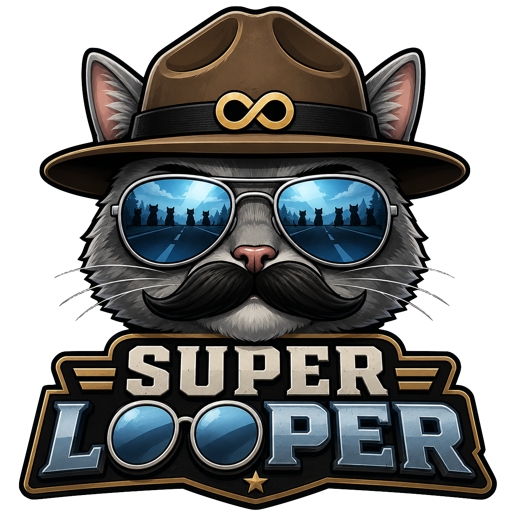
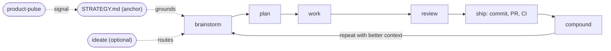

<p align="center">
  
</p>

# Super Looper

[](https://github.com/akornmeier/super-looper/actions/workflows/ci.yml)

AI skills and agents that make each unit of engineering work easier than the last.

## Philosophy

**Each unit of engineering work should make subsequent units easier -- not harder.**

Traditional development accumulates technical debt. Every feature adds complexity. Every bug fix leaves behind a little more local knowledge that someone has to rediscover later. The codebase gets larger, the context gets harder to hold, and the next change becomes slower.

Super looper inverts this. 80% is in planning and review, 20% is in execution:

- Plan thoroughly before writing code with `/sl-brainstorm` and `/sl-plan`
- Review to catch issues and calibrate judgment with `/sl-code-review` and `/sl-doc-review`
- Codify knowledge so it is reusable with `/sl-compound`
- Keep quality high so future changes are easy

The point is not ceremony. The point is leverage. A good brainstorm makes the plan sharper. A good plan makes execution smaller. A good review catches the pattern, not just the bug. A good compound note means the next agent does not have to learn the same lesson from scratch.

## The Loop

Super looper is not a box of tools you reach into when you remember to. It is a single loop you run, over and over, where each pass leaves the next one easier. The whole bet is to *enforce the loop* -- so the goal and the learnings can't be dropped -- instead of handing you individual skills and hoping you run them in the right order.



`/sl-strategy` sits upstream of the loop. It captures the product's target problem, approach, persona, metrics, and tracks as a short durable anchor at `STRATEGY.md`, which ideate, brainstorm, and plan all read as grounding -- so strategy choices flow into feature conception, prioritization, and spec.

The core loop is: **brainstorm** the requirements, **plan** the implementation, **work** through the plan, **review** the result, **ship** it, then **compound** the learning -- and repeat with better context. Use `/sl-ideate` *before* the loop when you want the agent to generate and critique bigger ideas before choosing one to brainstorm; it produces a ranked ideation artifact, not requirements, plans, or code.

| Stage          | Skill               | What it does                                                                                                                                                    |
| -------------- | ------------------- | --------------------------------------------------------------------------------------------------------------------------------------------------------------- |
| _anchor_       | `/sl-strategy`      | Create or maintain `STRATEGY.md` -- the product's target problem, approach, persona, key metrics, and tracks. Read as grounding by ideate, brainstorm, and plan |
| _pre-loop_     | `/sl-ideate`        | Optional big-picture ideation: generate and critically evaluate grounded ideas, then route the strongest one into brainstorming                                 |
| brainstorm     | `/sl-brainstorm`    | Interactive Q&A to think through a feature or problem and write a right-sized requirements doc before planning                                                  |
| plan           | `/sl-plan`          | Turn feature ideas into detailed implementation plans                                                                                                           |
| work           | `/sl-work`          | Execute plans with worktrees and task tracking                                                                                                                  |
| review         | `/sl-code-review`   | Multi-agent code review before merging                                                                                                                          |
| ship           | `/sl-commit-push-pr`| Commit, push, and open a PR with a value-communicating description                                                                                              |
| compound       | `/sl-compound`      | Document learnings to make future work easier                                                                                                                   |
| _read-side_    | `/sl-product-pulse` | Time-windowed report on usage, performance, errors, and followups. Saves to `docs/pulse-reports/`                                                               |

Hit a bug instead of a feature? `/sl-debug` reproduces the failure, traces root cause, and implements a test-first fix -- then rejoin the loop at review and compound.

`/sl-product-pulse` is the read-side companion: a time-windowed report on what users actually experienced and how the product performed over a window (24h, 7d, etc.), saved to `docs/pulse-reports/` so past pulses form a browseable timeline. The next strategy update and the next brainstorm get real signal to anchor to.

Each cycle compounds: brainstorms sharpen plans, plans inform future plans, reviews catch more issues, patterns get documented. The learnings written by `/sl-compound` into `docs/solutions/` are read back automatically by ideate, plan, and review on later passes -- so the toolset gets smarter every time you run it.

## Two ways to run it

Every stage above is a skill you can run yourself -- or you can hand the whole loop to the autopilot.

**Steer each stage.** Run the skills one at a time when the work is ambiguous or you want to shape each decision:

```text
/sl-brainstorm "make background job retries safer"
/sl-plan docs/brainstorms/background-job-retry-safety-requirements.md
/sl-work
/sl-code-review
/sl-compound
```

**Autopilot (`/lfg`).** One command runs the entire loop end-to-end without stopping -- it plans, works through the plan, reviews and applies fixes, commits, pushes, opens a PR, then (when a PR exists and `gh` is available) watches CI and takes a bounded number of passes at repairing failures, recording anything it can't resolve. Best when the task is clear and self-contained:

```text
/lfg "make background job retries safer"
```

**Unattended (`scripts/loop.sh`).** For a fully hands-off run in a clean context -- no accumulated session state -- the loop driver wraps `/lfg` headlessly and drives a committed plan in a target repo to a green PR. It runs against **another** project, not this one:

```bash
# Drive a committed plan to a green PR, unattended:
bash scripts/loop.sh \
  --target /path/to/your-project \
  --plan-file docs/plans/<plan>.md \
  --handoff-file docs/handoffs/<handoff>.md

# No GitHub remote? Verify with the target's own command (--verify-cmd must be last):
bash scripts/loop.sh \
  --target /path/to/your-project \
  --plan-file docs/plans/<plan>.md \
  --verify-cmd bun test
```

`/sl-plan` and `/sl-handoff` produce the plan and handoff docs the runner consumes. See the [loop driver operator guide](docs/loop-driver.md) for the full flag reference, verification modes, and safety rules.

## Quick Example

For a focused bug investigation, the loop narrows to three stages:

```text
/sl-debug "the checkout webhook sometimes creates duplicate invoices"
/sl-code-review
/sl-compound
```

Reach for `/lfg` or `scripts/loop.sh` when the task is clear and self-contained and you want hands-off execution; reach for the individual skills when you want to steer each stage yourself.

## Getting Started

After installing, run `/sl-setup` in any project. It checks your environment, installs missing tools, and bootstraps project config.

The `super-looper` plugin currently ships 40 skills and 43 agents. See the [full component reference](plugins/super-looper/README.md) for the complete inventory.

## Install

In Claude Code:

```text
/plugin marketplace add akornmeier/super-looper
/plugin install super-looper
```

## Local Development

```bash
bun install
bun test
bun run release:validate
```

For active development against your local checkout, add a shell alias so your local copy loads alongside your normal plugins:

```bash
alias cce='claude --plugin-dir ~/Code/super-looper-plugin/plugins/super-looper'
```

Run `cce` instead of `claude` to test your changes. Your production install stays untouched.

To test a branch from a worktree without switching checkouts, point `--plugin-dir` directly at the worktree path:

```bash
claude --plugin-dir /path/to/worktree/plugins/super-looper
```

## Limitations

Release versions are owned by release automation. Routine feature PRs should not hand-bump plugin or marketplace manifest versions.

## FAQ

### Where do I see all available skills and agents?

Read the [Super Looper plugin README](plugins/super-looper/README.md). It lists the current skill and agent inventory.

### Where is release history?

GitHub Releases are the canonical release-notes surface. The root [`CHANGELOG.md`](CHANGELOG.md) points to that history.

## Contributing

Contributions are welcome. Issues, bug reports, and pull requests all help make this better, and we genuinely appreciate them — bug reports especially.

A note on what to expect: Super Looper is opinionated by design. It's maintained by [@akornmeier](https://github.com/akornmeier), and its direction reflects a specific point of view about how AI-assisted engineering should work. So while we welcome help, we can't promise to accept every change — some proposals won't fit that vision even when they're good ideas on their own.

Open an issue or send a PR, and we'll fold in what moves the plugin in the right direction. We just want to be upfront that not everything will land.

## License

[MIT](LICENSE)
