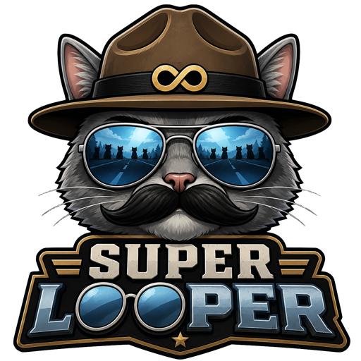

<p align="center">
  
</p>

# Super Looper

[](https://github.com/akornmeier/super-looper/actions/workflows/ci.yml)

AI skills and agents that make each unit of engineering work easier than the last.

## Three-command workflow

Super Looper turns a goal into a reviewed change with three public commands:

| Command | Role |
|---------|------|
| `/sl-strategy` | Create or reconcile the durable product direction in `STRATEGY.md`. Run once, then revisit when evidence changes direction. |
| `/sl-plan` | Ground the request and write one canonical Markdown execution plan with bounded units and verification. |
| `/sl-run` | Execute or resume that plan through code-owned routing, direct checks, independent verification, engineer review, approved delivery, CI repair, and evidence closeout. |

```text
/sl-strategy
/sl-plan "make background job retries safer"
/sl-run plan:docs/plans/<plan>.md
```

`sl-run` selects the least expensive safe workflow profile from the plan and repository evidence:

| Profile | Use it for | Evidence and authority floor |
|---------|------------|------------------------------|
| `chore` | Bounded maintenance with low behavioral risk | Configured checks and completion verification |
| `bug` | A defect with a reproducible or causal failure | Regression evidence plus correctness verification |
| `feature` | Product work, refactors, or cross-cutting changes | Acceptance, scope, testing, and independent verification |
| `hotfix` | An active production incident | Explicit proposal approval, surgical scope, rollback evidence, and final delivery approval |

You can raise the profile with `profile:...`; you cannot lower the safety floor selected from the work.

## Engineer review is the boundary

An unattended run stops at durable `review_ready`. That means implementation, configured checks, and independent verification passed; it does not mean the change was approved or delivered. The review packet carries intent, scope, diff gist, checks, findings, risks, profile, and proposed delivery action. Resume the state interactively and explicitly approve, reject, or request repair. Only approval authorizes the exact code-owned delivery action.

```bash
# The plan path is relative to the target. --verify-cmd must be last.
bash scripts/loop.sh \
  --target /path/to/your-project \
  --plan-file docs/plans/<plan>.md \
  --verify-cmd bun test
```

The state file under `/tmp/super-looper/sl-run/<run-id>/run-state.json` is the resume and audit handle. A separate session handoff document is unnecessary for a run.

## Supporting workflows

Use `/sl-brainstorm` before planning when product behavior is still ambiguous. Standalone `/sl-debug`, `/sl-code-review`, Git utilities, design skills, and platform testing remain available when you need that focused capability outside the core workflow. `/sl-compound` remains useful for manually documenting a verified solution; `sl-run` performs its own evidence-gated closeout.

`/lfg` and `/sl-work` remain compatibility commands. `/lfg` plans and launches `sl-run mode:unattended`; `/sl-work` defaults to `sl-run mode:interactive`. New workflows should use the three commands above directly. The old stacked-PR path remains explicit behind `loop.sh --legacy-lfg-plan` and `loop-phases.sh`.

After installing, `/sl-setup` can diagnose optional tools and project configuration. The [component reference](plugins/super-looper/README.md#complete-component-reference) lists standalone and compatibility capabilities without making the catalog the onboarding path.

## Install

In Claude Code:

```text
/plugin marketplace add akornmeier/super-looper
/plugin install super-looper
```

In Codex, add the native repo marketplace and install its plugin:

```bash
codex plugin marketplace add akornmeier/super-looper --ref main
codex plugin add super-looper@super-looper
```

Codex packaging and the cross-host adapter seam are available; migration of the legacy core workflows is still in progress. Run `$sl-host-smoke` in a fresh thread to validate the installed host path.

## Local Development

```bash
bun install
bun test
bun run release:validate
```

For active development against your local checkout, add a shell alias so your local copy loads alongside your normal plugins:

```bash
alias cce='claude --plugin-dir ~/Code/super-looper-plugin/plugins/super-looper'
```

Run `cce` instead of `claude` to test your changes. Your production install stays untouched.

To test a branch from a worktree without switching checkouts, point `--plugin-dir` directly at the worktree path:

```bash
claude --plugin-dir /path/to/worktree/plugins/super-looper
```

## Limitations

Release versions are owned by release automation. Routine feature PRs should not hand-bump plugin or marketplace manifest versions.

## FAQ

### Where do I see all available skills and agents?

Read the [Super Looper plugin README](plugins/super-looper/README.md). It lists the current skill and agent inventory.

### Where is release history?

GitHub Releases are the canonical release-notes surface. The root [`CHANGELOG.md`](CHANGELOG.md) points to that history.

## Contributing

Contributions are welcome. Issues, bug reports, and pull requests all help make this better, and we genuinely appreciate them — bug reports especially.

A note on what to expect: Super Looper is opinionated by design. It's maintained by [@akornmeier](https://github.com/akornmeier), and its direction reflects a specific point of view about how AI-assisted engineering should work. So while we welcome help, we can't promise to accept every change — some proposals won't fit that vision even when they're good ideas on their own.

Open an issue or send a PR, and we'll fold in what moves the plugin in the right direction. We just want to be upfront that not everything will land.

## License

[MIT](LICENSE)
