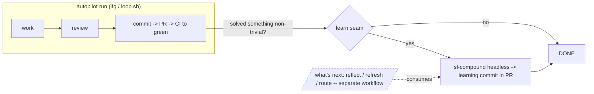

# Autopilot Learning Capture

## Summary

Add a ship-time "learn" capability to the autopilot: when an `lfg` run (interactive `/lfg` or unattended `loop.sh`) solved a non-trivial problem, it autonomously captures a learning via `sl-compound` headless and commits it into the run's PR. This closes the strategy's `… → review → learn → ship` loop on the produce side, so learnings stop being dropped whenever no human is present to run `/sl-compound`.

---

## Problem Frame

The autopilot is a one-way knowledge valve. It *consumes* learnings — `sl-learnings-researcher` reads `docs/solutions/` during plan and review — but never *produces* them: neither `lfg` (steps 1-10) nor `sl-work`'s shipping workflow invokes `sl-compound`. The only "compound" token in the ship path is the PR badge.

`STRATEGY.md` names this exact failure as the target problem: "learnings only get captured if done manually — so the same issues get repeated." The approach is to enforce the full loop so "the learnings can't be dropped," and the Learning-system track calls for *automatic* capture. The autopilot is the one place that skips the loop's "learn" close.

The gap is most acute for unattended `loop.sh` runs: a cold process executes one task and exits at `DONE`, with no human and no next cycle to capture what it learned — every learning from such a run is lost by construction. The CI-autofix loop (`lfg` step 9), where a failure is diagnosed and repaired, is a textbook learning source that currently evaporates at `DONE`.

---

## Key Decisions

- **Capture, not reflect.** This feature is the produce/capture half of compounding only. The cycle-boundary "reflect / refresh / route" operation (consume learnings, refresh stale docs, feed the next ideate) is a separate, complementary workflow — see Scope Boundaries.

- **Non-trivial trigger over compound-every-run.** Capture fires only when a run solved something noteworthy. Compounding every green PR would flood `docs/solutions/` with thin entries and degrade the signal the consume side depends on.

- **Autonomous write into the PR.** Capture runs without prompting (the autopilot never stops to ask) and lands as a commit in the run's PR, where the human reviews it like any other change. This honors "learnings can't be dropped" and reuses the PR as the existing review gate rather than adding a new surface — consistent with the loop-fork model (everything via PR).

- **Full headless `sl-compound`.** Capture performs the complete headless side effects — the `docs/solutions/` learning, `CONCEPTS.md` vocabulary capture, and the one-time instruction-file discoverability edit — so the target's understanding of itself evolves, not just its solution log. It does not auto-run `sl-compound-refresh`; headless mode already only recommends it.

- **Ship-time seam skill, not an `lfg` step.** Capture is its own skill fired at the end of a run (mirroring the `sl-handoff` seam), so `lfg` stays focused on shipping and the capability is independently testable. The autopilot triggers it; it is not interleaved into `lfg`'s numbered sequence.

---

## Key Flow

- F1. Autonomous learning capture at ship time
  - **Trigger:** An `lfg` run reaches the end of its pipeline (PR open, CI green / review fixes applied).
  - **Steps:** The autopilot evaluates whether the run solved a non-trivial problem; if so, it invokes the learn seam, which runs `sl-compound` headless against the run's still-hot context; `sl-compound` self-gates on its preconditions and, when satisfied, writes the learning plus its `CONCEPTS.md` / discoverability side effects; the learn seam commits those changes into the PR and the loop re-confirms the verifiable green stop before reporting success.
  - **Outcome:** A schema-valid learning is committed into the PR for review, or nothing is written when the run solved nothing noteworthy.
  - **Covered by:** R1, R3, R4, R5, R6, R8

---

## Requirements

### Trigger and selectivity
- R1. The autopilot captures a learning only when the run solved a non-trivial problem — a CI-autofix cycle, a debugging detour, or a review-finding fix that exposed a real gap. A run that shipped a feature without solving anything noteworthy captures nothing.
- R2. Capture reuses `sl-compound`'s own preconditions (problem solved, verified, non-trivial) as the quality gate. The autopilot supplies the signal that a qualifying problem occurred; `sl-compound` headless makes the final keep/skip decision.

### Capture and disposition
- R3. Capture runs autonomously with no human prompt, in both interactive `/lfg` and unattended `loop.sh` runs, consistent with the autopilot's existing "never stop to ask" contract.
- R4. The captured learning is committed into the run's PR as its own commit, so a human reviews it at PR time alongside the rest of the change.
- R5. Capture performs the full headless `sl-compound` side effects — the `docs/solutions/` learning, `CONCEPTS.md` vocabulary capture, and the one-time instruction-file discoverability edit — and does not auto-run `sl-compound-refresh`.

### Placement and loop integrity
- R6. Capture is a distinct ship-time seam capability (its own skill) the autopilot triggers at the end of a run, not interleaved into `lfg`'s numbered step sequence.
- R7. Capture runs while the solving session's context is still available, so an unattended run never depends on a later cycle or a human to produce the learning.
- R8. The learning commit must not leave the loop's verifiable green stop unmet: it can re-trigger the target's CI, and the loop must still reach (or re-confirm) green before reporting success.

---

## Acceptance Examples

- AE1. **Covers R1, R4.** Given an unattended run whose CI went red and was repaired in the autofix loop, when the run finishes, then a `docs/solutions/` learning describing the symptom, root cause, and fix is committed into the PR.
- AE2. **Covers R1.** Given a run that implemented a planned feature with no failed attempt, no CI failure, and no notable debugging, when the run finishes, then no learning is written.
- AE3. **Covers R1, R7.** Given a run where a non-obvious bug was diagnosed during the work phase, when the run finishes, then a learning is captured even though CI never failed.
- AE4. **Covers R8.** Given a learning committed after CI was green, when the loop reports success, then the reported success still reflects a verified-green target rather than a run left with CI pending on the learn commit.

---

## Success Criteria

- Non-trivial unattended runs produce a committed, schema-valid learning with no human intervention — directly serving the `STRATEGY.md` "Learning reuse" metric and closing "learnings only get captured if done manually."
- Routine runs produce no learning; `docs/solutions/` signal stays high.
- A captured learning is retrievable by a later run's `sl-learnings-researcher` (the consume side already wired).
- The autopilot's Unattended completion rate does not regress from the added learn step (R8).

---

## Scope Boundaries

### Deferred (adjacent, its own brainstorm)
- The "what's next" reflect / refresh / route cycle-boundary workflow: consume accumulated learnings, refresh stale docs (`sl-compound-refresh`), and feed the next ideate. Complementary to capture; lives near `sl-strategy` / `sl-ideate`, not `lfg`. A handoff seed for it accompanies this brainstorm.

### Out of scope
- Standalone `/sl-work` capture — an interactive user can run `/sl-compound` themselves; the learn close belongs to the full loop.
- A chain-of-runs meta-loop (what pre-loop capture would require for unattended runs).
- Changing `sl-compound`'s preconditions, capture template, or headless behavior; auto-running `sl-compound-refresh` from the loop.

---

## Dependencies / Assumptions

- `sl-compound` is model-invocable (it carries no `disable-model-invocation`), so the autopilot can invoke it via the Skill tool inside a headless `claude -p` run (verified against `plugins/super-looper/skills/sl-compound/SKILL.md`).
- `sl-compound` headless conservatively skips when no solved problem is present; the autopilot relies on that gate as the quality backstop behind R1's signal.
- The autopilot can derive a reliable "a non-trivial problem was solved" signal from run state (CI went red then green, review fixes applied, a debugging detour). The exact source is an open question.
- `loop.sh` runs against a committed plan in the target, so learnings land in the target's `docs/solutions/` and PR — consistent with the loop-fork "everything via PR" model.

---

## Outstanding Questions

### Deferred to Planning
- Where the learn seam fires relative to `lfg`'s CI-watch so it captures CI-autofix-phase learnings without leaving CI pending at `DONE` (R8) — e.g., re-confirm green after the learn commit, or treat a docs-only learn commit specially.
- How the autopilot detects "non-trivial solved problem": explicit run signals (CI red→green, review fixes, debug detour) versus delegating the whole judgment to `sl-compound` headless.
- Whether interactive `/lfg` should behave any differently from unattended `loop.sh` (default: identical and autonomous).

---

## Sources / Research

- `STRATEGY.md` — target problem ("learnings only get captured if done manually"), the `… → review → learn → ship` approach, the Learning-system track, and the "Learning reuse" metric. The named gap this fills.
- `plugins/super-looper/skills/lfg/SKILL.md` (steps 1-10) — no learn step; the autopilot consumes learnings but never produces them.
- `plugins/super-looper/skills/sl-compound/SKILL.md` — `mode:headless` built for automation; side effects (Phase 2.4 `CONCEPTS.md`, the Discoverability Check); Phase 2.5 only recommends `sl-compound-refresh` in headless.
- `plugins/super-looper/skills/sl-code-review/SKILL.md` — `sl-learnings-researcher` always-on (the consume side already wired).
- `docs/loop-driver-acceptance.md` ("Origin DoD — second clause") — anticipates a loop run writing a `docs/solutions/` learning; this brainstorm specifies the wiring.
- `CONCEPTS.md` — Pipeline defined as closing "by capturing what was learned"; Learning as the unit of compounded knowledge.
