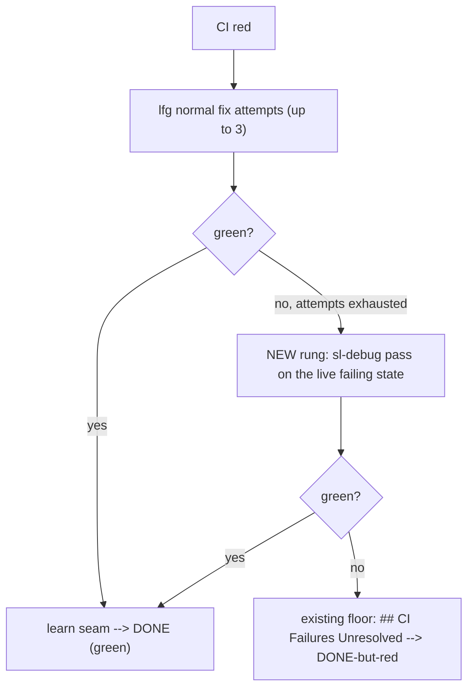

# Loop debug-escalation requirements

## Summary

Insert one deeper debugging rung into lfg's in-run CI-fix loop: when its normal fix attempts exhaust on red CI, hand the live failing state to a systematic `sl-debug` pass before giving up — so the loop's last move becomes "try once more, harder" instead of "document the failure and stop."

## Problem Frame

When an unattended run hits red CI, lfg already iterates to fix it — up to three fix-and-push cycles — then a hard gate stops it, writes a `## CI Failures Unresolved` section into the PR body, and the run ends as DONE-but-red. The driver's own retry is no help here: `loop.sh` re-launches only on a crash-without-DONE and resets the target to a clean base first, so red CI is terminal, not retried.

The cost is that the loop gives up at exactly the moment it has the most to work with. At the give-up point the failing state is still live — failing-check logs, the failing test, the diff that caused it — and lfg's fix attempts have been surface-level repairs inside the work loop, not systematic root-causing. The run discards a live, debuggable failure and a dedicated debugging skill (`sl-debug`) sits unused one step away.

## Key Decisions

- **In-run escalation, not driver-level routing.** The escalation lives inside lfg, where the failing state is live and reproducible. A driver-level router (between `loop.sh` attempts) would act only after the target was clean-reset, with the evidence already gone.
- **Debug-only for v1.** Flake quarantine and spec-mismatch re-plan are deferred. One reliable escalation beats three half-built routes — and unattended mid-run re-plan is a move the repo deliberately rejects (`sl-handoff` is descriptive not a re-plan; plan-mode skips planning by design).
- **A bounded rung above the existing floor.** The debug pass is one extra attempt inserted before the unresolved-CI terminal, not a new loop. The current "stop and document" behavior stays as the floor that catches anything the debug pass can't fix.
- **Don't escalate known flakes.** lfg already shortcuts a flaky-with-no-fix-path failure straight to a residual; sending those to a full debug pass would burn an unattended attempt, so escalation is scoped to failures lfg tried and failed to fix.

## Requirements

**Escalation trigger**

- R1. When lfg's in-run CI-fix attempts exhaust on red CI (the gate that stops after the normal fix iterations), the run escalates to one deeper debugging pass before declaring the failure unresolved.
- R2. Escalation fires only for failures lfg attempted to fix and could not — not for failures lfg already classified as flaky with no fix path, which continue to the existing residual path without a debug pass.

**The debug pass**

- R3. The escalation invokes a systematic `sl-debug` pass on the live failing state (the failing-check logs and failing test path lfg already has in hand), so it can reproduce and root-cause rather than surface-patch.
- R4. The debug pass is a single bounded escalation, not an open loop; CI is re-checked once after it completes.

**Terminal behavior**

- R5. If CI is green after the debug pass, the run proceeds normally to the learn seam and to DONE on verified green.
- R6. If CI is still red after the debug pass, the run falls through to the existing terminal behavior unchanged — compose `## CI Failures Unresolved` in the PR body and stop, surfacing as DONE-but-red. Escalation adds a rung; it does not remove the floor.

## Acceptance Examples

- AE1. **Covers R1, R3, R5.** **Given** lfg's normal fix attempts exhaust with CI still red on a genuine failure, **when** the debug escalation runs and its fix turns CI green, **then** the run proceeds to the learn seam and to DONE on verified green.
- AE2. **Covers R1, R6.** **Given** the debug escalation runs but CI is still red afterward, **when** the run terminates, **then** it composes `## CI Failures Unresolved` in the PR body and surfaces DONE-but-red, exactly as today.
- AE3. **Covers R2.** **Given** lfg classified the failure as a flaky test with no fix path, **when** the run reaches the give-up point, **then** it takes the existing residual path with no debug escalation.
- AE4. **Covers R4.** **Given** the debug pass does not resolve CI, **when** it completes, **then** CI is re-checked once and the run does not loop additional debug passes.

## Scope Boundaries

**Deferred for later**

- Flake detection and quarantine as a distinct route.
- Spec-vs-implementation mismatch detection triggering an unattended re-plan.
- Using `docs/solutions/` as a classification / routing table once the corpus grows.

**Outside this version's scope**

- Driver-level routing between `loop.sh` attempts — the failing state is gone after the clean-reset, which is why the locus is in-run.
- Treating the loop run-record (C1) as the classification input — in-run escalation reads the live state directly; the record is the post-hoc account of what happened.

## Dependencies / Assumptions

- Depends on `sl-debug`, which exists and accepts a description / error / test path and reproduces before fixing.
- Assumes lfg's CI-fix give-up point is the right insertion site, and that the failing-check logs and test path lfg already fetches are sufficient input for the debug pass.
- The per-attempt wall-clock cap (`--timeout`, default 1800s) still bounds the whole run; a deeper debug pass consumes wall-clock and could make a run likelier to hit the timeout — planning should weigh whether the debug pass needs its own sub-budget.
- Cross-link: the loop run-record (`docs/brainstorms/2026-06-18-loop-run-record-requirements.md`) should capture whether an escalation occurred and its outcome, so escalation effectiveness is measurable. That field lives in the run-record, not in this feature.

## Outstanding Questions

**Deferred to planning**

- Exact insertion mechanics in lfg's step sequence: replace the final normal fix iteration with the debug pass, or append it as an additional deeper rung.
- Whether the debug pass gets its own wall-clock sub-budget distinct from the normal fix iterations.
- Whether a debug pass that still fails enriches the `## CI Failures Unresolved` residual with its root-cause findings, or leaves that section unchanged.

## Sources / Research

- `plugins/super-looper/skills/lfg/SKILL.md` — the in-run CI-watch fix loop (up to 3 iterations), the gate that stops and writes `## CI Failures Unresolved`, and the learn-seam gating on unresolved CI. This is the give-up point the escalation inserts before.
- `plugins/super-looper/skills/sl-debug/SKILL.md` — the escalation target: triage → investigate → root-cause → fix; accepts logs / test path / description.
- `scripts/loop.sh` — retry fires only on crash-without-DONE (with clean-reset); red CI surfaces as terminal DONE-but-red, never retried at the driver level.
- `plugins/super-looper/skills/sl-handoff/SKILL.md`, `docs/plans/2026-06-17-001-feat-loop-driver-mvp-plan.md` (KTD8), `docs/brainstorms/2026-06-17-lfg-plan-input-handoff-requirements.md` — mid-run re-plan is deliberately rejected, which is why the re-plan route is out of scope.
- `docs/brainstorms/2026-06-18-loop-run-record-requirements.md` — the run-record (C1) and the relationship flip noted above.
- Origin: `docs/ideation/2026-06-18-whats-next-ideation.html`, idea "Auto-route on failure type."
