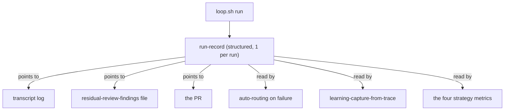

# Loop run-record requirements

## Summary

Have the loop driver emit one structured, machine-readable record per run — capturing what `loop.sh` directly observes (per-attempt outcome, timing, verification result, typed failure, PR URL) plus pointers to the artifacts that hold the deeper detail. It is designed as the substrate downstream features read, starting with failure auto-routing.

## Problem Frame

When an unattended `lfg` run finishes, `loop.sh` leaves behind only an exit code (0–7) and a free-text transcript appended to `/tmp/super-looper/loop/loop-*.log`. The driver already computes rich per-attempt state — `attempt`, `done_reached`, `timed_out`, `routed_via_pr`, `verify_green`, `route`, `url` — but renders it as echo strings and discards the structure at exit.

Two costs follow. First, the run leaves no queryable residue: three of `STRATEGY.md`'s four key metrics are marked "to define," and even unattended-completion rate (which names "loop logs / PR metadata" as its source) has no structured sink to read. Second, every consumer that wants to reason about a run — failure routing, learning capture — must re-parse a transcript or work from still-hot session context that is gone the moment the run ends. The artifact, not any single consumer, is the missing piece.

## Key Decisions

- **Spine: substrate for downstream features.** v1 is shaped so auto-routing and learning-capture-from-trace can read it programmatically. Operator triage and metric computation are beneficiaries of the same record, not the thing v1 is designed around.
- **Index, don't inline.** `loop.sh` stays the only writer. The record points at the transcript, the residual-review-findings file `lfg` writes, and the PR rather than copying their contents — which keeps the writer surface small and sidesteps the fact that in-target detail is `git clean`'d on retry-reset.
- **Coarse failure type in v1; fine classification reads the pointers.** The record carries the exit-code-class failure. The finer test-vs-spec-mismatch-vs-flake distinction a router needs is a consumer concern that reads the pointed-to verify output, not a field v1 commits to.
- **Always written, including failures.** A substrate that only records successful runs is useless exactly where the current free-text log is least usable — the run that died overnight.
- **Self-describing coverage boundary.** The record states what it does *not* contain, so the repo's headline learning ("a record covering some of the state is more dangerous than none — partial reads as complete") cannot recur at this layer.

## Requirements

**Record contents**

- R1. The loop driver emits one structured, machine-readable record per run, alongside the existing transcript log and exit code.
- R2. The record captures the driver-observable outcome: attempt count and per-attempt result, timing, the verification result, the typed failure (the run's exit-code class), the route (`DONE` vs crash-reconciled open-PR), and the PR URL when one exists.
- R3. The record carries pointers — not copies — to the artifacts holding deeper detail: the transcript log, the residual-review-findings file when `lfg` wrote one, and the PR.
- R4. The record includes a stable run-id that a future agent-contributed phase trace can use as a join key.

**Emission and lifecycle**

- R5. The record is written on every run that reaches launch, across all terminal paths including failures (cap exhausted, timeout, DONE-but-red, no-verify, isolation refusal) — not only on success.
- R6. The record is written to a stable, discoverable path paired with the run's transcript log, so a later invocation or consumer can locate it from the run.

**Integrity and evolution**

- R7. The record declares its own coverage boundary as a first-class field — what it indexes by pointer versus what it does not contain — so a partial record cannot be mistaken for a complete one.
- R8. The record carries a schema version so consumers can detect format changes.

**Observability contract**

- R9. The loop-driver test suite asserts the record's presence and key fields across representative terminal paths, establishing the record as part of the driver's observable contract (today the tests assert only exit code and stdout/stderr text).

## Acceptance Examples

- AE1. **Covers R2, R3, R5.** **Given** a run that reaches `DONE` with green CI, **when** the driver exits 0, **then** a record exists with route `DONE`, verification green, the PR URL, and pointers to the transcript and (if written) the residual-findings file.
- AE2. **Covers R2, R5.** **Given** a run that reaches `DONE` but CI is red, **when** the driver exits 7, **then** a record exists with typed failure = DONE-but-red, verification red, and pointers to the PR and transcript.
- AE3. **Covers R5.** **Given** a run that exhausts the retry cap without an open PR, **when** the driver exits 5, **then** a record exists capturing each attempt's outcome and the cap-exhausted failure type.
- AE4. **Covers R7.** **Given** any emitted record, **when** a consumer reads it, **then** a coverage-boundary field names what is reachable only by pointer versus absent, so the consumer never assumes per-phase detail is inline.

## Scope Boundaries

**Deferred for later**

- The agent-contributed per-phase trace (the `lfg` ↔ driver two-layer contract). v1 leaves the run-id join key (R4) for it to attach to.
- The consumers themselves: computing the four strategy metrics, any dashboard, auto-routing on failure, and learning-capture-from-trace. They read this record; they are separate work.

**Outside this version's scope**

- Fine-grained failure classification (test vs spec-mismatch vs flake) as a record field — a consumer concern that reads the pointers.
- Goal-fidelity scoring — no ground-truth mechanism exists (cut during ideation).
- Retention or rotation policy beyond the existing `/tmp` log behavior.

## Dependencies / Assumptions

- Assumes the transcript log and the residual-review-findings file remain at stable, resolvable locations: the log under `--log-dir` (default `/tmp/super-looper/loop/`), and the residual file committed into the PR by `lfg` step 6. Both verified against current source.
- Assumes the exit-code classes remain the failure taxonomy v1 maps the typed failure from.
- The record is a brand-new artifact with no current consumer, so format churn is low-risk near term; R8 (schema version) hedges the first consumer landing.

## Outstanding Questions

**Deferred to planning**

- Record location and naming: a sibling of the transcript log inside `--log-dir` (so one flag governs both, the default lean) versus a dedicated records directory.
- The exact field schema and serialization shape (JSON object assumed).
- Whether pre-launch errors (arg/usage, exit 2) warrant a record or terminate too early to matter.
- How the typed-failure value maps from the exit-code constants.

## Sources / Research

- `scripts/loop.sh` — exit-code constants, the final report block, and the per-attempt state variables the record formalizes; `LOG_FILE` construction and `--log-dir` default.
- `tests/loop-driver.test.ts` — current observable contract (exit code + stdout/stderr text; no structured artifact read), which R9 extends.
- `plugins/super-looper/skills/sl-learn/SKILL.md` and `plugins/super-looper/skills/lfg/SKILL.md` (step 10) — learning capture reads in-session context plus PR metadata, with no input file consumed today.
- `STRATEGY.md` — the four key metrics and their "to define" / "from loop logs" measurement notes.
- Origin: `docs/ideation/2026-06-18-whats-next-ideation.html`, idea "Structured run-record — the loop's black box."
