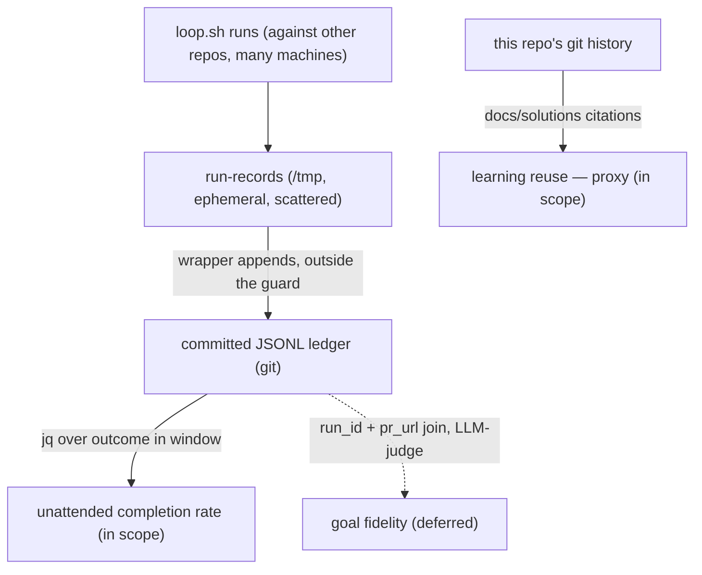

# Pulse strategy-metric wiring requirements

## Summary

Give the loop's run-record a durable, centralized, queryable corpus and point the
product pulse at it, so the strategy metrics stop rendering `no data`. Unattended
completion rate is the cheap win — it is the record's `outcome` field aggregated
over a window, a `jq` away once the records survive and collect in one place. The
emission already exists (the run-record, PR #15); what is missing is the corpus and
the pointer. Learning reuse gets a partial proxy from this repo's git today; goal
fidelity needs more than wiring and is deferred.

## Problem Frame

The first product pulse (2026-06-20) rendered three of `STRATEGY.md`'s four key
metrics as `no data (instrumentation pending)`. Code-review rework is computable
from this repo's GitHub data; the other three are not — but the reason differs by
metric, and "wire up loop logs" only addresses one of them.

The loop driver already emits exactly what unattended completion rate needs:
`scripts/loop.sh` writes one structured run-record per terminal run, with an
`outcome` of `success` | `failure` (success = `DONE` reached **and** verification
green, by construction). The metric — "share of loops that hit the verifiable stop
condition and open a PR without human intervention" — *is* that field. Yet the
pulse cannot read it, for three compounding reasons:

1. **Ephemeral.** Records land in `/tmp/super-looper/loop/loop-<ts>-<pid>.json`,
   cleared on reboot. `*.log` and `logs/` are gitignored and the session JSON was
   deliberately removed from git — there is no committed sink.
2. **Scattered, not centralized.** The loop's isolation guard *refuses to run on
   this repo* and runs against throwaway target repos. Records are therefore strewn
   across whichever operator machine ran `loop.sh`, beside disposable targets —
   never collected anywhere a metric reader can find them.
3. **Invisible to the cloud pulse.** The scheduled weekly pulse runs as a cloud
   routine that checks out this repo fresh; it can never see a local `/tmp`.

The black box exists and is well-shaped. The corpus that accumulates it and the
pointer that routes the pulse to it do not.

## Key Decisions

- **Corpus + pointer, not a pipeline.** The run-record already emits every field
  the metric needs (`scripts/loop.sh:341`). Do not rebuild emission or add fields —
  this work is making the records *durable, centralized, and read*.
- **Durability is cross-machine, not just cross-reboot.** Because the loop runs
  elsewhere (never here), a persistent local `--log-dir` is necessary but not
  sufficient. The corpus must live somewhere a pulse on *any* machine — including
  the cloud routine — can read it.
- **A committed JSONL ledger is the durable, cloud-readable sink.** The record is an
  *index, not a copy*: it carries no PII and never inlines seed/task text (the
  run-record design is explicit). That makes committing it to git privacy-safe, and
  git is the one store both a local pulse and the cloud routine already read.
- **Append happens outside the guarded run.** `loop.sh` launches the agent under
  `env -i` with a self-edit guard; it cannot and must not write the ledger into this
  repo itself. The operator-side wrapper (the documented `scripts/loop.example.env`
  seam) does the append. `loop.sh` stays the only writer of *records*; the ledger is
  a separate, append-only consumer artifact.
- **Storing records here does not violate the isolation model.** The records
  describe runs that happened against *other* repos; this repo is a neutral metrics
  store for them, not a loop target.
- **Tier the metrics by cost; ship the cheap one.** Unattended completion rate =
  `jq` over `outcome` (in scope). Learning reuse = a citation-count proxy from this
  repo's git, available today (partial, in scope as a proxy). Goal fidelity = an
  LLM-judged plan-vs-outcome comparison keyed by `run_id` — real work, no
  ground-truth mechanism, already cut once during run-record ideation (deferred).
- **The pulse stays read-only and source-routed.** Repoint via the existing
  `pulse_metric_sources` / `pulse_pending_metrics` config keys — no new pulse
  mechanism, no pulse mutation of the corpus.

## Requirements

**Corpus durability and centralization**

- R1. Run-records accumulate in a durable location that survives reboot, not only the
  default ephemeral `/tmp/super-looper/loop/`.
- R2. The records collect into a single committed, append-only JSONL ledger (one
  record per line) in a git repo that both a local pulse and the cloud pulse routine
  can read.
- R3. The append to the ledger occurs outside the loop's guarded `env -i` launch
  (operator-side wrapper), so `loop.sh`'s self-edit guard is never crossed and
  `loop.sh` remains the sole writer of records.
- R4. The ledger inherits the record's no-PII / index-not-copy property; no step adds
  seed text, transcripts, or identifiers when appending.

**Pulse wiring**

- R5. The pulse computes unattended completion rate as `success / total` over records
  whose `timing.started_at` falls in the pulse window.
- R6. `unattended_completion_rate` moves out of `pulse_pending_metrics` and into
  `pulse_metric_sources` pointing at the ledger source.
- R7. When the ledger is absent or empty (fresh checkout, no runs yet), the metric
  renders `no data` gracefully — never an error or a fabricated zero-rate.
- R8. Learning reuse renders a citation-count proxy (e.g., commits/PRs in the window
  referencing `docs/solutions/...` or `[[...]]` backlinks), explicitly labeled a
  proxy, rather than `no data`.

## Acceptance Examples

- AE1. **Covers R5, R6.** **Given** a ledger with N in-window records, **when** the
  pulse runs, **then** unattended completion rate shows `success / N` with the count,
  not `no data`.
- AE2. **Covers R7.** **Given** a checkout with no ledger or an empty one, **when** the
  pulse runs, **then** the metric renders `no data` and the pulse completes without
  error.
- AE3. **Covers R2.** **Given** the ledger is committed in-repo, **when** the cloud
  routine checks out the repo and runs the pulse, **then** it computes the same rate a
  local pulse would over the same window.
- AE4. **Covers R3, R4.** **Given** a completed loop run against a throwaway target,
  **when** the wrapper appends its record, **then** the new ledger line contains the
  record verbatim (no seed text, no PII) and `loop.sh` itself wrote nothing into this
  repo.
- AE5. **Covers R8.** **Given** window commits citing `docs/solutions/...`, **when** the
  pulse runs, **then** learning reuse shows a citation count marked as a proxy.

## Scope Boundaries

**In scope**

- Unattended completion rate end-to-end: durable corpus → committed ledger → pulse
  repoint → window-filtered rate.
- Learning-reuse cheap proxy from this repo's git (citation/backlink count).

**Deferred for later**

- Goal-fidelity scoring: an LLM-judged plan-vs-outcome comparison keyed by the
  record's `run_id` join key and `pr_url` pointer. Real comparison work with no
  ground-truth mechanism; cut once already during run-record ideation.
- True learning-*reuse* semantics ("a captured learning prevented a repeat") beyond
  the citation-count proxy.
- Any dashboard, alerting, or threshold annotation — the pulse stays "read like a
  founder," numbers only.
- Ledger retention / rotation / compaction policy.

**Outside this version's scope**

- Changing `loop.sh`'s record emission — it already produces the needed shape.
- Making the pulse mutate the corpus or any external system.

## Dependencies / Assumptions

- The run-record schema is stable: `schema_version`, `outcome`,
  `timing.started_at`, and `run_id` as used by R5 — verified in `scripts/loop.sh:341`.
- The operator runs the loop through a wrapper where the append can live; the
  documented `scripts/loop.example.env` is that seam.
- A single git repo owns the ledger and is readable by both the local pulse and the
  cloud routine; the records carry no PII by design, so committing them is safe.
- The pulse already supports per-metric source routing via `pulse_metric_sources`
  and `pulse_pending_metrics` (present in the 2026-06-20 first-run config).

## Outstanding Questions

**Deferred to planning**

- Which repo owns the ledger — this repo's `docs/run-records/ledger.jsonl` versus a
  dedicated metrics repo. (Not the target: throwaways are disposable.)
- Append mechanism — a wrapper one-liner, a small `scripts/record-append` helper, or
  a `loop.sh` post-run flag that emits the append command for the wrapper to run
  (must stay outside the guard either way).
- Whether the local pulse and cloud pulse share the single committed ledger as the
  one source of truth, or the local pulse may also read fresh `/tmp` records before
  they are appended.
- Is the citation-count proxy (R8) good enough to label "learning reuse," or does it
  mislead by counting citations that did not prevent a repeat?
- How to handle records from multiple targets if loops run against many repos — one
  ledger for all, or partitioned by target.

## Sources / Research

- `scripts/loop.sh:341` — the run-record JSON shape and the fields R5 reads
  (`outcome`, `timing.started_at`, `run_id`, `pointers.pr_url`).
- `docs/loop-driver.md` ("Run record") — record location
  (`loop-<ts>-<pid>.json` under `--log-dir`), index-not-copy, written on every
  operational terminal path; the isolation rule that keeps the loop off this repo.
- `docs/brainstorms/2026-06-18-loop-run-record-requirements.md` — the substrate this
  consumes; goal-fidelity already cut for lack of ground truth.
- `.gitignore` — `*.log` and `logs/` excluded; run-records are not committed today.
- `STRATEGY.md` — the four key metrics and their measurement notes.
- `.super-looper/config.local.yaml` — `pulse_metric_sources` /
  `pulse_pending_metrics` routing (first-run pulse config, 2026-06-20).
- `plugins/super-looper/skills/sl-product-pulse/references/report-template.md` — how
  pending versus sourced strategy metrics render in the report.
- Origin: 2026-06-20 product-pulse first run + the loop-log-capture discussion that
  followed it.
