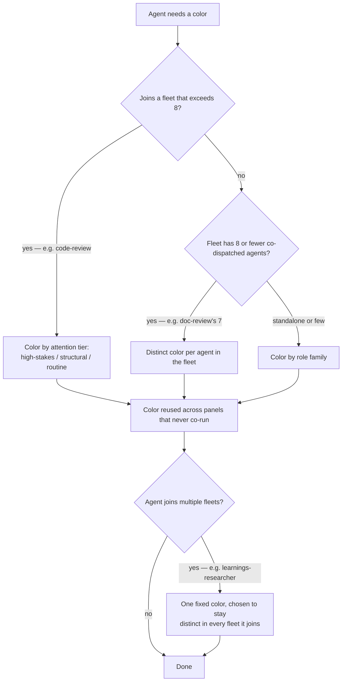

# Agent Color Scheme: role-based, fleet-scoped

## Summary

Assign every super-looper agent a `color` by its role, spreading the 8-value palette so that each co-dispatched fleet's task-list panel is legible at a glance. Distinctness is required where agents run together, not globally. This replaces today's ad-hoc state — `blue×13`, an invalid `violet`, and 25 uncolored agents — with an intentional, documented scheme.

---

## Problem Frame

When a skill fans out a fleet of agents, the live task list shows their colored chips side by side — that panel is where color earns its keep, by letting a user tell parallel agents apart at a glance. Today it does the opposite. Of 43 agents, 25 set no color and 13 are all `blue`; one (`sl-design-iterator`) uses `violet`, which is not a value Claude Code accepts. The worst collision sits exactly where parallelism is highest: `sl-code-review` dispatches up to ~14 agents, most of them the blue ones, so the densest panel is nearly monochrome.

The hard constraint behind all of this: the `color` field accepts exactly eight named values (`red`, `blue`, `green`, `yellow`, `purple`, `orange`, `pink`, `cyan`) — no hex. So a literally-unique color per agent is impossible, and "make them unique" has to be reframed before any assignment is sensible.

---

## Key Decisions

- **Color encodes role, spread for panel legibility.** An agent's color follows its role, but the palette is distributed so every co-dispatched panel shows several colors — chosen over a clean "one family = one color" rule because the densest fleet (code-review) needed multi-color more than it needed a single role hue.
- **"Unique" is scoped to co-dispatched fleets, not all 43.** Global per-agent uniqueness is impossible (8 < 43) and unnecessary — the agent's name always renders beside the chip. Distinctness is a requirement only where agents actually run together.
- **Oversized families sub-split into three attention tiers.** The code-review family is split into high-stakes / structural / routine tiers, each a different color, so a block-the-ship finding (correctness, security, adversarial) carries a high-salience color instead of hiding in recessive blue.
- **Straddlers are colored by their dispatch fleet, not their topic.** When an agent's role spans two families (e.g. `sl-security-reviewer` is code-review, `sl-security-lens-reviewer` is doc-review), its color follows the fleet it co-runs in — so within-fleet distinctness always holds, even though a topic like "security" is no longer one color across the system.
- **Name is the identity channel; color is the grouping channel.** Agents that share a color are told apart by name, which is always present. Color is a pre-attentive grouping cue, not the unique identifier.
- **A color's global meaning is allowed to go soft.** Accepted cost: `red` reads as "high-stakes" inside code-review but is reused for whatever fits the doc-review panel. Meaning is local to a panel, not fixed across the whole system.

### How an agent's color is decided

---

## Requirements

**Coverage and correctness**

- R1. Every agent sets `color` to one of the eight valid values (`red`, `blue`, `green`, `yellow`, `purple`, `orange`, `pink`, `cyan`). No agent is left unset.
- R2. No agent uses an off-palette value; the current `violet` on `sl-design-iterator` is corrected to a valid value.
- R3. The `blue×13` collision is eliminated — no single color is applied to a majority of agents as an unconsidered default.

**Assignment scheme**

- R4. An agent's color is determined by its role, not picked per-agent ad hoc. Roles group into ~6 families: code-review, doc-review, researchers, design/UI, writers/resolvers, data/deploy.
- R5. The palette is spread so each co-dispatched fleet's panel shows multiple colors — assignment optimizes for in-panel legibility, not for a globally-unique-per-agent or globally-fixed-per-color meaning.
- R6. A color may carry different roles in different panels; reuse across fleets that never co-run is intended, not a defect.

**Per-fleet distinctness**

- R7. In a fleet of 8 or fewer co-dispatched agents (e.g. `sl-doc-review`'s 7 personas), every agent has a distinct color.
- R8. In a fleet that exceeds 8 (`sl-code-review`, ~9–14), agents are sub-split into three attention tiers — high-stakes, structural, routine — so the panel shows several colors; agents sharing a tier may share a color, disambiguated by name.
- R10. When an agent's role spans two families, its color follows the fleet it dispatches in, not its topic — so a code-review persona and a doc-review persona on the same subject can hold different colors.
- R9. An agent that joins multiple fleets keeps one fixed color, chosen so it stays distinct within every fleet it joins — a single assignment across the co-dispatch graph, not independent per-fleet picks.

---

## Acceptance Examples

- AE1. **Covers R7.** `sl-doc-review` dispatches its 7 personas → all 7 chips render distinct colors; no two match.
- AE2. **Covers R8.** `sl-code-review` dispatches ~12 personas → high-stakes reviewers (correctness, security, adversarial) share one loud color, structural reviewers another, routine reviewers another; two agents in the same tier may share a color and are told apart by their names.
- AE3. **Covers R9.** `sl-learnings-researcher` appears in `sl-code-review`, `sl-ideate`, `sl-plan`, and `sl-optimize` → it shows the same color in all four, and that color collides with no other agent in any of those panels.

---

## Success Criteria

- All 43 agents render a valid, intentional color — none unset, none off-palette.
- In any fleet's live task list, a user can tell the agents apart at a glance: by color where the fleet fits the palette, by color-tier plus name where it overflows.
- The role and attention-tier taxonomy is written down, so a contributor adding an agent knows which color it should get without re-deriving the scheme.

---

## Scope Boundaries

**Deferred for later (natural follow-ons)**

- A validation test enforcing on-palette values and full color coverage across all agents — the guardrail that keeps the scheme from drifting back.
- Color-vision-deficiency safety and light/dark terminal-theme legibility rules (avoiding confusable pairs within a fleet, keeping `blue`/`yellow` off high-attention roles).
- A deterministic generator or `CONCEPTS.md` taxonomy that derives each color from its role.

**Outside this change**

- Loop-phase coloring (color keyed to ideate/plan/work/review/learn/ship) — considered and rejected in favor of role, because ~30 agents would collapse into "review".
- Recoloring non-agent surfaces (status line, pulse reports, demo reels).

---

## Outstanding Questions

**Deferred to planning**

- The exact per-agent color assignment, including which code-review personas fall in each of the three tiers — the concrete graph-coloring solution across the co-dispatch graph.
- Whether assignment is hand-authored or generated — a HOW decision; the generator itself is a deferred follow-on regardless.

---

## Sources / Research

- `docs/ideation/2026-06-26-agent-colors-ideation.html` — origin ideation (ideas "Color by role-family" + "Redefine unique as distinct-within-a-fleet").
- Claude Code sub-agents documentation — the authoritative 8-value `color` enum.
- `plugins/super-looper/agents/` — current color state (43 agents; `blue×13`, `violet`, 25 unset).
- `plugins/super-looper/skills/sl-code-review/SKILL.md` and `plugins/super-looper/skills/sl-doc-review/` — fleet composition (code-review ~9–14, doc-review 7).
- `tests/skill-agent-sl-prefix.test.ts` — the existing frontmatter-convention enforcement pattern, template for the deferred validation follow-on.
