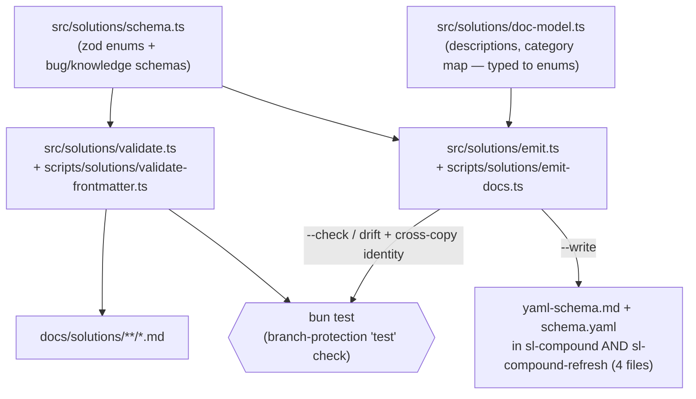

# feat: TypeScript single-source-of-truth schema for docs/solutions

## Summary

Make `schema.ts` the single source of truth for `docs/solutions/` frontmatter: relocate it (and the validator) into the repo's `src/`/`scripts/` tooling layout, add `zod`, run a bun enum-validator as a repo-side gate over the corpus, and generate the model-facing docs (`yaml-schema.md` + `schema.yaml`) from the schema with a drift check. The enum validator runs *on top of* — not in place of — the skills' runtime parser-safety guard.

---

## Problem Frame

This fork retargets the learning schema from the upstream Rails flavor to a TS/React/Vue/accessibility stack, and wants the schema to be defined once with real validation. Today the definition is duplicated across four hand-maintained files — `yaml-schema.md` and `schema.yaml` in both `sl-compound` and `sl-compound-refresh` — and they have already drifted: the shipped docs still carry the Rails enums (`rails_model`, `missing_association`, `rails_version`), while the retargeted `schema.ts` carries the web-stack enums (`react_component`, `hydration_mismatch`, `framework_version`). The two TS files (`schema.ts`, `validate-frontmatter.ts`) currently sit untracked-by-convention in the repo root, outside the type-checked `src/` tree, and `zod` — which `schema.ts` imports — is not installed, so neither file runs. This work installs the schema as durable tooling and makes the docs a generated projection of it, so enum drift across the four files cannot recur. (Field descriptions and the category map collapse into one typed source — a smaller residual hand-maintained surface than four files, not zero; see KTD3.)

This advances the **Learning system** track in `STRATEGY.md` — schema-validated learnings that can't silently rot.

---

## Requirements

### Schema as single source

- R1. `schema.ts` is the only definition of the `docs/solutions/` frontmatter enums and field shapes, relocated into the repo tooling layer and importable by other modules and tests.
- R7. `zod` is a declared dependency and the schema and validator run under Bun. Type-checking is a local-`tsc` convenience, not a CI guarantee — no gate runs `tsc` today, and `tsconfig` `include` is `src/**/*.ts` (so `scripts/` and `tests/` are unchecked); enum-metadata completeness is enforced at runtime by U3's completeness test (see KTD3).

### Repo-side enum validation

- R2. A bun validator checks `docs/solutions/` frontmatter against the zod schema (enum correctness plus per-track required fields), runnable over a single file or the whole corpus.
- R3. The validator keeps the existing exit-code contract (0 valid / 1 invalid / 2 usage) and names the offending field(s) on failure.
- R8. The validator and the emit drift check run under `bun test`, so the branch-protection `test` status check enforces both.

### Model-facing docs derive from the schema

- R4. `yaml-schema.md` and `schema.yaml` are generated from `schema.ts` plus a co-located typed doc-model; no enum value is hand-maintained in the docs.
- R5. The generator writes all four docs (both files in both `sl-compound` and `sl-compound-refresh`), and the two skills' copies are byte-identical.
- R6. Generated docs carry the retargeted TS/React/Vue/a11y enums (`framework_version`, not `rails_version`), replacing the Rails-flavored content.
- R9. Content the enums can't express (field and track descriptions, category mapping, YAML safety rules) has a single typed-or-template source feeding the generator.
- R10. A `--check` mode (and a `bun test`) fail when any committed doc has drifted from the generator output.

---

## Key Technical Decisions

- KTD1. **Placement: `src/solutions/` for logic, `scripts/solutions/` for CLI entries** — mirroring `src/release/` + `scripts/release/`. The `tsconfig` `include` is `src/**/*.ts`, so only `src/` is type-checked, and tests import logic directly from `src/`. This rejects the placement in `sl-loop-fork-workplan.md` (schema inside a skill `references/` dir), which leaves the toolchain untyped and splits it across the plugin boundary.
- KTD2. **The repo-side gate is additive; the per-skill Python `validate-frontmatter.py` stays.** They catch different bug classes: the Python script catches *silent YAML corruption* at user runtime inside the installed skill (pure stdlib, no deps), while the bun/zod validator catches *enum and field correctness* in this repo's CI. The bun tool cannot ship into installed skills (no `node_modules`/`zod` in a cached plugin), so it lives only in repo tooling.
- KTD3. **emit-docs sources.** `schema.ts` is the single source for enum values and field shape; `src/solutions/doc-model.ts` carries what zod can't express (field/track descriptions, category mapping) typed against the enums so a missing entry is caught by `tsc` locally — and, since no CI gate runs `tsc`, by U3's runtime completeness test, which is the enforcing check. Static prose (YAML Safety Rules, backward-compat note) lives in the emit template; faithful regeneration of the current docs needs more than the raw enums. The category map is typed-complete (one entry per `problem_type`), so the generated Category Mapping will list directories that don't exist on disk yet — it is **not authoritative for on-disk layout** until OQ1 reconciles the taxonomy; the generator preserves the current mapping values meanwhile.
- KTD4. **Generator mirrors `syncReleaseMetadata`.** A pure `emitDocs({root, write})` computes desired content, diffs against disk, returns `FileUpdate[]` (`{path, changed}`), and writes only when `write && changed` — one code path for both write and check. The CLI mirrors `sync-metadata.ts` (`--write`) and `validate.ts` (drift → exit 1).
- KTD5. **Gate runs under `bun test`**, the check required by branch protection — not `release:validate`, which is release-scoped.
- KTD6. **Regenerating replaces Rails-flavored content with the retargeted enums in both skills' docs** (`rails_version` → `framework_version`, Rails components/causes → web-stack). This is the intended completion of the retargeting at the doc layer; expect a large doc diff.
- KTD7. **`zod` added as a runtime dependency; `gray-matter` is not** — the validator reuses the js-yaml-based `parseFrontmatter` in `src/utils/frontmatter.ts` rather than the `gray-matter` mentioned in the original header comment.

---

## High-Level Technical Design

Single source on the left; two consumers (validator gate, doc generator); both enforced by `bun test`.

---

## Implementation Units

### U1. Add zod and relocate the schema into `src/solutions/`

- **Goal:** Install `zod` and move the root schema into the type-checked tooling layer so other modules and tests can import it.
- **Requirements:** R1, R7
- **Dependencies:** none
- **Files:**
  - `package.json` (add `zod` to `dependencies`)
  - `bun.lock` (updated by `bun add`)
  - `src/solutions/schema.ts` (moved from root `schema.ts`; drop the stale `gray-matter` mention in the header comment — keep `zod`)
  - delete root `schema.ts`
- **Approach:** `bun add zod`, then move the file unchanged except the header comment. The schemas themselves are not modified here. `tsconfig` `include` (`src/**/*.ts`) already covers the new path.
- **Patterns to follow:** `src/release/*.ts` module style — exported consts/functions, no shebang.
- **Test scenarios:** Test expectation: none — pure relocation plus dependency add; schema behavior is exercised by U2.
- **Verification:** `zod` resolves; `src/solutions/schema.ts` type-checks under the existing `tsconfig`; no root `schema.ts` remains and nothing imports the old root path.

### U2. Repo-side enum validator (logic + CLI + script)

- **Goal:** Validate `docs/solutions/` frontmatter against the zod schema, exposed as a CLI and a `solutions:validate` package script — the repo-side enum gate.
- **Requirements:** R2, R3, R8
- **Dependencies:** U1
- **Files:**
  - `src/solutions/validate.ts` (logic: parse frontmatter via `src/utils/frontmatter.ts` `parseFrontmatter`, pick schema via `schemaFor`, `safeParse`, return a structured result with per-field errors)
  - `scripts/solutions/validate-frontmatter.ts` (thin CLI: validate one path argument, or walk the corpus when no path is given; exit 0/1/2)
  - `package.json` (add `solutions:validate` → `bun run scripts/solutions/validate-frontmatter.ts`)
  - `tests/solutions-schema.test.ts`
  - delete root `validate-frontmatter.ts`
- **Approach:** Mirror the `src/release` split — testable logic in `src/`, thin argv/exit shell in `scripts/`. Reuse `parseFrontmatter` instead of the original inline regex; note `parseFrontmatter` returns empty `data` (it does not throw) for a missing or unterminated block, so `validate.ts` must treat empty data or a null `schemaFor` result as a validation failure (exit 1) — only genuinely unparseable YAML throws. Corpus mode walks `docs/solutions/` via `src/utils/files.ts` `walkFiles` and filters to `.md` paths — `walkFiles` returns every file regardless of extension, so mirror the `.endsWith(".md")` filter in `src/release/metadata.ts`'s `countMarkdownFiles`.
- **Execution note:** Implement the validation logic test-first.
- **Patterns to follow:** `src/release/config.ts` (`validateReleasePleaseConfig` returns structured errors), `scripts/release/validate.ts` (exit-code gating), `src/utils/files.ts`, `src/utils/frontmatter.ts`.
- **Test scenarios:**
  - Happy path: a valid bug-track doc (all shared required + `symptoms`/`root_cause`/`resolution_type`, valid enums) passes; a valid knowledge-track doc (shared required only) passes.
  - Edge: a knowledge doc carrying optional bug fields (`symptoms`, `root_cause`) passes (backward-compat); `tags` with exactly 8 items passes.
  - Error: unknown `problem_type` → error naming `problem_type`; invalid `component` enum → error naming `component`; bug doc missing `root_cause` → error; bug doc with empty `symptoms` (min 1) → error; `date` not `YYYY-MM-DD` → error; `tags` with 9 items → error; missing frontmatter block → error; unparseable YAML → error.
  - CLI/exit codes: no argument → exit 2; valid file → exit 0; invalid file → exit 1; corpus mode over the (currently empty) `docs/solutions/` → exit 0 (vacuous pass).
- **Verification:** `bun test tests/solutions-schema.test.ts` is green; `bun run solutions:validate` exits 0 on the empty corpus and 1 on a deliberately invalid fixture; root `validate-frontmatter.ts` is gone.

### U3. Single-source doc model and emit/render logic

- **Goal:** Capture the non-enum doc content as typed data keyed to the schema enums, and render `yaml-schema.md` + `schema.yaml` from the schema plus that model.
- **Requirements:** R4, R5, R9
- **Dependencies:** U1
- **Files:**
  - `src/solutions/doc-model.ts` (typed metadata: per-enum and per-field descriptions, track descriptions, `problem_type → docs/solutions/<dir>/` category map, YAML-safety reserved-char list — typed against the `schema.ts` enums so a new enum value without metadata is a compile/test error)
  - `src/solutions/emit.ts` (`renderYamlSchemaMd(model)`, `renderSchemaYaml(model)`, and `emitDocs({root, write})` returning `FileUpdate[]` for the four destinations, diffing vs disk, writing only when `write && changed`)
  - `tests/solutions-emit-render.test.ts`
- **Approach:** Mirror `src/release/metadata.ts` `syncReleaseMetadata`. The static prose blocks (YAML Safety Rules, backward-compat note) are template strings in `emit.ts`; everything enum-derived comes from `schema.ts` + `doc-model.ts`.
- **Execution note:** Implement the render functions test-first.
- **Patterns to follow:** `src/release/metadata.ts` (`FileUpdate`, write-flag), `src/utils/files.ts` (`readText`/`writeText`).
- **Test scenarios:**
  - Happy path: `renderYamlSchemaMd` output contains every `COMPONENTS` web value, both track tables, and every category-map row; `renderSchemaYaml` output parses back via js-yaml to the expected enum sets.
  - Completeness: every enum value across `COMPONENTS`/`ROOT_CAUSES`/`RESOLUTION_TYPES`/problem-types appears in the rendered docs (guards the typed-metadata coverage at runtime too).
  - Drift mechanics: `emitDocs({write:false})` on an in-sync fixture returns all `changed:false`; on a fixture with one stale doc returns `changed:true` for only that path.
  - Negative: rendered output contains no Rails values (`rails_model`, `rails_version`, `missing_association`).
- **Verification:** `bun test tests/solutions-emit-render.test.ts` green; render functions are pure (no filesystem writes when `write:false`).

### U4. emit CLI, regenerate the shipped docs, and lock with a drift + identity gate

- **Goal:** Ship the generator CLI, regenerate the four docs from the schema, and guard them with drift and cross-copy-identity tests.
- **Requirements:** R5, R6, R8, R10
- **Dependencies:** U3
- **Files:**
  - `scripts/solutions/emit-docs.ts` (CLI: `--write` calls `emitDocs({write:true})`; default/`--check` calls `emitDocs({write:false})`, prints drifted paths to stderr, exits 1 on any change else 0)
  - `package.json` (add `solutions:emit` → `bun run scripts/solutions/emit-docs.ts --write`)
  - `plugins/super-looper/skills/sl-compound/references/yaml-schema.md` (regenerated)
  - `plugins/super-looper/skills/sl-compound/references/schema.yaml` (regenerated)
  - `plugins/super-looper/skills/sl-compound-refresh/references/yaml-schema.md` (regenerated)
  - `plugins/super-looper/skills/sl-compound-refresh/references/schema.yaml` (regenerated)
  - `tests/solutions-emit-drift.test.ts`
- **Approach:** Mirror `scripts/release/validate.ts` exit-code gating. Regenerate the docs by running `--write`, then commit the result; the drift test is the durable gate under `bun test`.
- **Execution note:** Regenerate the docs by running the generator, never by hand-editing — the drift test enforces that the committed docs equal generator output.
- **Patterns to follow:** `scripts/release/sync-metadata.ts` (`--write` parse), `scripts/release/validate.ts` (drift → exit 1), `tests/release-metadata.test.ts` (mkdtemp drift assertion), `tests/frontmatter-validator.test.ts:279-284` (cross-copy identity via `toBe`).
- **Test scenarios:**
  - Drift: with the committed docs in sync, `emitDocs({write:false})` reports nothing changed (exit 0); a stale copy in a temp fixture reports that path changed (exit 1).
  - Cross-copy identity: `sl-compound`'s `yaml-schema.md` equals `sl-compound-refresh`'s; same for `schema.yaml`.
  - CLI: `--write` then re-run `--check` → exit 0; `--check` on a stale doc → exit 1 listing the path.
  - Content: a regenerated `yaml-schema.md` contains web `COMPONENTS` and `framework_version`, and no `rails_version`.
- **Verification:** `bun test` is green including the new drift and identity tests; `bun run solutions:emit` is idempotent (a second run changes nothing); the four docs carry the web-stack enums identically across both skills.

---

## Scope Boundaries

### Deferred to Follow-Up Work

- **Category taxonomy reconciliation** — see Open Questions; this plan relocates and regenerates the mapping but does not redesign the canonical category set.
- **Creating or migrating actual `docs/solutions/` entries** to the new enums — the corpus is empty today; the gate is preventive.
- **Removing the root scratch planning files** (`sl-loop-fork-workplan.md`, `START-HERE.md`, `STRATEGY.seed.md`) — noticed in the repo root, out of scope here.

### Out of scope

- The unattended-`lfg` loop (a separate strategy track).
- Replacing or removing the per-skill Python parser-safety validators (KTD2 keeps them).

---

## Open Questions

- OQ1. **Category mapping vs. actual directory taxonomy.** The current doc Category Mapping points at directories (`build-errors/`, `architecture-patterns/`, `conventions/`, …) that match neither the real `docs/solutions/` directories (`best-practices/`, `developer-experience/`, `skill-design/`, `workflow/`) nor the taxonomy in `AGENTS.md`. This plan seeds the mapping into a single typed source and regenerates faithfully; deciding the canonical category set (and whether `sl-compound` should write to the generated directory names) is a separate follow-up. Because the typed map is complete per `problem_type`, the regenerated Category Mapping will list directories that don't exist on disk yet (e.g. `build-errors/`, `conventions/`); treat it as non-authoritative for layout until reconciled (see KTD3). Resolving it does not block U1-U4.
- OQ2. **`sl-loop-fork-workplan.md` conflicts with repo rules** — it proposes one shared generated file for both skills, which the AGENTS.md duplication rule forbids. This plan supersedes it (KTD1, R5). Flagged so the stale workplan can be removed or corrected separately.

---

## Risks & Dependencies

- **zod readonly-enum compatibility.** `schema.ts` calls `z.enum(COMPONENTS)` on `as const` (readonly) tuples. Confirm the installed zod version accepts readonly arrays in `z.enum` (supported in zod 3.23+ and zod 4); an older v3 would need a spread. Pin the major that `bun add zod` resolves and verify the validator runs before relying on it.
- **Large, intended doc diff.** Regenerating the four docs changes shipped `sl-compound`/`sl-compound-refresh` reference content from Rails-flavored to web-stack enums (KTD6). Reviewers should expect the size; the drift test proves it equals generator output.
- **Two skill copies must stay identical.** `emitDocs` writes both copies from one render, so they are identical by construction; the cross-copy identity test (U4) guards against a future one-sided hand edit.

---

## Sources & Research

- `src/release/metadata.ts` — `syncReleaseMetadata`: the `FileUpdate[]` + write-flag codegen/drift pattern this work mirrors (KTD4).
- `scripts/release/sync-metadata.ts` (`--write`) and `scripts/release/validate.ts` (drift → exit 1) — CLI write-vs-check precedent.
- `src/utils/files.ts` (`walkFiles`, `readText`, `writeText`) and `src/utils/frontmatter.ts` (`parseFrontmatter`, js-yaml based) — helpers to reuse instead of re-implementing.
- `tests/release-metadata.test.ts` (mkdtemp fixture + drift assertion) and `tests/frontmatter-validator.test.ts:279-284` (cross-copy identity via `toBe`) — test precedents.
- `AGENTS.md` — *File References in Skills* (no cross-skill sharing → emit to both dirs) and *Directory Layout* (`src/` vs `scripts/`).
- `plugins/super-looper/skills/sl-compound/references/yaml-schema.md` and `schema.yaml` — current Rails-flavored docs; the drift target. Identical to the `sl-compound-refresh` copies today.
- `STRATEGY.md` — Learning-system track this advances.
