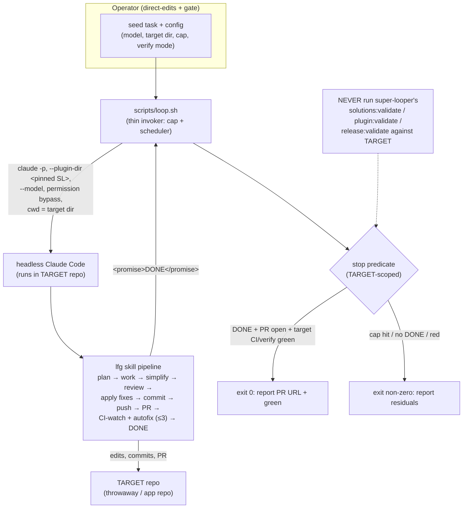

# feat: Unattended loop-driver MVP (loop.sh) for run-to-PR autonomy

## Summary

Build the thin, unattended run-until-green driver that is the only piece of the `sl-loop-fork-workplan.md` MVP still unbuilt. `lfg` already plans → works → simplifies → reviews → applies fixes → commits → pushes → opens a PR → watches CI → autofixes to green, all inside one Claude Code session. The remaining gap is **running that pipeline unattended against a target without a human babysitting the session.** This plan adds `scripts/loop.sh`: a headless invoker that launches `claude` against a seeded task in an external/throwaway target with pinned plugin wiring, an iteration/time cap, and a **target-scoped** stop predicate (target verification green, with `lfg`'s `DONE` treated as a completion signal that routes to verification — never success on its own), then proves the definition of done with a reproducible acceptance run and an operator doc.

This advances the **Loop autonomy** track in `STRATEGY.md` and its **Unattended completion rate** metric.

---

## Problem Frame

The workplan handed to planning describes a two-part effort: (a) a TypeScript single-source learning schema, and (b) an unattended loop driver. **Part (a) is already merged** (PR #2, `solutions-schema-single-source`): `src/solutions/schema.ts` (zod single source), `scripts/solutions/{validate-frontmatter,emit-docs}.ts`, generated `schema.yaml`/`yaml-schema.md` with a drift gate, and `tests/solutions-schema.test.ts` — including a corpus test (`corpus mode over docs/solutions exits 0`) that runs the real validator over `docs/solutions/` inside `bun test`, which CI runs. So schema validation is already CI-enforced, and the workplan's §8 "swap the skill's Python validator to TS" items were **superseded** by the Phase 1 plan's KTD2 (the bun/zod validator can't ship into installed skills, so the portable Python `validate-frontmatter.py` deliberately stays). See Scope Boundaries.

What is **not** built: `loop.sh` does not exist. Without it, the loop only runs when a human types `/lfg` in an interactive session and stays to clear permission prompts — there is no "seed one task and walk away." `lfg` is a skill (an in-session orchestration), not a CLI, so unattended execution requires launching Claude Code headlessly with permission bypass, a cap, and a way to confirm the run genuinely reached a reviewable PR. That is the driver this plan delivers.

**Execution posture for building this work:** direct edits + gate, not lfg-driven self-hosting. Per the operator decision recorded 2026-06-16, no pinned stable Super Looper exists — the live `sl-*` skills load as `super-looper@inline` from this working copy, so the workplan's "SL builds SL" tool/target isolation is not satisfiable when the target *is* this repo. The §-defined changes here are implemented directly (Edit/Write/TDD) and verified against the gate below, with the human keeping the merge via PR.

---

## Requirements

### The driver

- R1. `scripts/loop.sh` runs the `lfg` pipeline unattended (no interactive prompts) against a caller-specified target directory and seed task, and exits 0 only when the stop predicate is met.
- R2. The driver pins the Super Looper plugin used for the run via `--plugin-dir <checkout>` and runs `claude` from the target directory, so the loop edits the target — never the plugin code running it.
- R3. The driver enforces a **cap**: a per-run wall-clock timeout and a bounded number of re-launch attempts if a run dies before signalling completion. It never loops unbounded.
- R4. The driver's **stop predicate is target-scoped, and `DONE` is necessary but not sufficient**: an `lfg` `DONE` sentinel routes to verification, never directly to success. Success requires `DONE` **and** the target's own verification green, evaluated *after* `DONE` — because `lfg` emits `DONE` even when it gives up on red CI (its step 9 records a "CI Failures Unresolved" PR section after 3 fix iterations and exits red). The PR clause is **verify-mode-conditional**: in GitHub-CI mode, success also requires an open PR with green checks; in local `--verify-cmd` mode (no remote/PR), success requires `DONE` + a green `--verify-cmd`. The driver never runs Super Looper's own scripts (`solutions:validate`, `plugin:validate`, `release:validate`) against the target — those validate *this* repo's structure, and a throwaway target lacks `docs/solutions/`, so they would fail spuriously; target verification uses the target's own signals only.
- R5. On success the driver reports the target PR URL (when present) and a green status; on failure it reports what remained unresolved with a non-zero exit, distinguishing crash, timeout, cap-exhausted, and `DONE`-but-red. A `--dry-run` mode prints the `claude` command it would run without executing it.
- R6. The driver selects the top-level orchestrator model (Fable or Opus) via a configurable flag.

### Safety and recoverability

- R10. The driver bounds the blast radius of an unattended, permission-bypassed run, calibrated to a solo-developer operator: it launches `claude` with an explicit environment allowlist (not the operator's full ambient environment), refuses to run when the target is the same as, an ancestor of, or a descendant of the pinned plugin directory (self-edit guard), passes `--verify-cmd` as an argument vector (never `eval`'d), and tees the full run transcript to a timestamped log so there is an audit trail of what the unattended agent did.
- R11. Because `lfg` is not resumable, a retry after a crash-without-`DONE` reconciles target state before re-launching: a prior attempt that already opened a PR for the target branch is treated as terminal and routed to verification rather than re-run; otherwise each retry starts from a clean target base. The driver never re-runs `lfg` on top of a half-finished branch.

### Acceptance and operability

- R7. A reproducible acceptance demonstrates the definition of done — seed one task, run unattended, reach a green PR on a throwaway target — backed by a committed example seed/config.
- R8. An operator doc explains seeding, the flags, the cap, the stop predicate, and the isolation rule (external target; self-hosting on this repo stays direct-edits + gate until a pinned stable plugin exists).

### Verification

- R9. `scripts/loop.sh`'s argument parsing, command construction, stop-predicate scoping, `DONE` detection, and cap behavior are covered by `tests/loop-driver.test.ts` under `bun test`, so the branch-protection `test` check enforces them.

---

## Key Technical Decisions

- **KTD1. `loop.sh` is a thin headless invoker, not a second loop.** `lfg` already loops CI to green (3 internal fix iterations) and makes residuals durable before emitting `<promise>DONE</promise>` (see `plugins/super-looper/skills/lfg/SKILL.md`). `loop.sh` adds only what `lfg` lacks for unattended use: headless launch, permission bypass, a cap, target/plugin wiring, and a final stop-predicate check. If a step here starts to re-implement planning, working, or CI-watching, stop — that is `lfg`'s job.
- **KTD2. Isolation comes from target ≠ plugin, achieved by `--plugin-dir` + running in the target dir.** The 2026-06-16 memory's isolation concern ("no pinned stable SL; skills load `@inline`") bites only when the target *is* this repo. For an external/throwaway target the plugin edits the target, not itself, so the inline-plugin issue does not apply. Pin a specific checkout path via `--plugin-dir` for reproducibility (the operator's stable-plugin alias). Self-hosting the loop *on this repo* remains out of scope and stays direct-edits + gate.
- **KTD3. The stop predicate is scoped to the target, never to Super Looper.** The `git-untracked-empty-dirs-break-ci` learning warns that the corpus validator distinguishes "directory missing" (exit 2) from "empty" (exit 0); a throwaway target has no `docs/solutions/`, so blindly running `solutions:validate` there would fail spuriously. `loop.sh` verifies completion via the target's own signals (`gh pr checks` for the target PR, or a caller-supplied verify command), and runs none of this repo's gate scripts against the target.
- **KTD4. Verification mode is configurable: GitHub CI or a local verify command — and one mode is always required.** The faithful DoD ("reach CI-green") needs the target to have a GitHub remote with CI; the reproducible smoke needs to run without standing up Actions on a throwaway. `loop.sh` supports both — default to the target's GitHub CI when a PR/remote exists (matching `lfg`'s own `gh pr checks --watch` step), and accept a `--verify-cmd` for local-only targets. When no PR/remote is detected **and** no `--verify-cmd` is supplied, the driver fails fast (non-zero) rather than declaring success on `DONE` alone — there is no unverified success path. The DoD acceptance run uses the GitHub-CI path; the committed smoke uses local verify.
- **KTD5. Placement: `scripts/loop.sh` (repo tooling layer), not repo root and not a plugin skill.** It is an operator tool for running the loop on *other* repos, so it does not ship in the plugin (no `plugins/` change, no count change) and belongs alongside `scripts/release/` and `scripts/solutions/`. This deviates from the workplan's repo-root `loop.sh` for convention consistency.
- **KTD6. Shell driver over a Claude Code `/goal` primitive.** The workplan offered either; `/goal` is not a confirmed Claude Code primitive, while a shell script is concrete, testable under `bun test`, and directly cron-/Actions-schedulable for the deferred Phase 3 heartbeat.
- **KTD7. `DONE` is a routing signal, not a success signal.** `lfg` emits `<promise>DONE</promise>` as its terminal token in *every* exit path, including the give-up-on-red path (step 9 GATE: after 3 failed CI fix cycles it records "CI Failures Unresolved" in the PR body and proceeds to emit `DONE`). So the driver detects `DONE` only to know the run *finished*, then gates success on the independent target-verification result. To avoid a false positive from the sentinel string being echoed mid-transcript (it appears verbatim in `lfg`'s own skill source), match the **last** occurrence / end of output, and never treat a `DONE` substring as success without the green check.
- **KTD8. Retry reconciles, it does not blindly re-launch.** Since `lfg` has no resume entry point (it always restarts at step 1 `sl-plan`), a naive re-launch on a crashed run would re-plan and re-work on top of a half-finished branch — duplicating the plan file, stacking commits, or conflicting with an already-open PR. The driver therefore checks target state first: an existing open PR for the target branch is terminal (route to verification, do not re-run); otherwise reset the target to a clean base (or use a fresh branch) per attempt. The conservative default for the MVP is a clean base per retry; see Open Questions.

---

## High-Level Technical Design

Two distinct gates must not be conflated. The **plan's own gate** verifies that `loop.sh` is built correctly (this repo's `bun test` + `plugin:validate` + `release:validate` + CI green on the PR). The **stop predicate** is what `loop.sh` enforces on its *target*. The flow:

The driver's only moving parts are: build the command, run it in the target with the pinned plugin, detect `DONE`, verify the target's PR/CI, and bound the whole thing with a timeout + retry cap.

---

## Implementation Units

### U1. `scripts/loop.sh` — unattended run-until-green driver

- **Goal:** A thin headless driver that runs `lfg` on a seeded task against a target directory, unattended, with a cap and a target-scoped stop predicate, emitting the target PR URL and status.
- **Requirements:** R1, R2, R3, R4, R5, R6, R9, R10, R11.
- **Dependencies:** none (first unit).
- **Files:**
  - `scripts/loop.sh` (new) — the driver.
  - `tests/loop-driver.test.ts` (new) — argument/command-construction and stop-predicate-logic tests.
- **Approach:** Parse inputs (target dir, seed task/seed-file, model, plugin-dir, timeout, max-retries, verify mode/command, `--dry-run`) from flags and/or environment. "Headless `claude`" means the Claude Code CLI invoked non-interactively (exact form pinned by the smoke test — see execution note). Before launching: run the **isolation guard** (realpath-canonicalize target and plugin-dir; refuse with a non-zero error if target == plugin-dir or is an ancestor/descendant), and require a verification mode (fail fast if neither a PR/remote nor `--verify-cmd` is available). Construct the invocation — `cwd` = target dir, `--plugin-dir <pinned checkout>`, `--model <configured>`, a non-interactive permission-bypass flag, launched under an **environment allowlist** (`env -i` with only the variables the run needs, e.g. `HOME`, `PATH`, `GH_TOKEN`/`GITHUB_TOKEN`) so ambient operator secrets aren't inherited — feeding it the `lfg` pipeline against the seed. Wrap the call in a wall-clock timeout that signals the whole process group (so a child `gh pr checks --watch` is reaped, not orphaned), and **tee** the full transcript to a timestamped run log. Detect the `<promise>DONE</promise>` sentinel as a **routing** signal (match the last occurrence / end of output, not any substring), then evaluate the **target-scoped** verification *after* `DONE`: in GitHub-CI mode an open PR with green checks via `gh`; in `--verify-cmd` mode the command (passed as an argument vector, never `eval`'d) exiting 0. Success = `DONE` **and** verification green. On a crash-without-`DONE`, reconcile before retrying (R11: existing-open-PR → route to verification, do not re-run; otherwise clean base) up to the cap. Exit 0 with the PR URL on success; otherwise non-zero with a residual summary that names the failure mode (crash / timeout / cap-exhausted / `DONE`-but-red) and points at the run log. `--dry-run` prints the constructed command and the verification it would run, without executing.
- **Execution note:** Characterization-first. The exact headless `claude` flags (invocation form, whether the `lfg` skill is triggered via a slash command vs. inline instructions, permission-bypass flag name, model values, output capture for `DONE`, long multi-turn behavior) are **execution-time unknowns** — smoke-test the headless `claude` + `lfg` invocation on a trivial target and pin the working flags *before* building the cap/stop logic. Keep the test-covered logic (parsing, command construction, predicate scoping, `DONE` detection, cap) separable from the live `claude` call so it is unit-testable without invoking Claude.
- **Patterns to follow:** Mirror the entry-point style of `scripts/release/` and `scripts/solutions/`. Per `AGENTS.md`: a shell script must derive its own directory from `BASH_SOURCE` (not `$CLAUDE_SKILL_DIR`, which is a SKILL.md substitution, not a runtime var); keep pinned commands single and unguarded so an allow-rule isn't defeated and an unattended run never stalls on a prompt; one simple command at a time, no error suppression that hides failures.
- **Test scenarios (`tests/loop-driver.test.ts`):** Tests exercise the driver's logic with stubbed `claude`, `gh`, and `--verify-cmd` outputs — no live Claude or GitHub calls — so they pass on any branch.
  - Missing required input (no target dir, or no seed) → exits non-zero with a usage message naming what's missing.
  - Isolation guard: target == plugin-dir, and target as ancestor/descendant of plugin-dir, both exit non-zero with an error naming the self-edit hazard. Covers R10.
  - No verification mode available (no PR/remote, no `--verify-cmd`) → exits non-zero; never declares success on `DONE` alone. Covers R4/KTD4.
  - `--dry-run` constructs a command that includes `--plugin-dir <pinned>`, `--model <configured>`, the permission-bypass flag, the env allowlist (`env -i …`), and targets the configured target directory — assert on the printed command string. Covers R10 env-allowlist.
  - Stop-predicate scoping: the verification step targets the *target* (its PR via `gh`, or the `--verify-cmd`) and contains **no** invocation of `solutions:validate`, `plugin:validate`, or `release:validate`. Covers R4/KTD3.
  - `DONE` is routing, not success: stubbed output where `DONE` is present **and** target verification is green → success; `DONE` present **but target verification red** (the lfg-gave-up-on-CI case) → exit non-zero with a residual citing the red verification; `DONE` absent → failure. Covers R4/KTD7.
  - Sentinel robustness: a `<promise>DONE</promise>` string echoed mid-transcript (not at end) does **not** trigger success on its own; matching anchors to the last occurrence. Covers KTD7.
  - Retry reconciliation: a simulated crash-without-`DONE` where an open PR already exists for the target branch routes to verification (no re-launch); otherwise the driver resets to a clean base before retrying, up to `max-retries=N`, then exits non-zero. Covers R3/R11/KTD8.
  - Timeout: the wall-clock flag is parsed and wired into a process-group-signalling timeout wrapper (assert the wiring, not real wall-clock).
  - `--verify-cmd` is passed as an argument vector, not interpolated into an `eval`/shell string. Covers R10.
  - Verify-mode selection: GitHub-CI mode constructs a `gh pr checks`-style verification; `--verify-cmd "<cmd>"` mode runs that command instead. Covers KTD4.
  - Covers the DoD's "unattended → PR opened" at the logic layer via the dry-run + routing paths; the live end-to-end run is U2's acceptance.
- **Verification:** `bun test tests/loop-driver.test.ts` green; `bash scripts/loop.sh` with no args prints usage and exits non-zero; `--dry-run` against a sample config prints a well-formed `claude` command and a target-scoped verification step.

### U2. MVP acceptance: seed → unattended run → green PR

- **Goal:** Prove the definition of done end-to-end on a throwaway target, and commit a reusable example seed/config so the acceptance is reproducible.
- **Requirements:** R7 (and exercises R1–R6, R10–R11 live).
- **Dependencies:** U1.
- **Files:**
  - `scripts/loop.example.env` (new) — a documented example invocation/config (target dir, model, cap, verify mode), including the headless-`claude` flags pinned by U1's smoke test, so U2 and U1 do not diverge on invocation form.
  - `examples/loop-seed.md` (new) — an example seed task, sized to plan → implement → verify in one run **and specified tightly enough that `sl-plan` never reaches a clarifying-question branch** (no domain ambiguity, no unresolved product question) — an underspecified seed would stall the unattended run until the timeout cap rather than fail fast.
  - `docs/loop-driver-acceptance.md` (new) — the committed acceptance record (invocation used, run-log excerpt, resulting PR URL / verify result) so the DoD is reproducible and auditable without re-running against a live target.
- **Approach:** Run `loop.sh` against a throwaway target seeded with the example task and confirm the loop plans → works → reviews → fixes → opens a PR and reaches green, unattended. Use the local-verify path (`--verify-cmd`) for the committed, reproducible smoke so it runs without GitHub Actions; document the GitHub-CI path for the faithful "reach CI-green" demonstration, and note in the acceptance record which predicate the committed smoke proves (local verify) vs. the faithful run (CI-green). **Also verify the origin DoD's second clause**: if the seeded run writes a `docs/solutions/` learning, confirm it passes the schema validator and is retrievable by the next run's grep-over-frontmatter — the Phase 1 validator already enforces schema-validity, so this is a confirmation that the *unattended* path produces a valid, retrievable learning, not new validation machinery.
- **Execution note:** This is an integration/acceptance step, not unit-tested. The live run depends on a real target directory and — for the faithful CI demonstration — a GitHub remote with CI; that setup is an execution-time decision per the available throwaway. The throwaway acceptance proves the *mechanism*, not completion on a representative complex feature — state that ceiling in the acceptance record so it isn't read as proof of real-feature autonomy. Confirm `loop.sh` ran the loop *in the target* and that none of this repo's gate scripts ran against the target.
- **Test scenarios:** Test expectation: none -- the example/record files are config/fixtures with no behavior; the driver logic they feed is covered by U1's tests, and the live acceptance is an integration run verified by outcome below.
- **Verification:** An unattended `loop.sh` run produces an open PR on the target and a green status (real GitHub CI for the faithful run, or the `--verify-cmd` proxy for the committed smoke), with the run log showing `DONE`; any learning the run wrote validates against the schema; no Super Looper gate script executed against the target; the acceptance record is committed.

### U3. Operator usage doc for the loop driver

- **Goal:** A short doc covering how to seed and run the driver, the flags, the cap, the stop predicate, and the isolation rule.
- **Requirements:** R8.
- **Dependencies:** U1 (documents its actual flags), U2 (links the example seed/config).
- **Files:** `docs/loop-driver.md` (new).
- **Approach:** Document the invocation, every flag, the two verification modes, the cap and retry-reconciliation semantics, and the isolation rule — external/throwaway target by default, and why self-hosting the loop on *this* repo stays direct-edits + gate until a pinned stable plugin exists (cross-reference the 2026-06-16 execution-model decision). Include a **safety section**: the environment-allowlist behavior and which secrets are/aren't passed through, the run-log location (audit trail), the operator's responsibility that `--verify-cmd` is theirs to keep safe, and the recommendation to use a fine-grained `gh` token scoped to the target repo so a hallucinated or compromised seed cannot reach other repos. Include **seed-authoring guidance** (tight enough to avoid `sl-plan` clarifying-question stalls). Keep it operator-facing and current with `loop.sh`'s real interface.
- **Test scenarios:** Test expectation: none -- documentation.
- **Verification:** The doc renders, every documented flag exists in `loop.sh`, and the isolation/stop-predicate description matches the implementation.

---

## Scope Boundaries

### Already complete (not re-planned here)

- The entire Phase 1 learning schema — `src/solutions/schema.ts` (zod single source), `scripts/solutions/{validate-frontmatter,emit-docs}.ts`, generated `schema.yaml`/`yaml-schema.md`, drift gate, and `tests/solutions-schema.test.ts` (including the real-corpus CI test) — merged via PR #2.
- The workplan's §8 "swap the skill's Python validator to TS" is **superseded, not pending**: the Phase 1 plan's KTD2 deliberately keeps the portable Python `validate-frontmatter.py` in both skills because the bun/zod validator cannot ship into an installed plugin (no `node_modules`/`zod`). Enum/field validation is enforced where it can run — this repo's CI via `bun test`.

### Deferred to Follow-Up Work

- **Phase 3 discovery/triage heartbeat** — a scheduled step (cron / Actions) that reads CI failures + open issues and emits a ranked seed into `loop.sh`. Build only once the seeded-task MVP is trustworthy (workplan §10).
- **Scheduling `loop.sh`** via cron / GitHub Actions — the shell form makes this trivial later; not part of the MVP.
- **Optional full retirement of the Python validator** by bundling a generated, zero-dependency TS validator into each skill (drift-gated against `src/solutions/schema.ts`). This is a design *reversal* of KTD2, not a loose end — pull it into scope explicitly only if write-time enum validation inside installed skills becomes a requirement.
- **Fix the dangling `AGENTS.md` reference** to `docs/solutions/workflow/release-please-version-drift-recovery.md`, which is cited in several places but does not exist on disk or in git history — either write the learning or remove the references. Unrelated to the loop driver.
- **Instrument the "Unattended completion rate" metric** (the Loop-autonomy track's headline metric in `STRATEGY.md`). This MVP demonstrates a single unattended run; *measuring* the completion rate across runs (from loop logs / PR metadata) is a distinct follow-up. Named here so it is explicitly owned, not implicitly assumed done by the acceptance.

### Out of scope (non-goals, per workplan §2)

A new orchestrator (lfg is the loop); a schema DSL / codegen framework; a second agent runtime or daemon; vector-DB / RAG memory (retrieval stays grep-over-frontmatter); auto-merge (the PR is the human gate); running the loop *on this plugin repo itself* (stays direct-edits + gate until a pinned stable plugin exists).

---

## Verification Gate (this plan's own stop predicate)

Built via direct edits + gate; a unit is done when, on its branch:

- `bun test` passes (includes `tests/loop-driver.test.ts` and the existing suite, the latter covering `solutions:validate` corpus mode).
- `bun run plugin:validate` passes.
- `bun run release:validate` reports no drift.
- CI is green on the PR, and the human reviews/merges.

(`solutions:validate` is not a separate manual step — it runs inside `bun test`'s corpus test.)

---

## Risks & Mitigations

| Risk | Mitigation |
| --- | --- |
| Headless Claude Code may not invoke the `lfg` skill, bypass permissions, or sustain long multi-turn runs as assumed — the core execution-time unknown | Characterization-first (U1 execution note): smoke-test the headless `claude` + `lfg` invocation on a trivial target and pin working flags before building cap/stop logic; keep testable logic separable from the live call |
| An unattended run stalls on a permission prompt | Run in permission-bypass mode; keep pinned commands single and unguarded (`AGENTS.md` permission caveat) so no allow-rule is defeated |
| Running this repo's gate scripts against an external target → spurious failures / missing `docs/solutions/` | KTD3: stop predicate is target-scoped; tests assert no `solutions:validate`/`plugin:validate`/`release:validate` against the target |
| Runaway cost / non-terminating run | R3 cap: per-run wall-clock timeout + bounded re-launch attempts |
| Self-edit hazard (target == plugin, or target is an ancestor/descendant) | KTD2 + R10 isolation guard: realpath check refuses the run; tested in U1 |
| `lfg` emits `DONE` even on red CI → driver reports false success | KTD7/R4: `DONE` is routing-only; success gates on the independent target-green check; U1 tests the `DONE`-but-red case |
| Retry re-runs non-idempotent `lfg` on a half-done branch → duplicate plan/commits/PR | R11/KTD8 reconciliation: existing-PR is terminal (route to verify), else clean base per attempt; U1 tests it |
| Unattended permission-bypassed run inherits operator secrets (gh token, env) | R10 env allowlist (`env -i` + explicit passthrough); operator-doc recommends a target-scoped fine-grained `gh` token |
| Agent pushes to an unintended remote, or `--verify-cmd` runs unsafe shell | R10: `--verify-cmd` passed as a vector (no `eval`); run transcript tee'd to an audit log; doc names the token-scoping mitigation |
| Underspecified seed stalls `sl-plan` on a clarifying question, burning the cap | U2 seed must be tight enough to avoid clarifying branches; documented in U3 seed-authoring guidance |
| The faithful "CI-green" DoD needs a GitHub remote on the throwaway | KTD4: configurable verify mode — local `--verify-cmd` for the committed smoke, GitHub CI for the faithful acceptance |

---

## Open Questions

- **OQ1 (acceptance target).** Whether the DoD acceptance run must use a real throwaway GitHub repo with Actions (faithful "CI-green", matching the origin DoD's wording) or whether the local `--verify-cmd` proxy is sufficient for human sign-off. The committed smoke uses local verify regardless; this question is only about what bar the human applies to declare the MVP done. If the faithful CI-green run is required, the example throwaway target + its Actions workflow should be documented/reproducible.
- **OQ2 (retry reconciliation).** The MVP defaults to "clean base per retry, existing-PR is terminal" (KTD8/R11). Confirm this is the desired recovery contract vs. a resume-the-existing-branch approach — the two imply different cleanup behavior and test scenarios.

(Placement — `scripts/loop.sh` vs. repo-root — is decided in KTD5, not an open question.)
