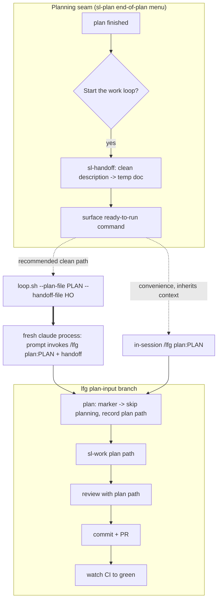

# feat: Clean plan-to-work handoff for the implementation autopilot

## Summary

Give the implementation autopilot a plan-shaped entry point and a clean seam handoff. `lfg` and `loop.sh` gain an explicit "execute this plan" mode (`/lfg plan:<path>`, `loop.sh --plan-file <path>`) that skips planning and runs the existing work → review → commit → PR → CI-to-green pipeline. A new self-contained `sl-handoff` skill compacts a planning session into a clean description, and `sl-plan`'s end-of-plan menu offers to start the work loop — producing the handoff and surfacing the ready-to-run command. Both triggers converge on one `lfg` plan-input branch; `loop.sh`'s fresh process delivers the clean context.

---

## Problem Frame

Super-looper is used in two phases — interactive planning, then unattended implementation — but the autopilot has no plan-shaped entry: `lfg` always runs `sl-plan` first, and passing a plan path routes into `sl-plan`'s interactive deepen flow, which stalls hands-off execution. Separately, when implementation runs in the same session that produced the plan, it inherits the entire planning dialogue instead of being driven by the plan. See `origin` for full motivation and requirements.

---

## Key Technical Decisions

- KTD1. **Both triggers converge on one `lfg` plan-input branch.** `/lfg plan:<path>` and the `loop.sh` driver drive one `lfg` plan-input branch, not parallel code paths. The branch must recognize the `plan:<path>` marker however it arrives — a slash argument in-session, or named in the driving prompt `loop.sh`'s headless `claude -p` run uses. The precise headless trigger form (inline instruction vs. a `/lfg` slash invocation) is the same execution-time unknown `loop.sh` already documents (`scripts/loop.sh:50-51`, `scripts/loop.example.env`); U3 pins it with a live smoke rather than assuming it works.
- KTD2. **Handoff at the seam, not `lfg` self-clearing.** `lfg` runs every step in one conversation context and has no mid-run `/clear` primitive (`plugins/super-looper/skills/lfg/SKILL.md`). The handoff is produced before the autopilot starts; `loop.sh`'s fresh process is the guaranteed-clean path.
- KTD3. **`sl-handoff` is a self-contained super-looper skill.** It cannot depend on the personal `~/.agents/skills/handoff/` skill, which does not ship with the plugin. `sl-handoff` mirrors that skill's compact-and-reference shape (write a temp doc, reference artifacts by path, name the next skill).
- KTD4. **R10 ownership split.** `loop.sh` validates the plan path is present and readable (fail fast `EX_USAGE`); the plan-shape check (is it actually a plan doc) is **net-new in the `lfg` plan-input branch** and must be a hard gate *before* `sl-work` is invoked. `sl-work` does not reject non-plan files today — Phase 0 reads frontmatter only to detect `execution: knowledge-work` and otherwise routes any existing file into the code lifecycle, so a non-plan file would fail confusingly deep instead of erroring early. The shell does the cheap existence check; the `lfg` branch owns the shape gate.
- KTD5. **The unattended path depends on a separate `sl-work` unattended-mode fix.** `sl-work` asks a clarifying question (`sl-work/SKILL.md:58`) and a branch-choice question (`:87`) unconditionally; it has no pipeline / `disable-model-invocation` carve-out, and `lfg` invokes it bare, so a headless run stalls (a pre-existing gap on the description-mode path too). The fix is net-new unattended-mode handling in `sl-work` that `lfg` signals — **split to a separate plan/PR** (see Scope Boundaries) to keep this plan scoped to the plan-input and handoff surfaces. Until it lands, the fully-unattended `loop.sh --plan-file` path stalls at `sl-work`'s prompts; the in-session `/lfg plan:` and seam-offer paths are unaffected.
- KTD6. **The seam-offer surfaces the ready-to-run `loop.sh` command** (clean path) and names in-session `/lfg plan:` as a best-effort convenience — it does not auto-spawn a background `loop.sh` process from the interactive session. Keeps the human in control of launching the unattended run (consistent with the loop-fork model).
- KTD7. **Handoff reaches a fresh run via `loop.sh --handoff-file`** (optional, valid only with `--plan-file`): the seam-offer's compacted description rides along into the clean process. In-session `/lfg plan:` already has the context (dirty) and takes no handoff argument.

---

## High-Level Technical Design

Two entry paths converge on one `lfg` plan-input branch; the clean context comes from the seam handoff (in-session) or the fresh process (`loop.sh`).

---

## Requirements

Carried from `origin`. Grouped by concern; R-IDs continuous.

### Plan-input trigger
- R1. `loop.sh` accepts `--plan-file <path>`, mutually exclusive with `--seed` / `--seed-file`.
- R2. `/lfg` accepts a `plan:<path>` marker naming a plan to execute.
- R3. A supplied plan skips planning and is executed.

### Implementation pipeline (preserved)
- R4. After the plan is supplied, the existing pipeline runs unchanged.
- R5. The supplied plan feeds the code-review requirements-completeness check.

### Handoff (sl-handoff + seam)
- R6. A new `sl-handoff` skill compacts the planning session into a clean description, referencing the plan by path and naming the next skill.
- R7. The handoff is produced at the seam, before the autopilot starts; the autopilot is initiated with the plan plus the handoff.
- R8. `sl-plan`'s end-of-plan menu offers to start the work loop, running `sl-handoff` and surfacing the launch command.
- R9. `loop.sh --plan-file` runs clean by construction and carries the handoff; in-session `/lfg plan:` is best-effort, with `loop.sh`/fresh session as the guaranteed-clean path.

### Error handling
- R10. A missing, unreadable, or non-plan plan path stops the autopilot with a clear error; no silent fallback to planning.

---

## Implementation Units

### U1. `sl-handoff` skill

- **Goal:** A self-contained super-looper skill that compacts the current session into a clean handoff description for a fresh agent.
- **Requirements:** R6.
- **Dependencies:** none.
- **Files:** `plugins/super-looper/skills/sl-handoff/SKILL.md` (new); `plugins/super-looper/README.md` (add to Workflow skills table + bump skill count).
- **Approach:** Mirror the personal handoff's contract (`~/.agents/skills/handoff/SKILL.md`): write the handoff to an OS temp path (`mktemp -t handoff-XXXXXX.md` per repo scratch convention), summarize the session so a fresh agent can continue, reference existing artifacts (the plan, brainstorm, ADRs) by path rather than duplicating, and name the next skill (`lfg`). Accept an optional focus argument (what the next session will do) like the personal skill. Frontmatter `name: sl-handoff`, `description:` covering what/when. Follow the `sl-` prefix rule and self-contained-file rule (no references outside its own dir).
- **Patterns to follow:** the personal handoff skill's body; existing `sl-*` skill frontmatter; the scratch-space convention in `AGENTS.md` (OS temp default).
- **Test scenarios:** `Test expectation: none -- behavioral skill prose.` Validate via the `skill-creator` eval workflow with scenarios: (a) given a planning session, produces a handoff doc at a temp path that references the plan by path and does not duplicate its content; (b) names `lfg` as the recommended next skill; (c) with a focus argument, tailors the description to it.
- **Verification:** The skill exists, is `sl-`-prefixed, passes `bun run release:validate` (skill count/tables consistent), and a skill-creator eval produces a temp handoff doc matching the scenarios above.

### U2. `lfg` plan-input branch

- **Goal:** `lfg` recognizes `plan:<path>`, skips planning, and routes to `sl-work` against that plan.
- **Requirements:** R2, R3, R4, R5, R10 (plan-shape half), KTD1, KTD4.
- **Dependencies:** the separate `sl-work` unattended-mode fix (see Scope Boundaries / KTD5) for the suppression signal `lfg` passes.
- **Files:** `plugins/super-looper/skills/lfg/SKILL.md`.
- **Approach:** Add a branch that *replaces* step 1 (`lfg/SKILL.md:11-13`) in plan-input mode, **including its GATE**: recognize the `plan:` marker however it arrives — a slash argument in-session, or named in the driving prompt `loop.sh` uses (KTD1; same literal-prefix convention as `sl-code-review`'s `plan:<path>`). Strip it, resolve the path, and verify it is a plan doc (exists; has plan frontmatter / `## Implementation Units`) as a hard gate. On success, record the plan path (the same variable step 4 consumes for the `plan:<path>` review argument) and go straight to step 2 with `sl-work <plan-path>` — do **not** run the step-1 GATE's `invoke sl-plan again` clause. On a missing, unreadable, or non-plan path, stop with a clear error — never fall through to the GATE or to planning (R10). Pass the unattended-mode signal into the `sl-work` invocation so its prompts are suppressed once the separate `sl-work` fix lands (KTD5). Steps 2-10 are unchanged.
- **Patterns to follow:** the `plan:<path>` marker already parsed for `sl-code-review` (`lfg/SKILL.md:25`); `sl-plan` Phase 0.0 token-parsing convention (literal-prefix strip); `sl-work` Phase 0 input triage that reads a plan-path argument (`sl-work/SKILL.md:21-25`).
- **Test scenarios:** `Test expectation: none -- behavioral skill prose.` skill-creator eval: (a) `plan:<valid-plan-path>` skips planning and invokes `sl-work` with the path; (b) the recorded plan path reaches the step-4 review; (c) a missing/unreadable path stops with a clear error and never invokes `sl-plan`; (d) an existing-but-non-plan file (e.g., a README) is rejected by the plan-shape gate with a clear error before any `sl-work` invocation; (e) `sl-work` does not stall on interactive prompts under plan-input mode (relies on the deferred `sl-work` unattended-mode fix — see Scope Boundaries).
- **Verification:** skill-creator eval confirms the four scenarios; no regression to the description-mode path (a bare description still runs `sl-plan` first).

### U3. `loop.sh --plan-file` and `--handoff-file`

- **Goal:** `loop.sh` accepts a plan to execute and an optional handoff to carry, building a plan-mode prompt that drives `lfg`'s plan-input branch.
- **Requirements:** R1, R7, R9, R10 (existence half), KTD1, KTD6, KTD7.
- **Dependencies:** U2 (the `plan:<path>` marker contract — both must agree on how the branch detects the marker).
- **Files:** `scripts/loop.sh`; `tests/loop-driver.test.ts`; `docs/loop-driver-acceptance.md` (extend the smoke).
- **Approach:** Add `--plan-file <path>` and `--handoff-file <path>` to the arg-parsing `case` loop (`loop.sh:106-119`) with `require_val`; add defaults near `:56-58`. Extend the mutual-exclusion check (`:148-152`) so `--plan-file` is exclusive with `--seed`/`--seed-file`, and `--handoff-file` is valid only with `--plan-file`. Validate the plan path exists and is readable near the seed-file check (`:185`), failing `EX_USAGE` with a clear message (R10 existence half). When in plan mode, construct a distinct plan-mode prompt — built in the **proven inline-instruction style** of the existing `LOOP_PROMPT_PREFIX` (`:53`), not assuming a `/lfg` slash command fires from `claude -p` — that names the plan at `<plan-path>` in the form U2's branch is specified to detect (KTD1), appending the `--handoff-file` content as orienting context when present, instead of inlining the input as a task (`:190-191`). Surface plan mode + the plan path in `--dry-run` output (`:246-282`). Update the `usage()` heredoc (`:70-94`). Because the headless trigger form is the repo's documented execution-time unknown, do not declare the path proven on `bun test` alone (those tests assert the constructed prompt, not routing) — extend `docs/loop-driver-acceptance.md` with a live smoke that proves a plan-mode run routes into `lfg`'s plan-input branch (skips planning) rather than description-mode planning.
- **Patterns to follow:** the existing `--seed`/`--seed-file` parse + `require_val` + mutual-exclusion pattern; the existing `PROMPT` construction and `--dry-run` assertions.
- **Test scenarios:**
  - Happy: `--plan-file <path>` with `--dry-run` → constructed prompt names the plan at `<path>` in plan-mode form and does not inline the plan as a task.
  - Edge: `--plan-file` with no value → `EX_USAGE`. `--handoff-file <h>` with `--dry-run` → handoff content present in the prompt.
  - Error: `--plan-file` + `--seed` (and + `--seed-file`) → `EX_USAGE` "mutually exclusive". `--handoff-file` without `--plan-file` → `EX_USAGE`. `--plan-file` pointing at a missing/unreadable path → `EX_USAGE` clear error (R10).
  - Routing (live smoke, not `bun test`): a plan-mode run routes into `lfg`'s plan-input branch and skips planning — `bun test` asserts the constructed prompt only; routing is pinned in `docs/loop-driver-acceptance.md`.
- **Verification:** `bun test tests/loop-driver.test.ts` green; `--dry-run` shows plan mode; mutual-exclusion and missing-path errors exit 2.

### U4. `loop.sh` docs and env mirror sync

- **Goal:** Keep the loop-driver flag docs and the prompt mirror consistent with U3.
- **Requirements:** R1 (documentation surface), KTD6.
- **Dependencies:** U3.
- **Files:** `docs/loop-driver.md` (flags table; usage); `scripts/loop.example.env` (prompt mirror note).
- **Approach:** Add `--plan-file` and `--handoff-file` to the `docs/loop-driver.md` flags table and any usage block; document plan mode and that it skips planning. If the plan-mode prompt form is added to `LOOP_PROMPT_PREFIX`, update the mirror note in `scripts/loop.example.env` (`:19-21`). Do not alter the exit-code contract.
- **Patterns to follow:** existing flags table and exit-code table in `docs/loop-driver.md`; the mirror note in `loop.example.env`.
- **Test scenarios:** `Test expectation: none -- docs/config sync.` Optional: extend `tests/loop-driver.test.ts` to assert `usage()`/help output contains `--plan-file`.
- **Verification:** Docs flags table lists the new flags; `loop.example.env` mirror matches `loop.sh`; no exit-code drift.

### U5. `sl-plan` seam-offer

- **Goal:** `sl-plan`'s end-of-plan menu offers to start the work loop, producing the handoff and surfacing the launch command.
- **Requirements:** R6, R7, R8, KTD2, KTD6.
- **Dependencies:** U1 (`sl-handoff`). Flag shape from U3 (the option surfaces a command string; U3 need not merge first).
- **Files:** `plugins/super-looper/skills/sl-plan/references/plan-handoff.md` (the post-generation menu lives here) and a stub in `plugins/super-looper/skills/sl-plan/SKILL.md` if needed.
- **Approach:** Add a menu option "Start the work loop (`lfg`)" to the post-generation handoff menu. On selection: load `sl-handoff` to produce the clean handoff doc, then surface the ready-to-run `loop.sh --plan-file <plan> --handoff-file <handoff>` command as the clean path — naming the flags the operator must still supply (`--target`, and `--verify-cmd` for repos without a remote, per `loop.sh:285-287`) — and name in-session `/lfg plan:<plan>` as the best-effort convenience, stating its cost concretely at the decision point ("runs in this session's accumulated context — use the `loop.sh` command for a clean run"), not only in docs (KTD6). Do not auto-spawn a process. The menu is already at the 5-option overflow cap that renders as a numbered list; decide the new option's shape relative to the existing recommended "Start `/sl-work`" (both start implementation) — distinct option vs. a sub-choice — rather than blindly adding a sixth. The option renders only in interactive runs: 5.4's pipeline gate already skips the whole menu under LFG/`disable-model-invocation`, so no new pipeline rule is needed and eval scenarios target interactive sessions only.
- **Patterns to follow:** the existing post-generation menu and its routing in `references/plan-handoff.md`; the existing "Start `/sl-work`" option's invocation shape.
- **Test scenarios:** `Test expectation: none -- behavioral skill prose.` skill-creator eval: (a) the menu includes "Start the work loop (lfg)"; (b) selecting it runs `sl-handoff` and surfaces the `loop.sh --plan-file ... --handoff-file ...` command; (c) it names in-session `/lfg plan:` as the convenience path; (d) it does not spawn a background process.
- **Verification:** skill-creator eval confirms the option, the handoff invocation, and the surfaced command.

---

## Scope Boundaries

### Deferred to Follow-Up Work
- Resuming an unfinished/crashed loop from its existing plan.
- Reusing one plan across multiple targets or repeated runs.
- A truly clean in-session `/lfg plan:` (would require forking the work phase into a subagent — out of scope; `loop.sh` is the clean path).
- `sl-work` unattended mode — a pipeline / `disable-model-invocation` carve-out so `sl-work` skips its clarifying (`:58`) and branch-choice (`:87`) prompts under automation, with `lfg` passing the signal. Net-new `sl-work` work, split to a separate plan/PR. **Prerequisite for the fully-unattended `loop.sh --plan-file` path** — until it lands, an unattended plan-run stalls at `sl-work`'s prompts (a pre-existing gap, not introduced here).

### Outside this feature
- Auto-detection of plan paths (explicit trigger only).
- Any change to `sl-plan`'s interactive deepen flow.
- Accepting a requirements/brainstorm doc as autopilot input (plan docs only).

---

## Risks & Dependencies

- **Plugin caching.** `lfg`, `sl-plan`, and `sl-handoff` are behavioral skill-prose changes that cache at session start — validate via the `skill-creator` eval workflow, not by re-invoking the skill in the same session (`AGENTS.md` "Validating Agent and Skill Changes"). `loop.sh` and its tests are mechanical and run current source.
- **Open PR #7 overlap.** The root `README.md` `lfg`/Workflow section is being changed in open PR #7 (`docs/readme-lfg-loop-principle`). This plan does not touch root `README.md`; any root-README mention of plan-input mode should land after #7 merges to avoid a conflict.
- **release:validate.** Adding `sl-handoff` changes the skill count and Workflow table — run `bun run release:validate` and update `plugins/super-looper/README.md` (and `plugin.json` description if it carries counts). Do not hand-bump release-owned versions.
- **Docs/env sync (U4).** `loop.sh` flags, `docs/loop-driver.md`, and `scripts/loop.example.env` must stay in sync; the exit-code contract must not drift.
- **In-session cleanliness is best-effort.** `/lfg plan:` inherits the current session; this is a documented limitation, not a bug. U5 must make this cost visible at the menu decision point, not only in docs.
- **Untracked plan deleted on retry.** `loop.sh`'s `reset_target` runs `git clean -fd` on a re-attempt (`scripts/loop.sh:324-330`), which would delete an untracked plan in the target before the next try. The supplied plan must be committed in the target so it survives reset (resolves the prior open question).
- **Blocking dependency: `sl-work` unattended mode.** The fully-unattended `loop.sh --plan-file` path is blocked until the separate `sl-work` unattended-mode fix lands (deferred — see Scope Boundaries / KTD5); without it the run stalls at `sl-work`'s prompts. Sequence that fix before relying on hands-off `loop.sh` runs. The interactive `/lfg plan:` and seam-offer paths do not depend on it.
- **Thin handoff value in cold `loop.sh` runs.** A `loop.sh` run is a fresh process with no session to compact, so `--handoff-file` mainly carries planning-chat context that is not already in the plan doc. If the plan is self-sufficient, the marginal value is low — U1/U3 should state what the handoff adds beyond the plan-by-path, or scope `--handoff-file` to the seam path.

---

## Open Questions

### Deferred to Implementation
- Exact wording of the plan-mode `loop.sh` prompt and the `lfg` plan-input branch copy (tuned during implementation against a skill-creator eval and the routing smoke).
- The new option's shape in the post-generation menu (distinct option vs. sub-choice under "Start `/sl-work`") — a menu-design call resolved during U5 implementation.

---

## Sources / Research

- `lfg` invokes every step via the Skill tool in one context; no forks, no `/clear` — `plugins/super-looper/skills/lfg/SKILL.md` (steps 1-10). Basis for KTD2.
- `sl-work` already accepts a plan-doc path — `plugins/super-looper/skills/sl-work/SKILL.md:4`, Phase 0 triage `:21-25`. The execution target for U2.
- `loop.sh` arg-parsing (`scripts/loop.sh:106-119`), mutual-exclusion (`:148-152`), seed-file inlining (`:186`), prompt prefix (`:53`), dry-run (`:246-282`), usage (`:70-94`). Integration points for U3.
- `tests/loop-driver.test.ts` stub-based patterns; mutual-exclusion test at `:582-591`, dry-run block `:216-285`. Coverage model for U3.
- Personal handoff contract — `~/.agents/skills/handoff/SKILL.md` (not shippable; basis for U1/KTD3).
- `docs/loop-driver.md` flags + exit-code tables; `scripts/loop.example.env` prompt mirror. Sync surface for U4.
- `STRATEGY.md` "Loop autonomy" and "Plan integrity" tracks — the feature serves both.
