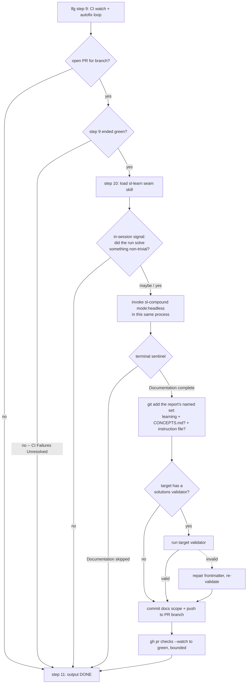

# feat: Autopilot learning capture seam

## Summary

Add a ship-time "learn" seam to the autopilot. When an `lfg` run (interactive `/lfg` or unattended `scripts/loop.sh`) solves a non-trivial problem, a new seam skill (`sl-learn`) runs `sl-compound` headless against the still-hot run context and commits the resulting learning into the run's PR. This closes the strategy's `… → review → learn → ship` loop on the produce side, so learnings stop being dropped whenever no human is present to run `/sl-compound`.

---

## Problem Frame

The autopilot consumes learnings (`sl-learnings-researcher` reads `docs/solutions/` during plan and review) but never produces them: neither `lfg` (steps 1-10) nor `sl-work` invokes `sl-compound`. `STRATEGY.md` names this exact gap — "learnings only get captured if done manually — so the same issues get repeated" — and the Learning-system track calls for *automatic* capture.

The gap is most acute for unattended `loop.sh` runs: a cold `claude -p` process executes one task and exits at `<promise>DONE</promise>`, with no human and no next cycle to capture what it learned. The CI-autofix loop (`lfg` step 9), where a failure is diagnosed and repaired, is a textbook learning source that currently evaporates at `DONE`.

Two facts from repo research reshape the brainstorm's framing and are carried into the decisions below:

- `lfg` does **not** currently invoke `sl-handoff` or any ship-time seam — the handoff seam is loaded by `sl-plan`'s post-generation menu. "Mirror `sl-handoff`" means mirror its thin single-file *structure*; the autopilot trigger point is net-new.
- The `docs/solutions/` schema validator (`scripts/solutions/validate-frontmatter.ts`) gates **this** repo's CI, not arbitrary targets. `loop.sh` never runs this repo's gate scripts against a throwaway target (loop-driver-acceptance.md:17-25), so a schema-invalid learning only breaks CI when `/lfg` runs *inside* a validator-adopting repo (this repo, or a fork) — the dogfood case.

---

## Requirements

Carried from the origin brainstorm (see origin: `docs/brainstorms/2026-06-18-autopilot-learning-capture-requirements.md`).

### Trigger and selectivity
- R1. The autopilot captures a learning only when the run solved a non-trivial problem — a CI-autofix cycle, a debugging detour, or a review-finding fix. A run that shipped a feature without solving anything noteworthy captures nothing.
- R2. Capture reuses `sl-compound`'s own preconditions (problem solved, verified, non-trivial) as the quality gate. The autopilot supplies the signal that a qualifying problem occurred; `sl-compound` headless makes the final keep/skip decision.

### Capture and disposition
- R3. Capture runs autonomously with no human prompt, in both interactive `/lfg` and unattended `loop.sh` runs.
- R4. The captured learning is committed into the run's PR as its own commit, so a human reviews it at PR time.
- R5. Capture performs the full headless `sl-compound` side effects — the `docs/solutions/` learning, `CONCEPTS.md` vocabulary capture, and the one-time instruction-file discoverability edit — and does not auto-run `sl-compound-refresh`.

### Placement and loop integrity
- R6. Capture is a distinct ship-time seam capability (its own skill) the autopilot triggers at the end of a run, not capture logic inlined into `lfg`'s numbered work steps.
- R7. Capture runs while the solving session's context is still available, so an unattended run never depends on a later cycle or a human to produce the learning.
- R8. The learning commit must not leave the loop's verifiable green stop unmet: it can re-trigger the target's CI, and the loop must still reach (or re-confirm) green before reporting success.

---

## High-Level Technical Design

The seam attaches at the end of an `lfg` run: after step 9's CI watch reaches green, before step 10 emits `DONE`. All capture logic lives in the `sl-learn` skill; `lfg` gains only the trigger and its skip gates. The seam runs **in the same process** as the solving session (an in-session Skill-tool call), so the hot context that makes a no-CI-failure learning (AE3) possible is still present — a fresh `claude -p` dispatch would lose it.

**Run end-state disposition** — the states the seam must handle so R8's verifiable-green stop stays honest:

| Run end-state | Seam action | Loop outcome |
| --- | --- | --- |
| Non-trivial solved, PR open, CI green | Invoke `sl-compound`; commit its outputs; re-confirm green | `DONE` on a green PR carrying the learning |
| `sl-compound` self-gates (no solved problem) | Read `Documentation skipped`; commit nothing | `DONE` on the already-green PR, unchanged |
| Plain feature ship, no qualifying signal | Skip before invoking `sl-compound` | `DONE` on the already-green PR, unchanged |
| No open PR (command-verify / no-GitHub target) | Skip capture entirely | `DONE`; verify via `--verify-cmd` as today |
| Step 9 ended red ("CI Failures Unresolved") | Do not fire (problem unverified by definition) | `DONE` on red, exits as today (`EX_DONE_RED`) |
| Learn commit re-triggers CI | Re-confirm green before `DONE` | `loop.sh`'s post-`DONE` `target_ci_green` sees green |

The seam↔`sl-compound` interface is `sl-compound`'s existing headless terminal report (sl-compound:516-543): the `Documentation complete` / `Documentation skipped` sentinel is the keep/skip signal, and the `File:`, `CONCEPTS.md:`, and `Instruction-file edit:` lines name exactly the files to stage.

---

## Key Technical Decisions

- **Seam attach point — after step 9 green, before `DONE`.** Firing after the CI-autofix loop reaches green lets the seam capture step-9 learnings (the textbook source the brainstorm names) and matches the brainstorm's "natural seam after step 9." The cost is the seam owns a re-confirm-green wait (next decision). The rejected alternative — firing before step 9's watch so the existing watch covers the learn commit — is structurally simpler for R8 but would miss every CI-autofix learning, gutting the primary use case.

- **Two-stage detection gate (R1/R2).** Stage 1 is a permissive autopilot-side signal: the seam decides whether a qualifying problem plausibly occurred using in-session signals available at end-of-run — a `fix(ci):` commit from step 9 (CI went red→green), review-fix commits from step 5, or the agent's own read of whether it solved something hairy during work (the only signal for AE3, where CI never failed) — and errs toward invoking `sl-compound` when unsure. Stage 2 is authoritative: `sl-compound`'s advisory preconditions make the final keep/skip call, surfaced as the report sentinel. This implements R2's two-part design verbatim and keeps AE3 capturable. The rejected alternative (skip stage 1, invoke `sl-compound` on every green run) is simpler but probes plain feature ships on every run.

- **Same-process invocation (R7).** The seam invokes `sl-compound` via the in-session Skill tool, never a fresh `claude -p`. The hot solving context is the input `sl-compound` needs; a fresh process would only see the diff, breaking AE3 and degrading every learning to what the PR diff alone shows.

- **Stage the report's named set, not `git add -A` (R5).** The seam parses `sl-compound`'s terminal report and stages exactly the named paths: the `File:` learning, `CONCEPTS.md` when the report says created/updated, and the instruction file when `Instruction-file edit: applied to <path>`. A blanket `git add -A` would sweep unrelated working-tree residue from earlier `lfg` steps; a learning-only commit would orphan the `CONCEPTS.md` and instruction edits, which `loop.sh`'s `reset_target` hard-reset (loop.sh:400-406) then destroys on the next retry — silently degrading R5 to learning-only.

- **Always re-confirm green; never special-case docs-only (R8).** After committing and pushing, the seam re-enters a bounded `gh pr checks --watch`-to-green wait before `lfg` emits `DONE`. The seam cannot know the target's CI `paths`/`paths-ignore` config, so it cannot assume a docs-only commit skips CI — it always re-confirms. This keeps `loop.sh`'s post-`DONE` `target_ci_green` (loop.sh:382-396, which requires ≥1 check all in `pass|skipping`) satisfiable.

- **Skip when no open PR (R4).** R4 frames capture as a commit into the run's PR, and the loop-fork model is "everything via PR." When no open PR exists (command-verify / no-GitHub targets, where `lfg` step 9 is itself skipped), the seam skips capture rather than crashing on `gh pr view` or inventing a sink. A push-to-branch fallback is deferred (see Scope Boundaries).

- **Do not fire on a step-9-red run.** When step 9 exhausted its 3 attempts and wrote "CI Failures Unresolved," `sl-compound`'s `solution_verified` precondition is unmet by definition (the problem was not solved), so a fire would only yield a `Documentation skipped` no-op while committing onto a known-red PR. The seam skips.

- **Schema-validate before commit when the target adopts a validator (R8).** `sl-compound`'s headless self-check validates parser-safety only, not schema (enum values, required fields). In a validator-adopting target (this repo / forks — the dogfood case), a schema-invalid learning passes self-check, commits, then fails the target's CI (in this repo the schema validator runs inside `bun test`, not as a standalone job), turning the PR red on the learn commit. The seam runs the target's validator before committing when one is present — in this repo, detected by the presence of `scripts/solutions/validate-frontmatter.ts` and invoked as `bun run scripts/solutions/validate-frontmatter.ts <learning-path>` (exit 1 = schema-invalid). Forks that wire a validator differently are out of scope for auto-discovery; the seam falls back to `sl-compound`'s parser-safety self-check. `loop.sh` throwaway targets have no such validator, so this is a no-op there.

- **Interactive and unattended behave identically (R3).** Both run autonomously. Interactive `/lfg` optionally echoes `sl-compound`'s one-line report to chat (the report is produced regardless); no behavioral divergence. This resolves the brainstorm's open question with its stated default.

- **The capture logic is its own skill (R6).** All gating, invocation, parsing, commit, and re-green logic lives in `sl-learn`, mirroring `sl-handoff`'s thin single-file shape (and differing only in that it writes into the repo and commits, which `sl-handoff` deliberately does not). `lfg` gains one trigger that loads the skill — capture is not inlined as a numbered work step — so the capability is independently testable.

---

## Implementation Units

### U1. Create the `sl-learn` ship-time seam skill

**Goal:** A new seam skill that performs the full capture flow end-to-end and leaves the loop's green stop intact.

**Requirements:** R1, R2, R3, R4, R5, R7, R8.

**Dependencies:** none (the skill is self-contained; `lfg` wiring is U2).

**Files:**
- `plugins/super-looper/skills/sl-learn/SKILL.md` (create)
- `tests/frontmatter.test.ts` (existing — auto-covers the new skill's `sl-` prefix, strict-YAML validity, and ≤1024-char description; no edit expected)

**Approach:** Single prose `SKILL.md`, structured as a short phase sequence:
1. **Gate (stage 1).** Decide whether a qualifying non-trivial problem plausibly occurred from in-session signals: a `fix(ci):` commit on the branch (`git log` since base = CI went red→green in step 9), step-5 review-fix commits, or the agent's own assessment of a debugging detour. Err toward proceeding. Skip-and-return when no open PR exists (`gh pr view`), or when step 9 ended red — detected by a `## CI Failures Unresolved` section in the PR body (the section `lfg` step 9 writes via `gh pr edit`).
2. **Invoke `sl-compound mode:headless`** via the Skill tool, in this same process, passing a brief context hint. Pass the `mode:headless` token so `sl-compound` runs non-interactively (its precondition gate is stage 2).
3. **Read the terminal report.** On `Documentation skipped`, return without committing. On `Documentation complete`, parse `File:`, `CONCEPTS.md:`, and `Instruction-file edit:` to build the staging set.
4. **Validate (conditional).** When the target has a `docs/solutions/` validator — in this repo, detected by the presence of `scripts/solutions/validate-frontmatter.ts` — run it on the new learning (`bun run scripts/solutions/validate-frontmatter.ts <learning-path>`; exit 1 = invalid) and repair before committing. Forks with a differently-wired validator are out of scope for auto-discovery; fall back to `sl-compound`'s parser-safety self-check.
5. **Commit and push.** Stage exactly the named set, commit with a `docs(<scope>): …` message (intent is documentation; narrow scope per repo Commit Conventions), push to the PR branch.
6. **Re-confirm green.** Bounded `gh pr checks --watch` to green before returning, so `lfg` can emit `DONE` on a verified-green PR.

Frontmatter: `name: sl-learn`; quoted `description` stating what it does and when the autopilot triggers it; `argument-hint`. **No `disable-model-invocation`** — the autopilot invokes it model-side inside a permission-bypassed headless run, and that flag would make it invisible to the trigger. Keep `allowed-tools` minimal/absent unless a pinned script is added.

**Patterns to follow:**
- `plugins/super-looper/skills/sl-handoff/SKILL.md` — thin single-file seam shape, resolve-focus → act → surface, no frontmatter flags.
- `plugins/super-looper/skills/lfg/SKILL.md:57-69, 109-115` — the existing in-autopilot `gh pr view` / `git add <named> && commit && push` mechanics to reuse for the learn commit.
- `plugins/super-looper/skills/sl-compound/SKILL.md:30-39, 516-543` — the headless mode token and terminal-report contract this seam consumes.

**Execution note:** Behavioral correctness is validated via the `skill-creator` eval workflow and the live acceptance run (U4), not an in-session typed dispatch — plugin skill content caches at session start, so same-session dispatch would test pre-edit content (AGENTS.md, "Validating Agent and Skill Changes").

**Test scenarios** (eval scenarios for `skill-creator`; the mechanical frontmatter contract is auto-covered by `tests/frontmatter.test.ts`):
- Happy path: a run with a step-9 `fix(ci):` commit and an open green PR → seam invokes `sl-compound`, which returns `Documentation complete` with a `File:` line → seam stages that file, commits, pushes, re-confirms green, returns. Covers AE1, R4.
- AE3 path: a run where a non-obvious bug was diagnosed during work and CI never failed → stage-1 signal is the agent's own assessment → `sl-compound` writes a learning → committed. Covers AE3, R7.
- Skip (gate): a plain feature ship with no qualifying signal → seam returns without invoking `sl-compound`; nothing committed. Covers AE2, R1.
- Skip (backstop): seam invokes `sl-compound`, which returns `Documentation skipped` → seam commits nothing, leaves the green PR untouched. Covers R2.
- Full side-effect set: report shows `Instruction-file edit: applied to AGENTS.md` and `CONCEPTS.md: updated` → seam stages the learning **and** `AGENTS.md` **and** `CONCEPTS.md`, not just the learning. Covers R5.
- Add-set discipline: unrelated modified files are present in the working tree → seam stages only the report's named paths, not `git add -A`. Covers R5.
- Re-green: after the learn commit, CI goes pending → seam waits via `gh pr checks --watch` until green before returning. Covers R8, AE4.
- No-PR: end-of-run with no open PR → seam skips capture and returns cleanly (no `gh pr view` crash). Covers AE5.
- Step-9-red: "CI Failures Unresolved" present → seam does not fire. Covers AE6.
- Schema validity (validator-adopting target): the generated learning is schema-invalid → seam's pre-commit validation catches it and repairs before committing, so the learn commit does not turn the PR red. Covers AE7, R8.

**Verification:** The skill exists, passes `tests/frontmatter.test.ts` and `bun run release:validate`, and a `skill-creator` eval over the scenarios above produces the expected commit/skip/re-green behavior.

### U2. Wire the learn-seam trigger into `lfg`

**Goal:** `lfg` triggers `sl-learn` at end-of-run, gated so it only fires when capture is viable.

**Requirements:** R3, R6, R8.

**Dependencies:** U1 (the skill must exist to be loaded).

**Files:**
- `plugins/super-looper/skills/lfg/SKILL.md` (modify)

**Approach:** Insert a new step between current step 9 (CI watch + autofix) and the `DONE` output: a "learn seam" step that loads the `sl-learn` skill, renumbering the `DONE` output to step 11. The step is a thin trigger — "load the `sl-learn` skill" — with the skip gates stated inline so an implementer reading `lfg` alone sees them: fire only when an open PR exists for the branch and step 9 reached green; skip when no PR or when step 9 wrote "CI Failures Unresolved." All capture/commit/re-green logic stays in the skill (R6). Keep `lfg`'s "execute every step IN ORDER" framing intact. Update the frontmatter `description` only if it enumerates the pipeline stages (it currently lists "watch CI, fix CI failures until green" — add the learn close if the enumeration is meant to be complete).

**Patterns to follow:**
- `plugins/super-looper/skills/lfg/SKILL.md:79-81` — step 9's "only when an open PR exists … detect the PR; if none, skip this step" gate is the exact shape for the seam's no-PR skip.
- `plugins/super-looper/skills/sl-plan/SKILL.md` post-generation menu — the "Load the `sl-<seam>` skill" loader phrasing for triggering a seam by name.

**Test scenarios** (eval scenarios; covered live by U4):
- Trigger fires: a green-PR run reaches the new step → `sl-learn` is loaded. Covers R6.
- No-PR skip: a run with no open PR → the seam step is skipped, `DONE` still emitted. Covers AE5.
- Step-9-red skip: "CI Failures Unresolved" written → seam step skipped, `DONE` emitted on red as before. Covers AE6.
- Ordering: `DONE` is emitted only after `sl-learn` returns (so the re-green wait precedes `DONE`). Covers R8.

**Verification:** `lfg`'s step sequence reads cleanly with the seam between step 9 and `DONE`; the skip gates are explicit; a live `loop.sh` run (U4) routes through the seam and ends with `DONE` on a green PR.

### U3. Register `sl-learn` in the plugin catalog

**Goal:** The new skill is discoverable and the release metadata stays consistent.

**Requirements:** none directly — packaging requirement so the skill ships.

**Dependencies:** U1.

**Files:**
- `plugins/super-looper/README.md` (modify — add an `sl-learn` row to the Workflow Utilities table where `sl-handoff` lives; verify the Components skill count)

**Approach:** Add the `sl-learn` row alongside `sl-handoff` in the Workflow category table. The skill count is auto-derived by `countSkillDirectories` (`src/release/metadata.ts`), but the README Components table and any count-bearing `plugin.json`/`marketplace.json` description are reconciled by `bun run release:validate` — run it and let it auto-correct description drift. Do **not** hand-bump release-owned versions or add a `CHANGELOG.md` entry (release-please owns those; see `docs/solutions/workflow/release-please-version-drift-recovery.md`).

**Test scenarios:**
- `bun run release:validate` passes with no version drift after the skill and README row are added.
- `bun test tests/frontmatter.test.ts` passes (new skill has valid frontmatter and the `sl-` prefix).

**Verification:** `bun run release:validate` and `bun test` both pass; the README Workflow Utilities table lists `sl-learn`.

### U4. Exercise and document the unattended learning-capture acceptance path

**Goal:** The loop-driver acceptance confirms the unattended path produces a valid, retrievable, committed learning, and the new run end-states are recorded as acceptance criteria.

**Requirements:** R4, R7, R8 (verified end-to-end), plus the brainstorm Success Criteria.

**Dependencies:** U1, U2.

**Files:**
- `docs/loop-driver-acceptance.md` (modify — extend the "Origin DoD — second clause" section with a learning-producing seed exercise and the new skip/re-green end-states)
- `examples/` (optional — a learning-producing seed that deliberately solves a non-trivial problem; the existing `examples/loop-seed.md` isPalindrome seed does not write a learning)

**Approach:** The "Origin DoD — second clause" (loop-driver-acceptance.md:126-133) already anticipates a loop run writing a `docs/solutions/` learning but notes the isPalindrome seed does not exercise it. Specify the learning-producing exercise: a seed (or `--plan-file` plan) whose work involves a CI-autofix or debugging detour, run via `loop.sh`, then confirm the learning is committed into the PR, validates against the schema, and is retrievable by a later run's grep-over-frontmatter. Record the no-PR skip and step-9-red skip as expected outcomes so the acceptance doc captures the full disposition table.

**Execution note:** This is the live, operator-driven verification path — the same posture as the existing acceptance doc's "PENDING — to be completed by the operator's live run." The build delivers the documented exercise; the green check is the operator's run.

**Test scenarios:**
- Learning-producing seed → `loop.sh` run → an open PR carries a schema-valid `docs/solutions/` learning commit, and `loop.sh` exits 0 with `target_ci_green`. Covers AE1, R4, R8.
- The committed learning is retrievable by a subsequent run's `sl-learnings-researcher` grep-over-frontmatter. Covers the "retrievable by a later run" Success Criterion.

**Verification:** `docs/loop-driver-acceptance.md` documents the learning-producing exercise and the new end-states; an operator run produces a green PR with a committed, schema-valid, retrievable learning.

---

## Acceptance Examples

Carried from origin (AE1-AE4); AE5-AE7 cover new end-state scenarios (no-PR, step-9-red, validator failure) the flow analysis surfaced as uncovered. Requirement coverage spans both these examples (which gate R1, R4, R7, R8) and the per-unit test scenarios, which verify R2, R3, R5, and R6 directly.

- AE1. **Covers R1, R4.** Given an unattended run whose CI went red and was repaired in the autofix loop, when the run finishes, then a `docs/solutions/` learning describing the symptom, root cause, and fix is committed into the PR.
- AE2. **Covers R1.** Given a run that implemented a planned feature with no failed attempt, no CI failure, and no notable debugging, when the run finishes, then no learning is written.
- AE3. **Covers R1, R7.** Given a run where a non-obvious bug was diagnosed during the work phase, when the run finishes, then a learning is captured even though CI never failed.
- AE4. **Covers R8.** Given a learning committed after CI was green, when the loop reports success, then the reported success still reflects a verified-green target rather than a run left with CI pending on the learn commit.
- AE5. **Covers R4.** Given a run that finishes with no open PR (a command-verify or no-GitHub target), when the run finishes, then capture is skipped and the run completes its existing verification path unchanged.
- AE6. **Covers R8.** Given a run where step 9 exhausted its fix attempts and wrote "CI Failures Unresolved," when the run finishes, then the seam does not fire and the run exits on its red state as before.
- AE7. **Covers R8.** Given a validator-adopting target and a generated learning that would be schema-invalid, when the seam runs, then the learning is validated and repaired before the commit so the commit does not turn the PR red.

---

## Scope Boundaries

### Deferred to follow-up work
- A push-to-branch fallback sink so command-verify / no-GitHub runs (no open PR) also retain their learnings. The default skips capture in that case; a fallback would mirror `lfg` step 6's no-PR file sink and is a larger unit.
- A dedicated learning-producing example seed in `examples/`, if the acceptance exercise can reuse an existing plan rather than ship a new fixture.

### Deferred (adjacent, its own brainstorm)
- The "what's next" reflect / refresh / route cycle-boundary workflow: consume accumulated learnings, refresh stale docs (`sl-compound-refresh`), and feed the next ideate. Complementary to capture; lives near `sl-strategy` / `sl-ideate`, not `lfg`.

### Out of scope
- Standalone `/sl-work` capture — an interactive user can run `/sl-compound` themselves; the learn close belongs to the full loop.
- A chain-of-runs meta-loop (what pre-loop capture would require for unattended runs).
- Changing `sl-compound`'s preconditions, capture template, or headless behavior; auto-running `sl-compound-refresh` from the loop.

---

## Risks & Dependencies

- **R8 re-trigger race (primary risk).** A learn commit pushed after step 9's green-break has no CI watcher unless the seam re-confirms green before `DONE`. `loop.sh` does not watch CI mid-run; it evaluates `target_ci_green` once after `DONE` (loop.sh:505-513). If `lfg` emits `DONE` before the learn commit's CI settles, the run reports `DONE`-but-red (`EX_DONE_RED`) despite succeeding. Mitigation: the seam's bounded re-confirm-green wait (U1 step 6) precedes `DONE` (U2 ordering).
- **Schema-validity gap.** `sl-compound`'s headless self-check is parser-safety only. In validator-adopting targets the seam's pre-commit validation (U1 step 4) is the guard; in throwaway targets there is no validator and the risk does not apply.
- **Detection non-determinism.** The AE3 signal (a bug solved with no CI failure) is inherently a judgment the in-session agent makes, not a mechanical flag. `sl-compound`'s advisory gate is the backstop that prevents both over- and under-capture from this stage being load-bearing alone.
- **`CONCEPTS.md` appears in the PR diff.** A headless `sl-compound` run may accrete `CONCEPTS.md` vocabulary as a side effect; that change lands in the PR diff intentionally (R5), not as a surprise — reviewers should expect it.
- **Dependency: `sl-compound` is model-invocable.** It carries no `disable-model-invocation` (sl-compound:1-5), so the autopilot can invoke it via the Skill tool inside a headless `claude -p` run. The new `sl-learn` skill must likewise carry no such flag.
- **Session-start caching.** Behavioral changes to `sl-learn` and the `lfg` trigger are validated via `skill-creator` eval and the live acceptance run, not same-session dispatch (AGENTS.md).

---

## Open Questions

Resolved during planning; recorded here only where an implementation-time check could still shift the choice.

- The exact bound on the re-confirm-green wait (a watch-to-green vs. a capped poll) — settle against the target's typical CI latency during U1, mirroring step 9's `gh pr checks --watch`.
- Whether `docs/skills/sl-learn.md` is warranted — a deliberate call at U3, not reflexive; the seam is novel enough that a doc may help, but the README row is the floor.

---

## Sources / Research

- `STRATEGY.md` — target problem ("learnings only get captured if done manually"), the `… → review → learn → ship` approach, the Learning-system track, the "Learning reuse" metric.
- `plugins/super-looper/skills/lfg/SKILL.md` — steps 1-10; step 9 (CI watch + autofix, lines 79-128) and step 10 (`DONE`, line 130) bracket the seam attach point; step 6/9 commit-and-push mechanics (lines 57-69, 109-115).
- `plugins/super-looper/skills/sl-compound/SKILL.md` — headless mode token (lines 30-39), advisory preconditions (lines 462-474), terminal report contract (lines 516-543).
- `plugins/super-looper/skills/sl-handoff/SKILL.md` — the thin seam-skill structural model R6 mirrors.
- `scripts/loop.sh` — `target_ci_green` (lines 382-396), `reset_target` hard-reset (lines 400-406), `detect_done` (lines 411-418), post-`DONE` verification (lines 505-513).
- `docs/loop-driver-acceptance.md` — "Origin DoD — second clause" (lines 126-133) pre-specifies the learning validity + retrievability acceptance check; isolation invariant (lines 17-25) confirms this repo's gate scripts never run against a target.
- `docs/solutions/developer-experience/git-untracked-empty-dirs-break-ci.md` — the `docs/solutions/` frontmatter validator gates CI; a learning must carry valid frontmatter for its track.
- `docs/solutions/workflow/release-please-version-drift-recovery.md` — do not hand-bump release-owned versions when registering the new skill; run `bun run release:validate`.
- `CONCEPTS.md` — Pipeline closes "by capturing what was learned"; Learning as the unit of compounded knowledge; Track (bug vs knowledge) determines required frontmatter fields.
