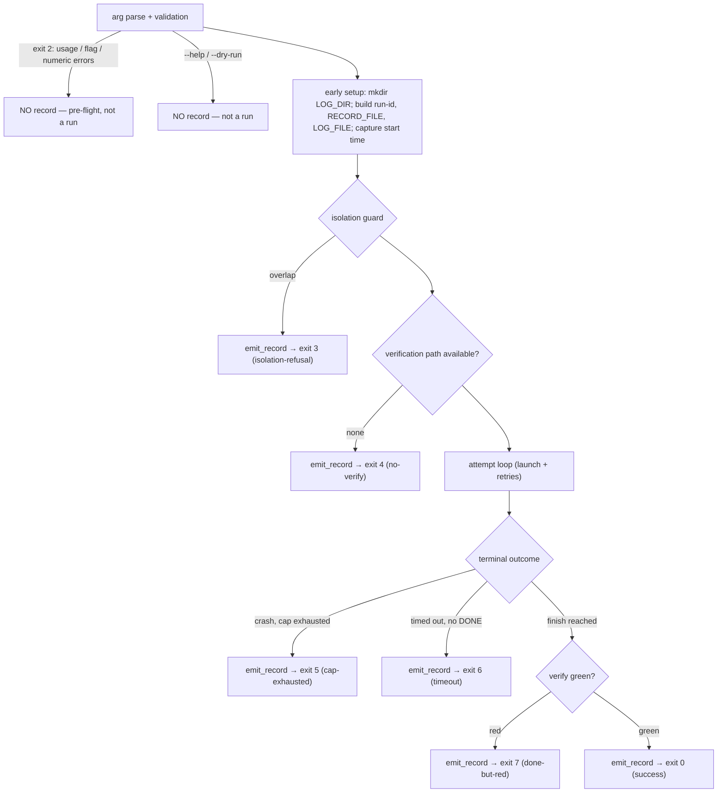

# feat: Loop run-record — structured per-run artifact

## Summary

Add a single structured JSON record that `scripts/loop.sh` writes once per run, paired with the transcript log under `--log-dir`. The record formalizes the per-attempt state the driver already computes — outcome, timing, verification, typed exit-code failure, route, PR URL — plus a coverage-boundary field, a schema version, and pointers (not copies) to the transcript, PR, and residual findings. It is the queryable substrate later features read; no consumer is built here.

---

## Problem Frame

When an unattended `lfg` run finishes, `loop.sh` leaves only an exit code (0–7) and a free-text transcript at `/tmp/super-looper/loop/loop-*.log`. The driver computes rich per-attempt state (`attempt`, `done_reached`, `timed_out`, `routed_via_pr`, `verify_green`, `route`, `url`) but renders it as `echo` strings and discards the structure at exit.

Two costs follow. The run leaves no queryable residue — three of `STRATEGY.md`'s four key metrics are "to define," and unattended-completion rate names "loop logs / PR metadata" as its source with no structured sink. And every consumer that wants to reason about a run (failure routing, learning capture) must re-parse a transcript or work from session context that is gone the moment the run ends. The missing piece is the artifact, not any single consumer.

---

## Requirements

Traced from origin (`docs/brainstorms/2026-06-18-loop-run-record-requirements.md`).

**Record contents**

- R1. The driver emits one structured, machine-readable record per run, alongside the transcript log and exit code.
- R2. The record captures the driver-observable outcome: attempt count and per-attempt result, timing, verification result, typed failure (exit-code class), route (`DONE` vs crash-reconciled open-PR), and PR URL when one exists.
- R3. The record carries pointers — not copies — to the transcript log, the residual-review-findings file when `lfg` wrote one, and the PR.
- R4. The record includes a stable run-id usable as a join key by a future agent-contributed phase trace.

**Emission and lifecycle**

- R5. The record is written on every run that launches, across the terminal failure paths (cap exhausted, timeout, DONE-but-red, no-verify, isolation refusal) — not only on success.
- R6. The record is written to a stable, discoverable path paired with the run's transcript log.

**Integrity and evolution**

- R7. The record declares its own coverage boundary as a first-class field — what it indexes by pointer versus what it does not contain — so a partial record cannot be mistaken for a complete one.
- R8. The record carries a schema version so consumers can detect format changes.

**Observability contract**

- R9. The loop-driver test suite asserts the record's presence and key fields across representative terminal paths (today the tests assert only exit code and stdout/stderr text).

---

## Key Technical Decisions

- KTD1. **Single `emit_record` helper, called at each terminal exit site.** R5's must-emit set spans pre-launch refusals (isolation, no-verify) and post-launch terminal paths (cap, timeout, DONE-but-red, success). One helper that serializes current driver state, invoked at each site with the site's exit-code/typed-failure, is the minimal shape that covers all of them without duplicating serialization.

- KTD2. **Record path is a sibling of the transcript log, same stem, `.json` extension.** The transcript is `$LOG_DIR/loop-<ts>-<pid>.log`; the record is `$LOG_DIR/loop-<ts>-<pid>.json`. One `--log-dir` flag governs both (the origin's default lean), and the shared stem makes each discoverable from the other. The run-id (R4) reuses that stem (`loop-<ts>-<pid>`), already unique per run.

- KTD3. **Emission boundary = operational terminal paths only.** Emit for exit 0, 3, 4, 5, 6, 7. Do *not* emit for the pre-flight usage/argument family (exit 2), `--help`, or `--dry-run` — those are input validation or inspection, not runs, and recording them would pollute the substrate with non-runs. This resolves the origin's open question on pre-launch errors. Consequence: `LOG_DIR` creation and record-path construction move ahead of the isolation guard so a refused run can still write its record (today `mkdir -p "$LOG_DIR"` happens after the isolation and no-verify exits).

- KTD4. **Hand-built JSON, no `jq` dependency; seed/task text is never copied in.** `jq` is not a repo dependency and adding one for this is unwarranted; the fields are controlled (exit codes, counts, constructed paths, a `gh`-supplied URL, timestamps). A small `json_escape` helper covers the few string fields. Per "index, don't inline," the seed/task text stays in the transcript and is referenced by pointer, not serialized — which also keeps the one injection-risk field out of the record.

- KTD5. **`typed_failure` maps from the exit-code constants**, not from transcript text or the `DONE` sentinel (`DONE` is a routing signal, not success):

  | Exit | `typed_failure` | `outcome` |
  |---|---|---|
  | `EX_OK` (0) | `null` | `success` |
  | `EX_ISOLATION` (3) | `isolation-refusal` | `failure` |
  | `EX_NO_VERIFY` (4) | `no-verify` | `failure` |
  | `EX_CAP` (5) | `cap-exhausted` | `failure` |
  | `EX_TIMEOUT` (6) | `timeout` | `failure` |
  | `EX_DONE_RED` (7) | `done-but-red` | `failure` |

- KTD6. **Residual-findings pointer is best-effort.** In the common open-PR path `lfg` appends residual findings to the PR body (no standalone file), so that detail is reachable via `pr_url`. A standalone on-disk residual pointer is resolved best-effort (and is often `null`, since the no-PR fallback file lives in the target and may be reset on retry). The coverage-boundary field states this rather than implying a guaranteed file.

- KTD7. **`coverage_boundary` and `schema_version` are first-class fields.** They encode the record's own incompleteness — what is reachable only by pointer versus absent — so the repo's headline learning ("a record covering some of the state is more dangerous than none — partial reads as complete") cannot recur here. `schema_version` is the low-cost hedge for the first consumer landing while no consumer exists yet.

---

## High-Level Technical Design

### Emission control flow

Where `emit_record` fires (and where it deliberately does not) across the driver's exit paths. The early-setup step is the control-flow change KTD3 requires.



### Record schema (directional, not implementation spec)

Illustrates field shape and the coverage-boundary contract. Exact key ordering and serialization are an implementation detail; the test contract (U3) pins the load-bearing fields.

```json
{
  "schema_version": 1,
  "run_id": "loop-20260619-143022-12345",
  "outcome": "success",
  "exit_code": 0,
  "typed_failure": null,
  "route": "DONE",
  "verification": { "mode": "github", "result": "green" },
  "attempts": {
    "count": 1,
    "done_reached": true,
    "timed_out": false,
    "routed_via_pr": false,
    "results": [ { "n": 1, "result": "done" } ]
  },
  "timing": {
    "started_at": "2026-06-19T14:30:22Z",
    "ended_at": "2026-06-19T14:52:10Z",
    "duration_seconds": 1308
  },
  "pointers": {
    "transcript_log": "/tmp/super-looper/loop/loop-20260619-143022-12345.log",
    "pr_url": "https://github.com/x/y/pull/7",
    "residual_findings": null
  },
  "coverage_boundary": {
    "indexed_by_pointer": ["transcript_log", "pr_url", "residual_findings"],
    "not_contained": [
      "per-phase agent trace (reserved for the run_id join key)",
      "fine-grained failure classification (read from the pointed-to verify output)",
      "in-target file detail (git-clean'd on retry-reset)"
    ]
  }
}
```

Field-source map (all from existing `loop.sh` state): `exit_code`/`typed_failure` ← the exit-code constant at the call site; `route`/`routed_via_pr` ← `routed_via_pr`; `verification.result` ← `verify_green`; `verification.mode` ← `VERIFY_MODE` (driver-observable verification context — kept within R2's "verification result" so a consumer can tell CI-green from `--verify-cmd`-green); `attempts.count` ← `attempt`; `pr_url` ← `target_pr_url`; `transcript_log` ← `LOG_FILE`; `run_id` ← the log stem.

---

## Implementation Units

### U1. Emit a run-record on every operational terminal path

**Goal:** A valid JSON record is written once per run at each operational terminal exit (0/3/4/5/6/7) and nowhere else. Lands the schema, the emit machinery, and the control-flow change that lets pre-launch refusals emit — with the `attempts` summary fields but not yet the per-attempt array (U2).

**Requirements:** R1, R2 (minus per-attempt results), R3, R4, R5, R6, R7, R8.

**Dependencies:** none.

**Files:**
- `scripts/loop.sh` (modify)

**Approach:**
- Add `json_escape()` (escape `\`, `"`, and control chars) and `emit_record()`, defined ahead of the isolation guard (alongside the early-setup block below) so the pre-launch exit sites can call them. `emit_record` takes the exit code and typed-failure label, reads the rest from driver globals, and writes the full JSON object to `RECORD_FILE` (truncate; single write per run). It must not call `target_pr_url`/`target_open_pr` directly — those are defined later in the script, so a call from the isolation or no-verify site would hit an undefined function and abort under `set -e`, killing the record those paths must write. Instead it reads a `pr_url` global that defaults empty.
- Move `mkdir -p "$LOG_DIR"` / `chmod 700` and the construction of `LOG_FILE`, `RECORD_FILE` (sibling `.json`), `RUN_ID` (the log stem), and the start timestamp (`started_at` ISO via `date -u`, start epoch for duration) ahead of the isolation guard. The existing `--dry-run` exit stays where it is, before this early-setup block, so a dry run still creates no log dir and writes no record.
- Compute `route` (`DONE` / `open-PR (crash-reconciled)` / `null`) and `verification.result` (`green` / `red` / `not-run` — `not-run` for refusals and crash/timeout) from globals, defaulting cleanly at sites where they were never set. Populate the `pr_url` global only on the post-launch verification paths (success, DONE-but-red); it stays empty at the isolation and no-verify sites.
- Resolve `residual_findings` best-effort per KTD6 (PR body via `pr_url` in the common path; standalone file pointer best-effort, else `null`).
- Insert `emit_record` calls at the six exit sites: isolation refusal, no-verify, cap-exhausted, timeout, DONE-but-red, and both success branches (github + command mode). Do not add it to the exit-2 family, `--help`, or `--dry-run`.

**Patterns to follow:** the existing array-built-command + helper-function style (`fail`, `log`, `target_pr_url`); diagnostics-to-stderr / parseable-output discipline (the record is a file, never stdout).

**Execution note:** the record is now part of the driver's observable contract — lock each field with a U3 assertion as it is added rather than after the fact.

**Test scenarios:** covered in U3 (the test contract is its own unit per R9). U1 is verified green by U3.

**Verification:** `bun test tests/loop-driver.test.ts` passes; a manual `--dry-run` writes no record; a stubbed success run writes a parseable `loop-<ts>-<pid>.json` next to the transcript with `outcome: "success"`.

### U2. Capture per-attempt outcomes

**Goal:** Stop discarding per-attempt structure — accumulate each attempt's outcome so the record's `attempts.results[]` array reflects every launch.

**Requirements:** R2 (per-attempt result).

**Dependencies:** U1.

**Files:**
- `scripts/loop.sh` (modify)

**Approach:** Append each attempt's outcome label (`done`, `crash`, `timeout`, or `open-PR-reconciled`) to a bash array inside the `while` loop as the attempt resolves. `emit_record` serializes that array into `attempts.results` — keeping all JSON construction inside the one helper (per KTD4) rather than building JSON fragments in the loop, which would add a second hand-built-JSON site to the correctness surface. The summary fields (`count`, `done_reached`, `timed_out`, `routed_via_pr`) from U1 stay; this adds the per-attempt detail beneath them.

**Patterns to follow:** the loop's existing per-attempt branches (DONE detected / timeout vs crash / open-PR reconcile) — append to the accumulator at the same points where `log "attempt N ..."` already fires.

**Test scenarios:** covered in U3 (the multi-attempt cap-exhausted case asserts `results.length === 3`).

**Verification:** `bun test tests/loop-driver.test.ts` passes; a stubbed 3-attempt cap-exhausted run records three entries in `attempts.results`, each with its outcome.

### U3. Test contract for the record (R9)

**Goal:** Extend the loop-driver suite to assert record presence and key fields across the representative terminal paths it already exercises, establishing the record as part of the driver's observable contract.

**Requirements:** R9 (and verifies R1–R8 behaviorally).

**Dependencies:** U1, U2.

**Files:**
- `tests/loop-driver.test.ts` (modify)

**Approach:** Drive each path through the existing `stubs()` bundle + per-test `mkdtempSync` workdir, passing `--log-dir "$work/records"` so the record lands in an inspectable, auto-cleaned location. Read it with `JSON.parse(fs.readFileSync(...))` (mirroring the existing marker-file read idiom) and assert the load-bearing fields. Add a small helper to locate the single `loop-*.json` in the per-test record dir.

**Patterns to follow:** existing per-path tests (success+PR-url, DONE-but-red, cap-exhausted, timeout, isolation, no-verify); the marker-file read pattern at the existing `fs.readFileSync(marker).split("\n")` call sites; per-test `mkdtempSync` workdir (avoids the committed-empty-dir CI trap in `docs/solutions/developer-experience/git-untracked-empty-dirs-break-ci.md`).

**Test scenarios:**
- Covers AE1. Success + green CI (github mode): a record exists with `outcome: "success"`, `route: "DONE"`, `verification.result: "green"`, `pr_url` set, and `pointers.transcript_log` set.
- Covers AE2. DONE + red CI (exit 7): a record exists with `typed_failure: "done-but-red"`, `verification.result: "red"`, and pointers to PR and transcript.
- Covers AE3. Cap-exhausted with no PR (exit 5): a record exists with `typed_failure: "cap-exhausted"` and `attempts.results` containing one entry per attempt (length 3 for `--max-retries 2`).
- Covers AE4. Coverage-boundary present: every emitted record has a `coverage_boundary` field naming what is reachable only by pointer versus absent, and a `schema_version`.
- Timeout (exit 6): record has `typed_failure: "timeout"`, `attempts.timed_out: true`, `verification.result: "not-run"`.
- Isolation refusal (exit 3): a record is written (despite the pre-launch exit) with `typed_failure: "isolation-refusal"`.
- No-verify (exit 4): a record is written with `typed_failure: "no-verify"`, `verification.result: "not-run"`.
- Emission boundary — negative: a usage/argument error (exit 2), `--help`, and `--dry-run` each write *no* `loop-*.json` in the record dir.
- Command-mode success: record has `verification.mode: "command"`, `result: "green"`, `pr_url: null`.
- Crash-reconciled open-PR success: record has `route: "open-PR (crash-reconciled)"`, `routed_via_pr: true`.
- Record validity: the emitted file parses as JSON across every asserted path (no malformed output from the hand-built serializer).

**Verification:** `bun test tests/loop-driver.test.ts` passes with the new assertions; the negative cases confirm no record is written for non-runs.

### U4. Document the record in operator docs

**Goal:** Document the record as part of the driver's observable contract, alongside the existing exit-code contract.

**Requirements:** supports R6, R7, R8 (discoverability and self-description for operators/consumers).

**Dependencies:** U1, U2.

**Files:**
- `docs/loop-driver.md` (modify)

**Approach:** Add a short section covering the record's path (sibling `.json` under `--log-dir`), the run-id, the field set, the `typed_failure` ↔ exit-code mapping, and the emission boundary (which exits emit, which do not). Keep it operator-facing; the schema sketch above is the reference.

**Patterns to follow:** the existing exit-code "stable contract" section in `docs/loop-driver.md`.

**Test expectation: none -- documentation only.**

---

## Scope Boundaries

### Deferred for later (from origin)

- The agent-contributed per-phase trace (the `lfg` ↔ driver two-layer contract). v1 leaves the run-id join key (R4) for it to attach to.
- The consumers: computing the four strategy metrics, any dashboard, auto-routing on failure, and learning-capture-from-trace. They read this record; they are separate work.

### Outside this version's scope (from origin)

- Fine-grained failure classification (test vs spec-mismatch vs flake) as a record field — a consumer concern that reads the pointers.
- Goal-fidelity scoring — no ground-truth mechanism exists.
- Retention or rotation policy beyond the existing `/tmp` log behavior.

### Deferred to Follow-Up Work (plan-local)

- Capture the "partial reads as complete" headline learning as a real `docs/solutions/` entry — it currently lives only as a one-line reference in the origin brainstorm. Natural to run `/sl-compound` after this lands, since the feature exists to prevent exactly that failure mode.

---

## Risks & Dependencies

- **Control-flow reorder (KTD3).** Moving `LOG_DIR` creation and path construction ahead of the isolation guard touches the refusal paths. The `emit_record`/`json_escape` helpers move up with it, and `emit_record` reads a `pr_url` global rather than calling `target_pr_url` (defined later), so a pre-launch emit cannot hit an undefined function under `set -e`. Mitigation: U3 asserts isolation (exit 3) and no-verify (exit 4) still exit with the correct code *and* now emit a record; the existing isolation/no-verify tests stay green.
- **New always-on behavior.** A refused or non-verifiable run now creates `/tmp/super-looper/loop/` and writes a record where before it wrote nothing. Low-impact (a `/tmp` file), but it is a behavior change worth noting in the operator doc.
- **Residual pointer reliability is low** (KTD6) — surfaced honestly via `coverage_boundary` rather than hidden.
- **Hand-built JSON correctness** — the serializer must stay valid across all paths; U3's "parses as JSON on every path" assertion is the guard.
- **`date -u` portability** — used for the ISO timestamp; supported on both macOS and Linux `date`. No new dependency (`jq` deliberately avoided).
- **No current consumer**, so schema churn is low-risk near term; `schema_version` (R8) hedges the first consumer landing.

---

## System-Wide Impact

The record is a new observable-contract surface for `scripts/loop.sh`, paired with the existing exit-code contract. It does not ship in the plugin and does not touch the marketplace/release surface, so `release:validate` is not triggered by content here; run it only if unrelated release-owned files change. The only persistent-state change is that the log directory is now created (and a record written) on the isolation-refusal and no-verify paths, which previously exited without creating it.

---

## Sources / Research

- `scripts/loop.sh` — exit-code constants (lines 30–36), the final report block (lines 496–530), per-attempt state, `LOG_FILE` construction (line 313), `mkdir -p "$LOG_DIR"` (line 422), the isolation guard (lines 259–264), and the no-verify exit (lines 362–364). The pre-launch vs post-launch split is the load-bearing structural fact behind KTD3.
- `tests/loop-driver.test.ts` — the `stubs()` bundle, per-test `mkdtempSync` workdir, `LOOP_*_BIN` seams, and the marker-file read idiom U3 mirrors; the suite asserts only exit code + stdout/stderr text today (the gap R9 fills).
- `plugins/super-looper/skills/lfg/SKILL.md` (step 6) — residual findings go to the PR body in the open-PR path, or to `docs/residual-review-findings/<branch-or-sha>.md` in the target in the no-PR fallback; grounds the best-effort residual pointer (KTD6).
- `docs/solutions/developer-experience/git-untracked-empty-dirs-break-ci.md` — keep per-test record dirs in `mkdtempSync` workdirs; never depend on a committed empty directory.
- The "partial reads as complete" headline learning is currently captured only in the origin brainstorm (no `docs/solutions/` entry yet) — see Deferred to Follow-Up Work.
- `STRATEGY.md` — the four key metrics and their "to define" / "from loop logs" measurement notes that motivate the substrate.
