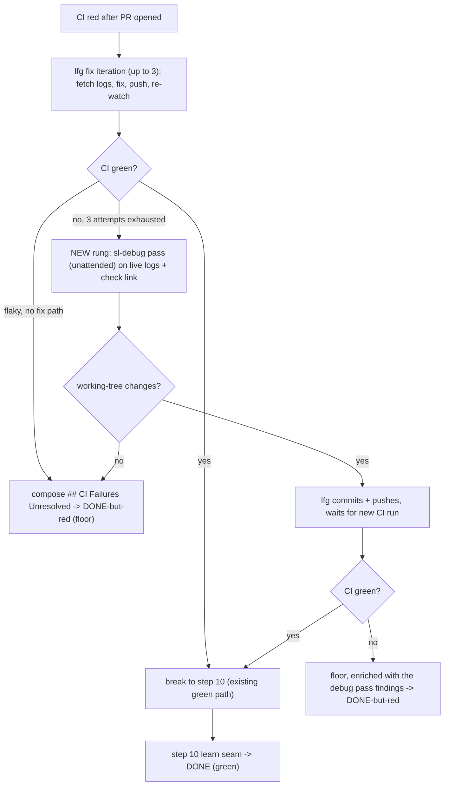

# feat: Loop debug-escalation rung in lfg's CI-fix loop

## Summary

Insert one deeper debugging rung into `lfg`'s in-run CI-fix loop: when its normal fix attempts exhaust on red CI, hand the live failing state to a systematic `sl-debug` pass before giving up. To run `sl-debug` without a human present, add a non-interactive mode to it first — it is interactive-only today and would block on a prompt mid-run. The existing "document and stop" behavior stays as the floor.

---

## Problem Frame

When an unattended run hits red CI, `lfg` step 9 iterates to fix it (up to 3 fix-and-push cycles), then a hard GATE stops, composes a `## CI Failures Unresolved` section into the PR body, and the run ends DONE-but-red. The driver's own retry is no help: `scripts/loop.sh` re-launches only on a crash-without-`DONE` and resets the target to a clean base first, so red CI is terminal at the driver level and the live failing state is gone after reset.

The loop gives up at the moment it has the most to work with. At the give-up point the failing state is still live — failing-check logs, the failing test, the diff that caused it — yet `lfg`'s fix attempts have been surface-level repairs inside the work loop, not systematic root-causing. A dedicated debugging skill (`sl-debug`) sits unused one step away. This serves the **Loop autonomy** strategy track: the loop's last move becomes "try once more, harder" instead of "stop and document," raising unattended completion without weakening the honest give-up floor.

Research surfaced one gap the brainstorm assumed away: `sl-debug` has **no non-interactive mode**. It is built around `AskUserQuestion` gates (present-findings, fix-vs-diagnose, branch check, handoff). `lfg`'s other sub-skill calls all pass a mode token (`sl-work mode:unattended`, `sl-code-review mode:agent`, `sl-test-browser mode:pipeline`) precisely to suppress prompts; `sl-debug` has no such token. So the feature spans two skills, not one.

---

## Requirements

Carried from the origin requirements doc (see origin: `docs/brainstorms/2026-06-18-loop-debug-escalation-requirements.md`).

**Escalation trigger**

- R1. When `lfg`'s in-run CI-fix attempts exhaust on red CI (the GATE that stops after the normal fix iterations), the run escalates to one deeper debugging pass before declaring the failure unresolved.
- R2. Escalation fires only for failures `lfg` attempted to fix and could not — not for failures `lfg` already classified as flaky with no fix path, which continue to the existing residual path without a debug pass.

**The debug pass**

- R3. The escalation invokes a systematic `sl-debug` pass on the live failing state (the failing-check logs and failing test path `lfg` already has in hand), so it can reproduce and root-cause rather than surface-patch.
- R4. The debug pass is a single bounded escalation, not an open loop; CI is re-checked once after it completes.

**Terminal behavior**

- R5. If CI is green after the debug pass, the run proceeds normally to the learn seam and to `DONE` on verified green.
- R6. If CI is still red after the debug pass, the run falls through to the existing terminal behavior — compose `## CI Failures Unresolved` in the PR body and stop, surfacing as DONE-but-red. Escalation adds a rung; it does not remove the floor.

**Enabling requirement** (added at planning; surfaced by research)

- R7. `sl-debug` supports a non-interactive invocation that suppresses its user-choice gates, so it can run to completion inside an unattended pipeline without blocking on a prompt.

---

## Key Technical Decisions

- **Add a non-interactive mode to `sl-debug` rather than inlining debug logic or constraining it via prose.** `sl-debug` is interactive-only and would block when invoked unattended. Adding a mode token mirrors the established `mode:unattended` / `mode:agent` / `mode:pipeline` convention `lfg` already uses for its other sub-skill calls, keeps the dedicated debugging skill reusable in any unattended context, and honors R3's "invokes a systematic `sl-debug` pass." Inlining would duplicate the methodology and drift from R3; prose-pinning is fragile because `sl-debug`'s own instructions say never to skip its gates.

- **Division of labor: `sl-debug` fixes in the working tree and returns without committing; `lfg` commits, pushes, and re-checks CI once.** `lfg` step 9 already owns the commit/push/CI-watch machinery, and `sl-debug` exposes no machine-parseable status the caller could branch on. So the green/red decision stays with `lfg` via `gh pr checks` after the pass — which is exactly R4/AE4's "CI is re-checked once."

- **Append the debug pass as a rung within step 9, after the 3-attempt GATE — not a new top-level step (resolves origin Q1).** A new step would renumber steps 10–11 and ripple through `lfg`'s "execute every step IN ORDER" contract and the cross-references to "step 10" / "step 9 reached green." The rung sits between the give-up GATE and the `## CI Failures Unresolved` compose instruction.

- **No separate wall-clock sub-budget for the debug pass (resolves origin Q2).** The existing per-attempt `--timeout` (default 1800s) already bounds the whole run including the pass. A dedicated sub-budget would require `loop.sh` coupling, breaking the in-run scope boundary. The tradeoff (a deep pass eats wall-clock and could make a timeout likelier) is recorded under Risks.

- **A failed debug pass enriches the `## CI Failures Unresolved` section with the debug pass's findings (resolves origin Q3).** Fold the pass's outcome into the residual — its root cause when one was found, or why it couldn't (e.g., "could not reproduce in the CI environment", "reproduced but no safe fix") — so the human who picks up the DONE-but-red PR gets a one-layer-direct account rather than a bare give-up. The framing is "the debug pass's findings," not guaranteed root cause: the paths that reach this floor are exactly the ones where root-causing did not fully land. This is cheap (append to the section `lfg` already composes).

- **Escalation is reachable only on the genuine-exhausted edge; the flaky path bypasses it (R2) — keyed to a disposition `lfg` already records, not new flake detection.** Today the flaky-no-fix-path shortcut is per-iteration (it stops retrying and routes to the same floor as exhaustion), so the two paths converge with no explicit branch label. The predicate reuses `lfg`'s *existing* classification rather than inventing a flake heuristic the rung would have to guess: the iteration step (line 107) already decides "flaky test that has no fix path", so that decision must be **recorded as a disposition and surfaced to the give-up GATE** (e.g., a flag set when an iteration takes the flaky-no-fix-path branch). The rung escalates only when no flaky-no-fix-path disposition was recorded across the 3 attempts; a recorded flaky disposition routes straight to the floor. This keeps R2's branch deterministic — it reads a decision `lfg` already makes instead of re-judging flakiness at the GATE.

- **The green path converges to the existing "break to step 10" without writing the floor marker.** Step 10's learn-seam gate keys on the presence of the `## CI Failures Unresolved` PR-body section. If the escalation turns CI green, the rung must join the existing green break and let control fall to step 10's normal path *before* any floor marker is composed, so the learn seam fires on verified green (R5).

- **Escalation must not manufacture a false green.** A green re-check is treated as success, so the unattended pass must carry `sl-debug`'s investigate-before-fix discipline and `lfg` step 9's existing prohibition — *do NOT weaken, skip, or mock the failing assertion; repair the actual issue* — **restated for the pass** (it is not inherited automatically once the rung calls out to `sl-debug`). The re-check (`gh pr checks`) certifies only the existing check set: it catches a fix that breaks a *different* check, but cannot detect a fix that masks the *same* failure by gaming its assertion. A masked failure shipped as DONE-green is strictly worse than the honest floor, so the no-weaken rule is load-bearing here; `loop.sh`'s independent post-`DONE` green re-verification is a backstop on the same check set, not a substitute for it.

---

## High-Level Technical Design

Step 9's CI-fix loop with the escalation rung inserted. The rung (highlighted path) sits on the genuine-exhausted edge only; the flaky edge and the post-escalation-red edge both land at the unchanged floor.

The rung reuses step 9's existing `gh pr checks` / `gh run view --log-failed` machinery for the re-check and for assembling the `sl-debug` input; it adds no new external tooling. There is **zero coupling to `scripts/loop.sh`**: the driver only ever observes `lfg`'s final `DONE` line plus GitHub CI state, so an escalation that turns CI green is observationally identical to a normal green, and a failed one is identical to today's floor.

---

## Implementation Units

### U1. Add a non-interactive mode to `sl-debug`

**Goal:** `sl-debug` accepts a mode token (e.g., `mode:unattended`) that suppresses every `AskUserQuestion` gate and runs reproduce → root-cause → fix-in-working-tree to completion without prompting, returning whatever it found without committing.

**Requirements:** R7 (enables R3).

**Dependencies:** none.

**Files:**
- `plugins/super-looper/skills/sl-debug/SKILL.md` — add the mode token to the argument convention and gate the interactive prompts on its absence.
- `plugins/super-looper/skills/sl-debug/references/` — if the suppression rules run long, extract them to a reference per the conditional-extraction convention; otherwise inline.
- `tests/loop-debug-escalation-contract.test.ts` — new contract test (created here; extended in U2).

**Approach:**
- Define the token in the same place `lfg`'s other sub-skills define theirs (mode token parsed from `$ARGUMENTS`). When present, suppress *every* interactive gate: auto-select "fix it now" at the present-findings gate, skip the trivial-bug fast-path user gate, and skip the Phase 4 handoff prompts (commit/PR/learning offers). The Phase 3 workspace check has **two** prompts — both must be conditioned on the mode: the branch-creation check (the caller is already on a branch) *and* the separate "confirm before overwriting unstaged work" prompt that fires on a dirty tree. Enumerate both so the contract test asserts each, not just the branch half.
- Suppressing the *prompts* must not relax the *method*: the mode preserves `sl-debug`'s investigate-before-fix discipline and its no-weaken rule (do not weaken/skip/mock an assertion to make a check pass) — see the false-green decision in Key Technical Decisions.
- The mode returns after the fix attempt **without committing** — the caller owns commit/push. If the bug can't be reproduced (including "cannot reproduce in this environment") or has no safe fix, it returns its disposition with **no working-tree change** rather than blocking. The caller reads "working tree changed?" as its only signal, so the mode must leave the tree untouched on every no-fix path.
- **Mode contract / precondition:** because the workspace-overwrite confirmation is suppressed, the mode assumes the caller guarantees a clean, intended working tree on a branch. State this as the mode's documented contract so future unattended callers don't silently inherit overwrite-of-uncommitted-work.
- Keep the interactive path the default and unchanged; the mode is purely additive. State the stable/beta sync decision and the `docs/skills/sl-debug.md` sync decision before committing (a new invocation mode is a material mechanic — likely warrants a doc note).

**Execution note:** Behavioral correctness (does it actually skip the gates) is validated via the `skill-creator` eval, not in-session `/sl-debug` — plugin skills cache at session start. The contract test below validates the prose structure immediately under `bun test`.

**Patterns to follow:** the mode-token gating in `lfg/SKILL.md` step 2 (`sl-work mode:unattended`) and step 4 (`sl-code-review mode:agent`); the `references/` offload + load-stub pattern in `lfg/SKILL.md` (`references/review-followup.md`).

**Test scenarios** (contract assertions on `sl-debug/SKILL.md` content; mirror the `toContain` / `toMatch` + section-slice idiom in `tests/review-skill-contract.test.ts`):
- Happy path: the SKILL.md declares the non-interactive mode token in its argument convention.
- The present-findings / fix-vs-diagnose gate is conditioned on interactive mode (the unattended branch auto-proceeds to fix) — assert the suppression prose exists.
- Both Phase 3 workspace prompts (branch-creation AND the uncommitted-work confirmation) are conditioned on the mode — assert each suppression, not just the branch half.
- The no-weaken-the-assertion discipline survives in the unattended path — assert the prohibition prose is not gated away by the mode.
- The mode prose states it returns without committing and leaves the tree untouched on every no-fix path.
- Negative assertion: the interactive default path is preserved (the `AskUserQuestion` gate text still present for the non-unattended case).

**Verification:** `bun test tests/loop-debug-escalation-contract.test.ts` passes the U1 assertions; a `skill-creator` eval confirms an unattended invocation runs to a fix or diagnosis without emitting an `AskUserQuestion`.

### U2. Insert the debug-escalation rung into `lfg` step 9

**Goal:** at step 9's give-up point, a genuine attempts-exhausted red CI escalates to one `sl-debug` pass (in the U1 mode); `lfg` commits/pushes any resulting fix, re-checks CI once, and routes green → step 10 / red → enriched floor. Flaky failures bypass the rung.

**Requirements:** R1, R2, R3, R4, R5, R6.

**Dependencies:** U1 (the unattended mode must exist to invoke).

**Files:**
- `plugins/super-looper/skills/lfg/SKILL.md` — insert the rung within step 9, after the 3-attempt GATE and before the `## CI Failures Unresolved` compose step.
- `plugins/super-looper/skills/lfg/references/` — if the rung's mechanics run long, extract to a reference (`references/ci-debug-escalation.md`) with a load-stub in SKILL.md, per the conditional/late-sequence extraction convention (step 9 is late-sequence and the rung is conditional — both extraction triggers).
- `tests/loop-debug-escalation-contract.test.ts` — extend with the lfg-side assertions.

**Approach:**
- At the give-up GATE, branch on the failure **disposition recorded during the iterations** (see the flaky-predicate decision in Key Technical Decisions): a recorded flaky-no-fix-path disposition → go straight to the floor (no escalation, satisfying R2); genuine exhaustion (3 real fix attempts, no flaky disposition) → escalate. This requires the iteration step's flaky-no-fix-path branch (line 107) to set a disposition the GATE can read — surface it; do not re-derive flakiness at the GATE.
- Build the `sl-debug` argument from the live state `lfg` already holds: the `gh run view --log-failed` output plus the failing check's link. There is no pre-extracted "failing test path" variable — the test path is derivable from the logs, so pass the logs + link, not a synthetic path.
- The tree is clean entering the rung (the 3 iterations commit their fixes), so any change after the pass is attributable to `sl-debug` — `lfg` need not distinguish stale edits. Invoke `sl-debug` with the U1 mode token (semantic "load the `sl-debug` skill ... `mode:unattended`", per the skill-reference convention), and **restate the no-weaken/skip/mock prohibition for the pass** (per the false-green decision). On return, detect whether the working tree changed: changes → commit + push (mirroring step 9's existing fix-iteration push) and wait for the new CI run; no change (found nothing / couldn't reproduce / no safe fix) → fall to the floor.
- Re-check CI exactly once via the existing `gh pr checks` path (R4). Green → converge to the existing "break out of the loop and proceed to step 10" so no floor marker is written and the learn seam fires (R5). Red → compose the `## CI Failures Unresolved` floor, enriched with the debug pass's findings (root cause when found, else its disposition) per the Q3 decision (R6). Whether a failed pass's commit is reverted before the floor is composed is an Open Question (below).

**Technical design (directional):** the rung is one bounded block, not a loop — no attempt counter, no return-to-iteration edge. It has exactly two exits: the green break (shared with the normal path) and the floor.

**Patterns to follow:** step 9's existing iteration push + `gh pr checks` re-watch (lines ~89–117); the `## CI Failures Unresolved` compose + `gh pr edit --body-file` block (lines ~121–126); step 10's learn-seam gate wording that keys on the floor marker.

**Test scenarios** (contract assertions on `lfg/SKILL.md`; slice the step-9 region as `tests/pipeline-review-contract.test.ts` slices stages):
- Covers AE1. The step-9 give-up region contains an escalation rung that invokes `sl-debug` with the non-interactive mode token, positioned after the 3-attempt GATE.
- Covers AE2 / R6. The `## CI Failures Unresolved` floor text still exists and is reachable after the escalation (floor preserved, not replaced), and the red path enriches it with the debug pass's findings — assert the enrichment prose is present, not just the bare marker.
- Covers AE3 / R2. The flaky-no-fix-path case routes to the floor without invoking the escalation — assert the give-up branch reads the recorded flaky disposition and bypasses the `sl-debug` rung.
- The rung restates the no-weaken/skip/mock prohibition for the unattended pass — assert the prohibition prose appears inside the escalation block (guards against a masked false green).
- Covers AE4 / R4. The rung re-checks CI once and contains no return-to-iteration / loop-back edge (negative assertion: no "return to iteration" inside the rung block).
- Covers R5. The green-after-escalation path joins the existing break-to-step-10 and the rung does not compose the floor marker on the green branch.
- Step ordering preserved: the `indexOf` of the step-9 markers stays before the step-10 learn-seam marker (no renumbering).

**Verification:** `bun test tests/loop-debug-escalation-contract.test.ts` passes; `bun run release:validate` clean (expected no-op — no new skill/agent/count change); a `skill-creator` eval of `lfg` step 9 against a seeded genuine-red scenario shows the rung firing and routing correctly.

---

## Scope Boundaries

### Deferred for later (from origin)

- Flake detection and quarantine as a distinct route.
- Spec-vs-implementation mismatch detection triggering an unattended re-plan.
- Using `docs/solutions/` as a classification / routing table once the corpus grows.

### Outside this version's scope (from origin)

- Driver-level routing between `loop.sh` attempts — the failing state is gone after the clean-reset, which is why the locus is in-run.
- Treating the loop run-record as the classification input — the rung reads live state directly; the record is the post-hoc account.

### Deferred to follow-up work

- An "escalation occurred / outcome" field in the run-record. The run-record is a separate, already-landed `loop.sh` feature with no escalation field today; adding one is net-new work in the driver/schema and is explicitly out of this feature per the origin's cross-link. Worth filing so escalation effectiveness becomes measurable.
- An in-run soft time cap for the debug pass, or a "skip the escalation on retry" signal the driver passes, to bound the budget-sink risk above. Deferred alongside the run-record escalation field — both want driver/`loop.sh` involvement that Q2 keeps out of v1.

---

## Acceptance Examples

Carried from origin.

- AE1. Covers R1, R3, R5. **Given** `lfg`'s normal fix attempts exhaust with CI still red on a genuine failure, **when** the debug escalation runs and its fix turns CI green, **then** the run proceeds to the learn seam and to `DONE` on verified green.
- AE2. Covers R1, R6. **Given** the debug escalation runs but CI is still red afterward, **when** the run terminates, **then** it composes `## CI Failures Unresolved` in the PR body — enriched with the debug pass's findings (Q3 decision) — and surfaces DONE-but-red. The terminal state (DONE-but-red via the floor) matches today; the section content gains the debug findings.
- AE3. Covers R2. **Given** `lfg` classified the failure as a flaky test with no fix path, **when** the run reaches the give-up point, **then** it takes the existing residual path with no debug escalation.
- AE4. Covers R4. **Given** the debug pass does not resolve CI, **when** it completes, **then** CI is re-checked once and the run does not loop additional debug passes.

---

## Open Questions

- **Revert a failed escalation's commit before composing the floor?** On the red-after-escalation path the rung has already committed and pushed `sl-debug`'s changes. Reverting them first means the DONE-but-red PR reflects `lfg`'s original failing state — honoring the floor's "stop on the state `lfg` had" contract and avoiding shipping an unproven `fix(ci)` commit asserting a repair that didn't hold. Keeping them preserves any partial progress the pass made. Lean: revert, so the floor stays an honest account of the pre-escalation state; confirm at implementation, since reverting discards partial fixes a human might have built on.

---

## Risks & Dependencies

- **Wall-clock pressure — a budget sink, not just "likelier to time out."** With no sub-budget (Q2), a deep pass runs on the *entire remaining* per-attempt `--timeout`, and root-causing a 3-attempt-resistant failure is the slowest branch in the pipeline. If the timeout fires mid-pass, `loop.sh` SIGTERMs the run and `reset_target` clean-resets on retry, discarding the in-progress fix — and the retry has no memory an escalation was attempted (the run-record escalation field is deferred). So on exactly the hard failures the rung targets, it can reliably consume the budget, get killed, and throw away its work. Accepted for v1 (the timeout is a safe outer bound), but flagged: an in-run soft cap or a "skip escalation on retry" signal would mitigate — see Deferred to follow-up work. Monitor whether escalation runs approach the timeout.
- **Partial-green hazard (institutional learning).** `docs/solutions/workflow/release-please-version-drift-recovery.md`: a check that passes while covering only a subset of invariants is more dangerous than none. The escalation must never convert a genuinely-red CI into a false green. The re-check (real `gh pr checks` over all checks) catches a fix that breaks a *different* check, but it certifies only the existing check set — a fix that masks the *same* failure by gaming its assertion is not caught by re-checking, so the no-weaken discipline (see the "Escalation must not manufacture a false green" decision) is the actual guard. An unresolved pass must fall through to the honest floor. Flake-skipping itself narrows what "green" certifies, so the floor's enriched residual should name what was skipped and what remained unresolved (one-layer-direct, per `docs/solutions/developer-experience/git-untracked-empty-dirs-break-ci.md`).
- **Dependency: U2 on U1.** The rung cannot be invoked safely until `sl-debug` has a non-interactive mode; land U1 first (or in the same PR ahead of U2).
- **Validation dependency.** Prose-behavior changes to `lfg` and `sl-debug` cannot be validated by re-running `/lfg` or `/sl-debug` in the editing session (plugin skill caching). Use the `skill-creator` eval or a fresh session; the contract test covers the structural invariants under `bun test`.

---

## Documentation / Operational Notes

- `docs/skills/sl-debug.md` exists — U1 adds a material mechanic (a non-interactive mode), so state a sync decision before committing and update the doc if the mode surfaces at its level of abstraction.
- No `docs/skills/lfg.md` exists, so the lfg-side change needs no skill-doc sync.
- After this lands, it is a strong `/sl-compound` candidate: a bounded one-shot escalation rung that preserves a give-up floor while avoiding partial-green is exactly the skill-design pattern the corpus currently lacks (per the learnings search).

---

## Sources / Research

- `plugins/super-looper/skills/lfg/SKILL.md` — step 9 CI-watch fix loop (3-iteration cap ~line 87, give-up GATE ~line 119, `## CI Failures Unresolved` compose ~line 121, green break ~line 95); step 10 learn-seam gate keyed on the floor marker (~line 137).
- `plugins/super-looper/skills/sl-debug/SKILL.md` — the escalation target: triage → investigate → root-cause → fix; interactive `AskUserQuestion` gates at present-findings, branch check, and handoff; no non-interactive mode today.
- `scripts/loop.sh` — `emit_record()` (run-record, already landed); retry fires only on crash-without-`DONE` with clean reset, confirming the in-run (not driver-level) locus and zero coupling to the escalation.
- `tests/review-skill-contract.test.ts`, `tests/pipeline-review-contract.test.ts` — the `toContain` / `toMatch` + section-slice + ordering-`indexOf` idioms the new contract test mirrors; step 9 has no existing coverage.
- `docs/solutions/workflow/release-please-version-drift-recovery.md`, `docs/solutions/developer-experience/git-untracked-empty-dirs-break-ci.md` — the "partial/local green hides real gaps" learnings shaping the partial-green risk and the enriched-residual decision.
- Origin: `docs/brainstorms/2026-06-18-loop-debug-escalation-requirements.md` (idea from `docs/ideation/2026-06-18-whats-next-ideation.html`, "Auto-route on failure type").
