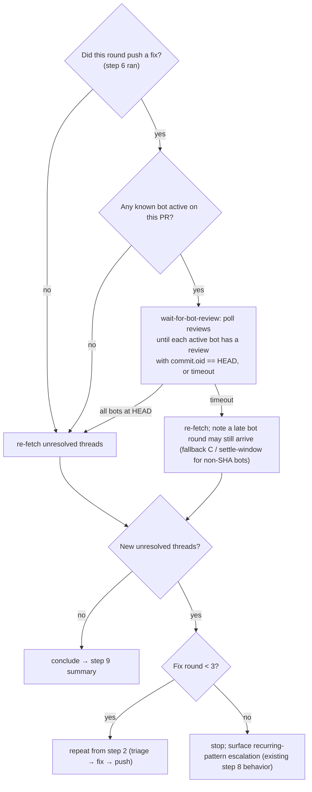

# fix: Bot-aware reviewer-quiescence gate in sl-resolve-pr-feedback verify loop

## Summary

`sl-resolve-pr-feedback` Full-mode step 8 (Verify) re-fetches unresolved threads **immediately** after pushing fixes, then concludes if none remain. But automated reviewers (GitHub Copilot, Greptile, CodeRabbit) re-review **asynchronously** — triggered by the fix push and completing seconds-to-minutes later. So the verify almost always sees "0 unresolved," exits, and the bot's next round lands afterward — forcing the user to re-run the command. This plan makes step 8 **wait for the active automated reviewers to re-review the pushed commit** before concluding, so a single invocation captures bot re-review rounds. The wait is bounded (per-wait timeout + raised fix-round cap), waits only on known bot logins that are active on the PR (never humans), and falls back to a settle-window for reviewers whose output isn't tied to a re-review on HEAD.

---

## Problem Frame

Step 8's termination condition is *"no unresolved threads at this instant."* For asynchronous bot reviewers it should be *"no unresolved threads **after** the active reviewers have re-reviewed this exact pushed commit."* The skill already has an internal up-to-2-cycle fix-verify loop, but it never engages for bot rounds: at re-fetch time the bot hasn't posted yet, so the loop sees zero and exits.

**Evidence (PR #18, 2026-06-19).** Copilot's reviews are each tied to a commit SHA. After a fix push at ~15:17 (commit `67e92d5`), Copilot's re-review of that commit landed at ~15:20 — a **~3-minute lag**. A second fix push (`95a45df`) had **no** Copilot review yet when verify ran. The verify reported "0 unresolved" on a commit the bot had not re-reviewed — the exact gap.

**The detectable signal.** `gh pr view <pr> --json reviews` exposes `.reviews[].commit.oid` per review. A bot has re-reviewed the current HEAD when a review by that bot's login exists with `commit.oid == HEAD`. This is the primary quiescence signal (Option A).

This serves the skill's core promise — resolve a PR's review feedback in one pass — by closing the async-bot gap that currently breaks it for the most common reviewers.

---

## Requirements

- **R1.** Full-mode step 8 waits for the active automated reviewers to re-review the pushed HEAD before concluding the verify loop.
- **R2.** The wait keys on the per-review `commit.oid == HEAD` signal — a bot has re-reviewed when it has a review tied to the pushed commit.
- **R3.** The wait targets only **known automated reviewer logins** that are **active on this PR** (have at least one prior review on the PR). It **never** waits on human reviewers — human threads are handled in the round they are present.
- **R4.** Two bounds: a **per-wait timeout** (the gate proceeds rather than hanging if a bot never responds) and a **max fix-round cap** (raised from 2 to 3) after which the existing recurring-pattern escalation fires.
- **R5.** A documented **settle-window fallback (C)** handles reviewers whose feedback is not detectable as a re-review on HEAD (e.g., top-level comments, no SHA-tied review): conclude after a quiet period with no new threads.
- **R6.** The bot-login list is **hardcoded in the script and extensible by editing it** — no config-file plumbing (resolved call-out).
- **R7.** The gate engages **only after a fix push** (a new commit exists for bots to re-review). A round with only replies / not-addressing / declined (no push) skips the wait (resolved call-out: CI is not waited on — reviewer quiescence only).
- **R8.** Targeted mode (single thread by URL) is **unchanged** — no quiescence wait.

---

## Key Technical Decisions

- **Bundle a `wait-for-bot-review` poll script rather than inline `gh` in the reference.** The poll is non-trivial (loop, backoff, per-bot `commit.oid == HEAD` comparison, timeout) and the repo's shell-safety convention forbids chaining/suppression in skill bash and prefers a script for non-trivial logic. The skill already ships four bash+`gh` scripts under `scripts/`; this mirrors them. The reference invokes it as one pinned command.

- **Wait only on *active* bots = known-bot-logins ∩ reviewers-who-have-reviewed-this-PR.** A known bot that has never reviewed this PR is not waited on (avoids hanging the full timeout for Greptile when only Copilot is configured on the repo). Determined from the same `reviews` payload that carries `commit.oid`.

- **Reviewer-quiescence only; no CI wait (resolved call-out).** `sl-resolve-pr-feedback` already runs the project's validation in step 5; CI-watch is `lfg`'s responsibility. Adding a CI-green wait would couple this skill to CI timing and overlap `lfg`. The gate waits for *reviewers*, not checks.

- **Timeout is "stop waiting and proceed," not a hard failure.** If an active bot doesn't reach HEAD within the per-wait timeout (~5 min, matched to the observed ~3-min latency, polled with mild backoff), the gate re-fetches anyway and the step-9 summary notes that a late bot round may still arrive. Hanging is the worst failure.

- **Hardcoded, extensible bot list (resolved call-out).** A default login set (`copilot-pull-request-reviewer`, `coderabbitai[bot]`, and `greptile-apps[bot]`) lives in the script; adding a reviewer is a one-line edit. (Exact suffix/casing can vary per install — see the bot-login-drift risk; the active-bot intersection makes a wrong login a no-op, not a hang.) No `.super-looper/config.local.yaml` plumbing for v1 (YAGNI) — revisit only if per-repo tuning is requested.

- **Fallback C (settle-window) stays a documented secondary path, not the primary.** Option A (poll-for-review-on-HEAD) is primary because it is deterministic. C covers bots that post top-level comments without a SHA-tied review; A covers the common case.

- **Option B (explicit re-request review via API) is out of scope, noted as future.** Prior art: the gstack `greploop` skill does trigger → fix → re-trigger → repeat for Greptile + Copilot. Only needed if a bot stops auto-re-reviewing.

---

## High-Level Technical Design

Step 8 (Verify) after the change. The gate sits between the fix push and the re-fetch; the existing fix-verify loop and escalation are reused, only the termination is corrected.

The gate adds no new external tooling beyond `gh pr view --json reviews` (already used elsewhere in the skill) wrapped in the new poll script.

---

## Implementation Units

### U1. Add the `wait-for-bot-review` poll script

**Goal:** A bundled script that blocks until every *active* known automated reviewer has a review tied to a given HEAD SHA, or a timeout elapses, then exits 0 — printing which bots reached HEAD and which timed out.

**Requirements:** R2, R3, R4 (timeout half), R6.

**Dependencies:** none.

**Files:**
- `plugins/super-looper/skills/sl-resolve-pr-feedback/scripts/wait-for-bot-review` — new bash script (create).
- `tests/resolve-pr-feedback-quiescence.test.ts` — new contract test (created here; extended in U2).

**Approach:**
- Mirror the existing script conventions in `scripts/get-pr-comments`: `#!/usr/bin/env bash`, `set -e`, positional args with a usage block, and the same OWNER/REPO resolution (arg `$N` or `gh repo view ... || true` fallback with a friendly error).
- Signature (directional): `wait-for-bot-review PR_NUMBER HEAD_SHA [OWNER/REPO]`. The caller passes `HEAD_SHA` from `git rev-parse HEAD` after the push.
- Hold the default bot-login list as a shell array near the top of the script (`copilot-pull-request-reviewer`, `coderabbitai[bot]`, `greptile-apps[bot]`). Comment it as the extension point.
- Each poll: `gh pr view "$PR_NUMBER" --json reviews` → reduce to `{login, commit}` rows. `active_bots = known_bots ∩ {logins present in reviews}`. A bot is "at HEAD" when it has any review row with `commit == HEAD_SHA`. Loop while some active bot is not yet at HEAD, sleeping with mild backoff, until all are at HEAD (exit 0, "quiescent") or the total wait exceeds the timeout (exit 0, print a `timed-out waiting for: <logins>` line so the caller can note the late-round caveat).
- No active bots → exit 0 immediately (nothing to wait for). This is the human-only-PR path (R3).
- Bound the loop by elapsed wall-clock against a timeout constant (~5 min) — never an unbounded `while true` without the timeout check.

**Patterns to follow:** `scripts/get-pr-comments` (arg parsing, OWNER/REPO resolution, `set -e` with the documented `|| true` for command-substitution-under-set-e); `scripts/get-thread-for-comment` and `scripts/resolve-pr-thread` for `gh` usage shape.

**Execution note:** Behavioral correctness (does it actually block until HEAD, does it stop at timeout) is validated by reading the script + a `skill-creator` eval, not by live PR runs in-session. The contract test asserts the script's structure.

**Test scenarios** (script-shape contract assertions reading the script body, mirroring `tests/resolve-pr-feedback-pagination.test.ts`'s read-and-regex idiom):
- The script file exists and is executable-shaped (`#!/usr/bin/env bash`, `set -e`).
- It declares a default bot-login list containing `copilot-pull-request-reviewer`, `coderabbitai[bot]`, and `greptile-apps[bot]` — assert the list is present and commented as the extension point.
- It compares a review's commit against the passed HEAD SHA (assert it reads `reviews` with `commit`/`oid` and references the HEAD-SHA argument).
- It bounds the wait by a timeout (assert a timeout constant + an elapsed-time check exist — negative-assert there is no unbounded `while true` without a timeout guard).
- It filters to bots active on the PR (assert it intersects the known list against reviewers present in the payload, rather than waiting on the full known list unconditionally).
- `Test expectation:` script-structure only; runtime poll behavior is eval-validated (no live-network unit test).

**Verification:** `bun test tests/resolve-pr-feedback-quiescence.test.ts` passes the U1 assertions; the script is listed in `git status` as a new executable under the skill's `scripts/`.

### U2. Rewrite step 8 (Verify) in `full-mode.md` to use the quiescence gate

**Goal:** Step 8 invokes `wait-for-bot-review` after a fix push before re-fetching threads, waits only on bots (never humans), raises the fix-round cap to 3, documents the settle-window fallback, and on timeout proceeds while noting a possible late round.

**Requirements:** R1, R3, R4, R5, R7, R8 (the targeted-mode exclusion note lands in U3).

**Dependencies:** U1 (the script must exist to invoke).

**Files:**
- `plugins/super-looper/skills/sl-resolve-pr-feedback/references/full-mode.md` — rewrite step 8 (Verify) and the iteration-count/escalation wording.
- `tests/resolve-pr-feedback-quiescence.test.ts` — extend with the full-mode.md prose assertions.

**Approach:**
- Insert the quiescence gate at the top of step 8, gated on "this round pushed a fix" (reuse step 5's `files_changed` non-empty signal — reply-only rounds skip the wait per R7). Invoke the bundled script via `${CLAUDE_SKILL_DIR}` per the repo's bundled-script-path convention (the Bash CWD is the project root, not the skill dir), passing `PR_NUMBER` and `git rev-parse HEAD`.
- State the bot-only / human-never rule explicitly at the gate (R3): the wait is for automated reviewers; human threads are handled in the round they appear and are never waited on.
- State both bounds (R4): the per-wait timeout (gate proceeds on timeout, noting a late round may still arrive — feeds the step-9 summary) and the raised max fix-round cap of **3** before the existing recurring-pattern escalation. Update the current "After the second fix-verify cycle" wording to the third.
- Document fallback C (R5) as a short secondary paragraph: when a known bot's feedback isn't detectable as a re-review on HEAD, fall back to a settle-window (conclude after a quiet period with no new threads) rather than waiting on the SHA signal forever.
- Keep the existing re-fetch (`get-pr-comments`) and the loop-back-to-step-2 structure — only the *termination/timing* changes.

**Patterns to follow:** the existing step 8 (Verify) structure and its 2-cycle escalation wording in `full-mode.md`; the `${CLAUDE_SKILL_DIR}`-prefixed bundled-script invocation convention (repo `AGENTS.md` → "Bundled Script Paths in Skills"); the `toContain`/section-slice idiom in `tests/review-skill-contract.test.ts`.

**Test scenarios** (contract assertions on `full-mode.md`; slice the step-8 region):
- Covers R1/R2. The step-8 region invokes `wait-for-bot-review` (assert the script name and that it is invoked before the re-fetch / `get-pr-comments` call in step 8).
- Covers R3. The gate prose states the wait targets automated reviewers only and never waits on human reviewers — assert both halves.
- Covers R4. Both bounds appear: a per-wait timeout with proceed-on-timeout wording, and a max fix-round cap of 3 (assert "3" replaced "second"/"2" in the escalation wording; negative-assert the old 2-cycle cap wording is gone).
- Covers R5. The settle-window fallback (C) prose is present for non-SHA-detectable reviewers.
- Covers R7. The gate engages only after a fix push — assert the "skip the wait when no push / reply-only" condition is stated.
- Bundled-script path uses `${CLAUDE_SKILL_DIR}` (assert), not a bare relative `scripts/` path.

**Verification:** `bun test tests/resolve-pr-feedback-quiescence.test.ts` passes; `bun run release:validate` clean (no new skill/agent/count change — a new script is not a counted component).

### U3. Surface the new script and scope the gate out of Targeted mode

**Goal:** SKILL.md lists the new script; targeted-mode.md states the quiescence gate does not apply to single-thread resolution.

**Requirements:** R8 (targeted-mode exclusion); discoverability of the new script.

**Dependencies:** U1 (script exists), U2 (gate defined).

**Files:**
- `plugins/super-looper/skills/sl-resolve-pr-feedback/SKILL.md` — add `wait-for-bot-review` to the `## Scripts` list with a one-line description.
- `plugins/super-looper/skills/sl-resolve-pr-feedback/references/targeted-mode.md` — add a one-line note that the bot-quiescence gate is Full-mode-only (targeted mode addresses one named thread and does not wait for a full re-review).
- `tests/resolve-pr-feedback-quiescence.test.ts` — extend with the SKILL.md scripts-list assertion and the targeted-mode exclusion assertion.

**Approach:** Mechanical doc-consistency edits — no behavior beyond what U2 defined. Match the existing Scripts-list bullet style in SKILL.md.

**Patterns to follow:** the existing `## Scripts` bullet list in `sl-resolve-pr-feedback/SKILL.md`.

**Test scenarios:**
- SKILL.md `## Scripts` lists `wait-for-bot-review` (assert the entry).
- targeted-mode.md states the quiescence gate is Full-mode-only / does not apply to targeted resolution (assert the exclusion prose).
- `Test expectation:` doc-consistency assertions only (no behavioral change in this unit).

**Verification:** `bun test tests/resolve-pr-feedback-quiescence.test.ts` passes all U1–U3 assertions; full `bun test` green; `bun run release:validate` clean.

---

## Acceptance Examples

- **AE1.** Covers R1, R2. **Given** a fix round pushed a commit and Copilot is active on the PR, **when** step 8 runs, **then** it waits until Copilot's review tied to the pushed SHA appears, re-fetches, and catches the new round **in the same invocation** (no re-run).
- **AE2.** Covers R3. **Given** a PR whose only reviewers are humans, **when** step 8 runs after a push, **then** no wait occurs and human threads are handled in the round they are present.
- **AE3.** Covers R4, R5. **Given** an active bot that never re-reviews within the timeout, **when** the wait elapses, **then** the gate proceeds (does not hang) and the step-9 summary notes a late bot round may still arrive.
- **AE4.** Covers R4. **Given** feedback that keeps recurring, **when** the third fix round completes, **then** the loop stops and surfaces the recurring-pattern escalation rather than looping a fourth time.
- **AE5.** Covers R7. **Given** a round that only posted replies / not-addressing (no push), **when** step 8 runs, **then** it skips the wait and concludes (nothing was pushed for a bot to re-review).

---

## Scope Boundaries

### In scope
- Full-mode step 8 quiescence gate (Option A) + the `wait-for-bot-review` script + the settle-window fallback (C) as a documented secondary path.
- Raising the fix-round cap to 3 and reusing the existing escalation.

### Out of scope
- **Changing how threads are triaged or fixed** (steps 2–4) — only the verify timing changes.
- **Targeted mode** behavior — single-thread resolution does not wait (R8).
- **CI-green waiting** — reviewer quiescence only (resolved call-out); CI-watch remains `lfg`'s concern.
- **Config-file-driven bot list** — hardcoded-extensible for v1 (resolved call-out).

### Deferred to follow-up work
- **Option B — explicit re-request review via API then wait.** Only needed if a bot stops auto-re-reviewing on push. Prior art: the gstack `greploop` skill (trigger → fix → re-trigger → repeat for Greptile + Copilot). File if a non-auto-re-reviewing bot is adopted.
- **Consolidation with `greploop`** — out of scope; noted for awareness only.

---

## Risks & Dependencies

- **Bot latency variance / timeout tuning.** The observed Copilot latency was ~3 min; the ~5-min timeout is a starting bound. If real-world latency is higher, the gate will proceed early and the user still re-runs occasionally (degrades to today's behavior, never worse). The timeout constant is a single tunable in the script. Monitor and adjust.
- **Bot-login drift.** Reviewer bot logins can change (e.g., `[bot]` suffixes, app renames). The hardcoded list is the single maintenance point; a wrong/missing login silently means "not waited on" (degrades to today's behavior, not a hang). The active-bot intersection prevents waiting on a renamed login that never appears.
- **U2 depends on U1** — the gate prose cannot invoke a script that does not exist; land U1 first (or in the same PR ahead of U2).
- **Validation dependency.** This is a behavioral skill change; per repo `AGENTS.md` it cannot be validated by re-running `/sl-resolve-pr-feedback` in the editing session (plugin skills cache at session start). Use the `skill-creator` eval or a fresh session; the contract test covers the structural invariants under `bun test`.
- **Partial-detection honesty.** When the gate times out or uses fallback C, the step-9 summary must say so (a late round may still arrive) rather than implying full quiescence — otherwise it reproduces the original "looks done but isn't" problem one layer up.

---

## Documentation / Operational Notes

- No `docs/skills/sl-resolve-pr-feedback.md` is assumed to exist; confirm at execution and sync only if it does and the gate surfaces at its abstraction level.
- After this lands, it is a reasonable `/sl-compound` candidate: "wait for asynchronous reviewer quiescence on the pushed SHA before concluding a fix-verify loop" generalizes the bounded-escalation-rung lesson (don't conclude on a premature signal) captured at `docs/solutions/skill-design/bounded-escalation-rung.md`.

---

## Sources / Research

- Live run on PR #18 (2026-06-19): the `gh pr view --json reviews` `commit.oid` signal and the ~3-min Copilot re-review latency that demonstrate the gap and the fix signal.
- `plugins/super-looper/skills/sl-resolve-pr-feedback/references/full-mode.md` — step 8 (Verify) and the current 2-cycle escalation wording (the change target).
- `plugins/super-looper/skills/sl-resolve-pr-feedback/scripts/get-pr-comments`, `reply-to-pr-thread`, `resolve-pr-thread` — script conventions the new poll script mirrors.
- `tests/resolve-pr-feedback-pagination.test.ts` — the read-script-body + regex contract-test idiom the new test mirrors; `tests/review-skill-contract.test.ts` — the `toContain`/section-slice idiom for the full-mode.md prose assertions.
- Repo `AGENTS.md` — "Bundled Script Paths in Skills" (`${CLAUDE_SKILL_DIR}` invocation), shell-safety conventions (no chaining/suppression; script for non-trivial logic), and the plugin-skill caching constraint on validation.
- Prior art (out of scope, noted): the gstack `greploop` skill — trigger → fix → re-trigger → repeat for Greptile + Copilot.
