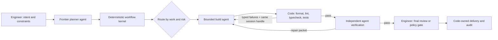

# refactor(workflows): Streamline Super Looper into code-first AI developer workflows

## Summary

Reduce Super Looper from a user-visible chain of overlapping orchestration skills into a small family of code-first AI developer workflows:

1. `sl-strategy` maintains durable product direction.
2. `sl-plan` uses a frontier model to produce one immutable, phased execution plan.
3. `sl-run` selects a right-sized workflow profile and hands execution to a deterministic workflow kernel that routes bounded agent work, code-owned checks, durable state, and review evidence.
4. A closeout seam records only evidence-backed learnings and proposes strategy changes for human approval.

Review, testing, repair, commit/PR work, learning capture, and resume behavior become explicit workflow nodes with typed inputs and outputs, not prose steps hidden inside one agent or separate workflow choices the user must remember. Existing specialist skills remain available as optional tools, but they stop defining the primary product path.

The redesign preserves the strongest existing mechanisms: immutable goals, checksum-based goal-drift detection, independent verification, honest failure terminals, structured run records, isolated workers, and durable solution docs. It removes repeated context gathering, fixed reviewer fleets, duplicated progress channels, and full-skill handoffs between every stage. Deterministic code owns repeatable control flow and validation; agents own bounded judgment and implementation; engineers own intent and final acceptance.

The streamlined core ships as one dual-host product. Existing Claude Code installation and behavior remain supported throughout the migration, while the same release component gains a separate native Codex package, marketplace entry, and runtime adapters. No workflow is considered migrated until it passes both host contracts; Codex support is not a later port of a Claude-only redesign.

## Implementation Progress

- [x] U1: baseline evals and observability (`f7e99fe`)
- [x] U2: shared plan, run-state, phase-packet, and worker-result contracts (`f7e99fe`)
- [x] U3: Claude preservation gates, native Codex packaging, release lockstep, and cross-host smoke seam (`d7c95e0`)
- [x] U4: lean frontier planner (implementation boundary; see `docs/evals/sl-plan-u4-report.md` for the token-telemetry caveat)
- [x] U5: resumable `sl-run` coordinator (`docs/evals/sl-run-u5-report.md`)
- [x] U6: extract the code-owned workflow kernel and deterministic validation graph (`docs/evals/sl-run-u6-report.md`)
- [x] U7: add risk-routed workflow profiles and bounded isolation (`docs/evals/sl-run-u7-report.md`)
- [x] U8: add engineer review, delivery, learning, and strategy closeout (`docs/evals/sl-run-u8-report.md`)
- [x] U9: migrate callers and reduce the public surface (`docs/evals/sl-run-u9-report.md`)
- [ ] U10: two-host evaluation and promotion

## Continuation Checkpoint

Work stopped cleanly at the U9/U10 boundary on branch `plan/streamline-super-looper`. U1-U9 are complete and validated. U9 made `sl-strategy -> sl-plan -> sl-run` the documented path on both hosts; reduced `lfg` and `sl-work` to short compatibility adapters; isolated their retired Claude-only workflows behind explicit legacy modes; narrowed `sl-handoff` to non-run transitions; migrated primary callers; and added fresh-source behavioral and repository contract coverage. See `docs/evals/sl-run-u9-report.md`. No U10 comparison, promotion, or compatibility deletion has started.

The continuation strategy remains the three-actor model described in the supplied Dan Eisler transcript:

- **Engineers** define intent and review consequential outcomes.
- **Deterministic code** owns routing, state, conditions, validation commands, budgets, isolation policy, and audit records.
- **Agents** perform bounded discovery, planning, implementation, repair, and semantic verification where judgment is actually required.

The next slice is U10 only, after explicit continuation: compare both hosts and every workflow profile against the established baselines, then promote only what earns the plan's evidence gates. Keep compatibility components until that evaluation supports a separately approved removal. This checkpoint is the durable resume note for the next implementation session.

---

## Problem Frame

The current strategy is sound: keep the goal intact through complex work, complete the work without babysitting, and make future work easier through captured learning. The implementation exposes too much of the machinery.

The documented happy path currently asks users to understand `sl-ideate`, `sl-brainstorm`, `sl-plan`, `sl-work`, `sl-code-review`, `sl-commit-push-pr`, `lfg`, `sl-handoff`, `sl-learn`, and `sl-compound`. Several of these skills invoke one another, repeat repository discovery, carry overlapping safety rules, and translate state through prose contracts.

The core orchestration bodies alone currently total approximately 289 KB across 3,059 lines:

| Component | Lines | Bytes |
|---|---:|---:|
| `lfg` | 196 | 22,060 |
| `sl-plan` | 855 | 92,956 |
| `sl-work` | 452 | 39,517 |
| `sl-code-review` | 698 | 67,068 |
| `sl-learn` | 105 | 13,500 |
| `sl-compound` | 656 | 47,464 |
| `sl-strategy` | 97 | 6,195 |

File size is only a proxy for token use, because references load conditionally and subagents have separate contexts. It still exposes the structural problem: one unit of work crosses several large orchestration contracts, and some of the same context and policy is reconstructed at each boundary.

The result is avoidable cost and fragility:

- Planning competes with output-format, image-generation, handoff, review, and routing machinery.
- Execution agents may independently rediscover the repository, plan intent, project standards, and relevant learnings.
- Large fixed reviewer fleets spend tokens on lenses the diff does not need.
- Progress is represented in plan markers, a progress JSON file, run records, PR text, commits, and chat summaries.
- `lfg` is an orchestration list over other orchestration skills rather than a small state machine over stable capabilities.
- The user must choose between overlapping interactive, headless, loop-driver, handoff, worktree, review, and ship paths.
- Learnings can become obligatory process output instead of a high-signal record of something novel and reusable.

The simplification must improve efficiency without turning the system into an unstructured "just ask an agent" prompt. The plan, phase gates, progress state, verification, and learning discipline remain the product.

---

## Strategy Reframe: From Loop to Developer Workflows

The transcript does not invalidate U1-U5. Those units established the plan contract, immutable-goal protection, dual-host packaging, frontier planning, and resumable state needed by any reliable workflow. It does change the best next step.

U5 currently gives `sl-run` an agent-oriented coordinator contract. If U6 immediately adds teams and reviewers, the plugin risks scaling the least reliable actor before separating deterministic process control from model judgment. The remaining refactor therefore treats the existing loop as one control-flow feature inside a larger AI developer workflow.

| Transcript principle | Current fit at U5 | Plan response |
|---|---|---|
| Combine engineers, agents, and code deliberately | Engineers and agents are explicit; deterministic code is strongest in state helpers and the shell supervisor | Extract a code-owned workflow kernel before adding teams |
| Put engineers at planning and review boundaries | Planning is explicit; final human acceptance is not yet a first-class node | Add a review-ready terminal and explicit approval policy before delivery |
| Use code for reliable, zero-token decisions | Goal checks and state transitions use code, but much execution and verification routing remains skill prose | Make commands, conditions, retries, routing, and audit transitions independently testable code nodes |
| Separate agents from code | U5 still describes one coordinator that dispatches agents and performs the surrounding workflow | Make `sl-run` a thin entry; the kernel invokes/resumes agent nodes and runs code nodes itself |
| Start simple, then scale | U6 previously started with parallel teams | Prove a serial plan -> build -> check -> repair -> review workflow first |
| Specialize workflows by task and urgency | One main phase topology serves all work | Add chore, bug, feature, and hotfix profiles with distinct cost and approval policies |
| Isolate parallel work | Worktrees are supported, but isolation and concurrency are coupled to worker dispatch | Add an isolation adapter; prefer sandbox, fall back to worktree, otherwise serialize safely |
| Test nodes and transitions independently | State transitions are tested; agent/code boundaries are not yet fully separable | Add mocked agent adapters, command runners, node contracts, and transition fixtures |

The useful product is not a larger autonomous loop. It is a small, inspectable workflow factory that selects the least expensive safe path, uses models only where judgment adds value, and produces an evidence packet an engineer can review quickly.

---

## Desired Outcome

### User-facing core

The primary workflow has three entry points:

```text
sl-strategy -> sl-plan -> sl-run
```

- `sl-strategy` is occasional project-level maintenance.
- `sl-plan` handles both clarification and planning. Separate ideation or brainstorming remains optional for work that truly benefits from it.
- `sl-run` handles interactive and unattended execution of an existing plan. The mode changes permissions and checkpoints, not the underlying phase model.
- Learning and strategy reconciliation happen automatically at closeout when warranted; they are not required user-invoked steps.

### AI developer workflow lifecycle

The user-facing path stays small, but `sl-run` is an entry point into a code-owned workflow rather than one agent simulating an entire software-development lifecycle:



The kernel may select a serial chore, bug, feature, or hotfix profile. Those profiles share node contracts and state machinery, but differ in model roles, isolation, review gates, budgets, and delivery authority. A loop is only one edge in this graph; the product is the complete developer workflow and its information flow.

### Definition of streamlined

The work is complete when:

- A new user can understand the core developer workflow from one short page and three skill names.
- Planning uses one frontier context rather than a default planning fleet.
- Execution agents receive scoped phase packets rather than the whole session or repeated repository surveys.
- The workflow kernel is the sole writer of run state and the sole integrator of worker results.
- One machine-readable state file answers what is pending, active, complete, blocked, verified, and resumable.
- Deterministic code, not model prose, evaluates configured formatter, linter, typecheck, test, retry, timeout, and transition conditions.
- Agent nodes and code nodes have separate, testable interfaces; a skill does not hide a hundred-step workflow inside one agent session.
- The engineer is explicitly present at goal definition and final review, with additional approval gates for hotfixes, high-risk work, or expanded authority.
- Work routes to the cheapest workflow that meets its risk and quality floor; a chore does not pay for the feature or hotfix topology.
- Review breadth is selected from actual risk signals instead of dispatching a standing persona catalog.
- A successful run may produce no learning and no strategy edit; no-op is a valid high-signal outcome.
- Token use is measured per role and phase when the host exposes usage, with stable structural proxies otherwise.
- The same `super-looper` semantic skill workflow installs and runs through both Claude Code and Codex packaging, with packaged copies protected by drift tests where host metadata cannot coexist.
- Claude Code behavior does not regress while Codex support is added; host-specific degradation is explicit and tested rather than silently skipped.

---

## Product and Design Principles

1. **Engineers at the consequential boundaries.** Engineers supply intent and constraints, then review the integrated result or approve a documented automation policy. High-risk and hotfix profiles may add earlier approval gates.
2. **Code owns deterministic control flow.** Routing, conditions, state transitions, command execution, retry/timeout budgets, overlap checks, and audit records belong in testable code rather than prompt prose.
3. **Agents own bounded judgment.** Spend models on planning, repository interpretation, implementation, repair, and semantic review. Do not ask an agent to decide whether a process exited zero or a schema parsed.
4. **Separate agent nodes from code nodes.** Each node has one interface and one owner. Code invokes or resumes an agent and passes typed results; an agent does not impersonate the outer workflow engine by calling every downstream step itself.
5. **Frontier intelligence at decision points.** Spend the strongest model on planning, ambiguity resolution, architecture decisions, hotfix proposals, and bounded escalation. Use workhorse or lightweight models for well-specified execution.
6. **One owner per kind of state.** The plan owns intended work. Run state owns execution progress. Git owns code history. Verification owns pass/fail evidence. Solution docs own reusable learning. Strategy owns durable direction.
7. **Immutable goal, mutable execution state.** Worker teams never edit `STRATEGY.md` or the active plan. A changed goal ends or supersedes the run.
8. **Context by pointer and typed packets.** Large evidence, logs, and intermediate results live in files. Transitions carry a schema, gist, paths, and agent session handle rather than copied transcripts.
9. **Start serial and earn parallelism.** The first production workflow is observable and serial. Add isolation and concurrency only for measured independent work with non-overlapping ownership.
10. **Specialize by work and risk, not persona count.** Chore, bug, feature, and hotfix workflows differ where their economics or safety differ. More permanent agents are not automatically more capability.
11. **Verification is layered and independent.** Deterministic checks run first. An independent agent interprets behavioral and risk evidence afterward. Neither the build agent nor a passing command alone certifies the whole result.
12. **Learning must earn permanence.** Capture a solution only when evidence supports a reusable causal lesson that is not already documented.
13. **Strategy stays human-owned.** Runs record observations that may challenge strategy; only an interactive, explicit approval changes the strategy document.
14. **Platform semantics before tool syntax.** Core workflow language describes roles, state transitions, and outcomes. Claude Code or Codex tool names live in thin runtime adapters.
15. **Two-host acceptance from the first slice.** Shared contracts, skills, scripts, and release metadata must validate on Claude Code and Codex before a migration unit is complete.

---

## Target Architecture

### 1. Lean planner

`sl-plan` becomes the sole required planning workflow. It runs in the frontier model selected for the parent session and does not dispatch a planning fleet by default.

Its default sequence is:

1. Read `STRATEGY.md` when present.
2. Read a compact index of relevant `docs/solutions/`, then only the matched solution docs.
3. Gather one scoped repository evidence dossier.
4. Ask only questions whose answers materially change scope, architecture, or acceptance criteria.
5. Write a canonical Markdown plan with phases and work units.
6. Perform one self-critique against the plan contract.
7. Dispatch one independent frontier critic only for a high-risk plan or when confidence remains below the gate.
8. Revise once and finish.

HTML rendering, decorative plan images, reciprocal-link wiring, and presentation polish leave the planning critical path. If retained, they become an optional renderer invoked after the canonical Markdown plan exists.

Every plan phase contains:

```yaml
id: phase-1
goal: one outcome this phase must establish
depends_on: []
work_units:
  - id: unit-1
    scope: bounded implementation responsibility
    files_or_area: expected ownership boundary
    acceptance: observable completion criteria
    verification: commands or inspection evidence
risks: []
completion_gate: evidence required before the next phase
```

The checked-in plan remains a human-readable Markdown document. The structured shape above is a conceptual contract, not a second generated plan file unless parsing Markdown proves unreliable in implementation.

### 2. Thin run entry and code-owned workflow kernel

Keep `sl-run` as the primary user entry point, but do not make its agent session the outer workflow engine. Its portable skill body interprets the request, resolves the plan, requests any required authority, starts or resumes the kernel, and presents status or review evidence. The deterministic kernel owns the process after that handoff.

The U5 state engine is the seed of this kernel. U6 extends it into a small CLI/library with three explicit node kinds:

| Node kind | Owner | Responsibilities |
|---|---|---|
| `code` | Workflow kernel | Validate artifacts; choose explicit routes; execute configured commands; classify results; enforce retries, timeouts, overlap, and authority; update state atomically |
| `agent` | Host adapter plus bounded agent session | Scout only when necessary; plan; implement; repair; perform semantic verification; return a typed result and evidence pointers |
| `human` | Engineer | Confirm intent or expanded authority, approve a hotfix proposal, review the integrated result, and authorize delivery unless an explicit policy permits it |

Each node transition uses one small record rather than narrative control flow:

```json
{
  "node_id": "feature.check.test",
  "kind": "code",
  "status": "failed",
  "input_paths": [],
  "output_paths": ["/tmp/super-looper/sl-run/.../test.log"],
  "session_handle": "opaque-or-null",
  "evidence": [{ "command": ["bun", "test"], "exit_code": 1 }],
  "next": "feature.build.repair"
}
```

The kernel:

- Validates plan and immutable-goal hashes and creates or resumes run state.
- Chooses the next node from the selected workflow profile and typed prior result.
- Invokes or resumes an agent through the current host adapter and persists its opaque session handle when supported.
- Runs formatter, linter, typecheck, tests, schema validation, and other configured checks directly, without spending agent tokens to determine pass or fail.
- Returns compact failure evidence to the same build session when the host supports resume; otherwise starts a replacement agent with a typed repair packet and records the degraded mode.
- Applies retry, timeout, isolation, overlap, and delivery-authority policies mechanically.
- Emits a review packet, terminal record, and durable evidence pointers on every exit.

The first kernel slice is deliberately serial. It must prove plan -> build -> deterministic checks -> same-session repair -> semantic verification -> review-ready before U7 introduces workflow routing, isolation, or parallel workers.

#### Workflow profiles

The kernel selects a profile from explicit user/plan metadata and mechanically detectable risk signals first. A frontier router is used only when those signals are genuinely ambiguous, and it must return a typed classification with rationale. The user can override a non-safety route.

| Profile | Default topology | Quality and approval policy |
|---|---|---|
| `chore` | One workhorse agent, serial code checks | Narrow checks plus final engineer review; no scout or frontier critic by default |
| `bug` | Optional reproduction scout, build/repair agent, deterministic regression checks, verifier | Require evidence that the failure reproduced and the regression is covered |
| `feature` | Frontier plan, bounded build agents when justified, full configured checks, verifier | Final engineer review; additional lenses selected from changed surfaces |
| `hotfix` | Frontier scout/proposal, engineer approval, isolated surgical build attempts when useful | Smallest safe diff, targeted deterministic checks, mandatory engineer approval before delivery |

Profiles reuse the same node and state contracts. They are configurations of the workflow, not four large duplicated skills.

### 3. Dual-host packaging and runtime adapters

Use one release component with separate host package roots. This preserves Claude-only skill frontmatter while Codex receives only migrated, validator-compliant skills:

```text
plugins/super-looper/
├── .claude-plugin/plugin.json
├── skills/
├── agents/                    # Claude Code agent definitions during migration
├── hooks/
├── codex/
│   └── super-looper/
│       ├── .codex-plugin/plugin.json
│       └── skills/            # only skills proven on Codex; drift-checked against shared semantics
├── assets/
├── .mcp.json                  # only when MCP servers exist
└── .app.json                  # only when a Codex/ChatGPT app exists

.claude-plugin/marketplace.json
.agents/plugins/marketplace.json
```

Packaging rules:

- Keep both host package folder basenames, both manifest names, and both marketplace entry names identical: `super-looper`.
- Keep both plugin manifest versions in the existing `super-looper` release component. Release automation updates and validates them together; routine feature PRs never hand-bump either version.
- Preserve the existing Claude marketplace as a supported distribution surface.
- Add a native repo Codex marketplace with `policy.installation`, `policy.authentication`, and `category`; do not rely only on Codex's legacy-compatible Claude marketplace reader.
- Point the Codex manifest at its package-local `./skills/`, migrate skills into that package only after their two-host contract passes, and only declare companion MCP/app files when those files exist.
- Let Codex discover `hooks/hooks.json` through its documented plugin default unless the current validator accepts and requires an explicit manifest path; do not add a manifest field that the checked-in validator rejects.
- Add Codex `interface` metadata and optional per-skill `agents/openai.yaml` presentation/invocation policy without making Claude Code depend on those files.

Keep each migrated core skill on a common portable instruction body plus co-located runtime references. Until packaging supports shared source imports safely, contract-test packaged copies byte for byte and treat the Claude copy as the authoring source:

```text
skills/sl-run/
├── SKILL.md
├── references/
│   ├── runtime-claude.md
│   ├── runtime-codex.md
│   └── ...shared workflow contracts...
└── scripts/
```

The runtime adapter boundary owns:

| Concern | Claude Code adapter | Codex adapter |
|---|---|---|
| Blocking questions | `AskUserQuestion`/`ToolSearch` behavior | Current Codex blocking-input capability when available; concise direct question otherwise |
| Subagent dispatch | Claude agent/task invocation and typed `sl-*` agents | Codex subagent workflow using built-in/custom roles with persona instructions injected into the task |
| Model roles | Claude-supported model selection or inheritance | Codex custom-agent/model configuration or inheritance |
| Work isolation | Claude worktree isolation semantics | Codex worker/worktree and shared-workspace semantics |
| Bundled scripts | `${CLAUDE_SKILL_DIR}` for runtime Bash calls | Resolve the filesystem-backed skill root supplied in the Codex skills catalog, then invoke the absolute script path |
| Plugin paths | Claude cache and marketplace layout | Codex plugin cache/marketplace layout and new-session reload behavior |
| Hooks | Claude tool names and hook payload fields | Codex tool names and hook payload fields |
| Platform history/update helpers | Claude-specific implementation | Codex-specific implementation or an explicit unsupported result |

Core prose must not directly require a host tool name. It names an operation such as "ask a blocking question," "dispatch a worker," or "resolve the bundled script," then loads the matching adapter. Tests forbid un-routed host-specific tool assumptions in the shared sections.

Skill metadata follows the same preservation rule. Keep `name` and `description` in the common agent-skills subset. Do not remove Claude-specific `allowed-tools`, `argument-hint`, or `disable-model-invocation` behavior merely to satisfy Codex. First verify which extra fields Codex safely ignores and map Codex invocation policy to `agents/openai.yaml`. If the two hosts require incompatible frontmatter, generate host-specific packaged metadata mechanically from one checked-in source rather than maintaining divergent copies of the workflow by hand.

Claude's 42 Markdown agents remain valid during migration. Codex currently documents custom agents as project/user TOML rather than a plugin `agents` component, so distributable Codex execution must not assume those Markdown files are installed as Codex agents. For Codex, `sl-run` dispatches generic or configured subagents with the selected risk-lens/persona instructions injected from its own self-contained references. This also becomes the long-term simplification path for Claude: retain a typed agent only when it needs distinct tools, permissions, or context—not merely a different review perspective.

Hook compatibility is handled as a real adapter, not assumed from similar JSON shapes. Codex supplies `CLAUDE_PLUGIN_ROOT` compatibility for plugin hooks, so the current script location can remain portable, but matcher names and input payload fields require host fixtures. Preserve the authoritative checksum guard in `loop.sh` on both hosts even if an early-deny hook cannot cover an editing primitive.

Every core migration PR reports this matrix:

| Gate | Claude Code | Codex |
|---|---|---|
| Source manifest validates | Required | Required |
| Marketplace resolves and installs | Required | Required |
| New session discovers plugin and skill | Required | Required |
| Explicit skill invocation | Required | Required |
| Implicit invocation policy | Preserved | Mapped and tested |
| Co-located reference loading | Required | Required |
| Bundled script execution | Required | Required |
| Blocking interaction | Required when workflow asks | Required when workflow asks |
| Worker dispatch and result collection | Required | Required |
| Isolation/overlap policy | Required | Required or explicit safe serialization |
| Goal guard and immutable plan | Required | Required |
| Resume from phase boundary | Required | Required |
| Release metadata lockstep | Required | Required |

A missing cell blocks promotion of that capability. "Not tested" is not treated as compatible.

### 4. Model-role policy

Use semantic roles rather than model names in skill prose:

| Role | Default capability | Use |
|---|---|---|
| `planner` | frontier, inherited from the parent | Plan creation, architecture, unresolved ambiguity |
| `router` | deterministic rules first; frontier only when ambiguous | Select a workflow profile and explain uncertain classifications |
| `scout` | efficient read-heavy model | Repository evidence and targeted retrieval |
| `worker` | capable implementation model | Independent work units |
| `verifier` | strong independent model | Phase gates and final acceptance |
| `escalator` | frontier | One bounded recovery when a phase cannot converge |
| `learner` | efficient model with evidence packet | Candidate learning extraction and deduplication |

Platform adapters map these roles to supported models. If the host cannot select per-agent models, every role inherits the parent model and structural controls provide the efficiency: bounded reads, short packets, output schemas, and limited fan-out.

Planning should fail clearly or warn when the selected parent model is not suitable for frontier planning; it must not silently pretend a weaker model met the planning policy. The exact capability check depends on what each host exposes and should remain advisory where reliable model introspection is unavailable.

### 5. Isolation and bounded execution

Default execution is serial. Parallelism is enabled only after the serial kernel is proven and only when a plan exposes independent units, ownership does not overlap, and an isolation backend is available.

Isolation is a runtime capability with a safe fallback order:

1. Dedicated agent sandbox when the host or configured provider supplies one.
2. Git worktree when repository state and the host support it.
3. Shared checkout with mechanically serialized edits and integration.

The smallest useful execution topology is:

- No scout when the plan packet and repository dossier are sufficient.
- One worker by default; up to three only for measured independent units with isolation.
- One code-owned kernel as the sole state writer and integrator; workers never merge one another.
- Deterministic checks immediately after integration.
- One independent verifier after code checks pass.
- One frontier escalator only after the normal repair budget cannot converge.

Repair work resumes the responsible worker session when the host exposes a stable handle. Session continuity is an optimization and a context-quality feature, not an unverified assumption: adapters must test it, persist the opaque handle, and report when they fall back to a fresh repair agent.

Workers receive a phase packet containing only:

- Plan path, plan hash, phase ID, and unit ID.
- Phase goal and unit acceptance criteria.
- Owned files or area and explicit non-goals.
- Relevant strategy excerpt.
- Relevant solution-doc pointers.
- Repository evidence dossier pointer and short gist.
- Required verification commands.
- Output schema: changed files, evidence, tests, risks, unresolved items.

Workers do not receive the whole plan, full strategy document, full session transcript, all solution docs, or the complete reviewer catalog unless their unit genuinely requires one of those artifacts.

### 6. Canonical run state

Replace loosely coupled progress signals with one atomic state file under stable OS temp:

```text
/tmp/super-looper/sl-run/<run-id>/run-state.json
```

This follows the repository scratch policy for cross-invocation reusable checkpoints. The path is surfaced to the user and recorded in the terminal run record. Durable aggregate history continues to use `docs/run-records/ledger.jsonl`; the temporary state is not committed.

Directional schema:

```json
{
  "schema_version": 1,
  "run_id": "...",
  "plan": { "path": "docs/plans/...", "sha256": "..." },
  "strategy": { "path": "STRATEGY.md", "sha256": "..." },
  "git": { "branch": "...", "base_ref": "...", "head_sha": "..." },
  "profile": { "name": "feature", "source": "explicit", "rationale": "..." },
  "status": "running",
  "current_phase": "phase-2",
  "current_node": "feature.check.test",
  "isolation": { "mode": "serialized_checkout", "parallel_cap": 1 },
  "agent_sessions": { "unit-2": { "handle": "opaque", "resumable": true } },
  "approvals": [],
  "nodes": [],
  "phases": [
    {
      "id": "phase-1",
      "status": "completed",
      "units": [],
      "verification": { "status": "passed", "evidence": [] },
      "commits": []
    }
  ],
  "usage": { "available": false, "by_role": {}, "by_phase": {} },
  "learning_candidates": [],
  "strategy_observations": [],
  "terminal": null
}
```

Rules:

- The workflow kernel is the only writer; skills and agents return proposed results but never mutate state directly.
- Writes use temp-file-plus-rename atomic replacement.
- Every node and phase transition records its owner, current `head_sha`, verification evidence, and relevant session or isolation metadata.
- Resume re-verifies hashes, branch, commit reachability, and completed-phase gates before continuing.
- Any mismatch produces an honest terminal or cold restart; it never marks work complete by assertion.
- The terminal run record indexes the state, transcript, PR, and residual evidence by pointer.

Plan status markers may remain as an optional human rendering, but they are derived from run state and are never an execution input. Unattended workers never edit the plan to record progress.

### 7. Risk-selected review

Replace the standing reviewer fleet with a small set of review lenses selected from evidence:

| Signal | Lens |
|---|---|
| Auth, secrets, permissions, untrusted input | Security |
| State transitions, concurrency, data mutation | Correctness and reliability |
| Schema, migration, persistence | Data integrity |
| Public API or contract change | API compatibility |
| Large structural diff | Maintainability and scope |
| UI behavior | Product, accessibility, and visual behavior |
| Test-only or narrowly mechanical diff | Testing and simplicity |

The default validation sequence is deterministic checks first, one verifier with the selected lenses second, and an engineer-facing review packet last. Dispatch additional independent reviewers only when risks are materially orthogonal or the verifier reports uncertainty. Cap the exceptional review team at three.

Passing code checks never substitutes for semantic review, and passing agent review never authorizes delivery by itself. The initial production policy stops at `review_ready` and requires engineer approval. A project may later opt into review waivers for a narrow profile only after benchmark evidence demonstrates repeatable safety; the waiver, scope, and evidence are recorded in run state. The hotfix profile always keeps its pre-build proposal approval and final delivery approval during this refactor.

The existing 42 agent files become a source catalog during migration, not the target runtime inventory. Preserve their best criteria as compact lens references. Keep only agents that need distinct tools, context, or execution behavior; a different perspective alone does not require a permanent agent definition.

### 8. Engineer review, delivery, learning, and strategy closeout

After deterministic and semantic verification:

1. Code assembles a compact review packet from the plan, changed files, diff summary, deterministic results, verifier findings, failed attempts, unresolved risks, and delivery intent.
2. The engineer approves, rejects, or requests a bounded repair. Unattended mode stops safely at `review_ready` unless a previously approved policy covers the exact profile and authority.
3. Code-owned delivery creates the approved commit/PR operation, observes CI, and routes typed CI failures back through the repair budget.
4. Code builds a learning evidence packet from run state, relevant diffs, failed attempts, and the final fix.
5. Search existing solution docs for overlap, then ask the learner for candidate causal lessons.
6. Grade each candidate: reusable, evidence-backed, novel, and likely to change future behavior.
7. Write a solution doc only when the candidate passes. Otherwise record `no_learning` with a reason.
8. Compare the outcome with the strategy target problem, approach, metrics, and tracks, and record only material observations.

Strategy handling:

- During a run: never edit `STRATEGY.md`.
- Interactive successful closeout: offer a concise proposed delta and require explicit approval before invoking a targeted `sl-strategy` update.
- Unattended closeout: write the proposal into the run summary or a durable tracked proposal only when one exists; do not edit strategy.
- Routine feature completion with no strategic implication records no proposal.

This preserves the goal guard while making strategy reconciliation an explicit workflow closeout node rather than an unrelated maintenance habit.

---

## Capability Consolidation

| Current capability | Target disposition |
|---|---|
| `sl-strategy` | Keep; narrow to deliberate strategy maintenance and approved post-run reconciliation |
| `sl-plan` | Rewrite as the frontier-model planner and canonical phased-plan producer |
| `sl-run` | Keep as the thin plan/profile entry and review surface; move outer control flow into the deterministic workflow kernel |
| Workflow kernel | Add as testable code for nodes, transitions, commands, agent-session adapters, policy, and evidence |
| `sl-work` | Move execution mechanics behind the kernel; retain a temporary compatibility wrapper to `sl-run` |
| `lfg` | Replace with a compatibility alias to unattended `sl-run`; deprecate after migration |
| `sl-code-review` | Keep standalone review as an optional skill; move its risk selection and final gate behind `sl-run` |
| `sl-commit-push-pr` | Keep standalone Git utility; `sl-run` calls a compact delivery capability internally |
| `sl-handoff` | Remove from the core workflow; canonical plan plus run state is the handoff |
| `sl-learn` | Make an internal closeout capability rather than a user-facing pipeline step |
| `sl-compound` | Keep as manual knowledge maintenance; reuse its validated writer behind the learning gate |
| `sl-ideate`, `sl-brainstorm` | Keep as optional discovery extensions; remove them from the required path |
| Reviewer agents | Convert most to compact risk-lens references; retain only tool- or domain-distinct agents |
| HTML plans and plan images | Move to an optional post-plan renderer outside the execution contract |
| Plan status markers | Make derived presentation only; run state is canonical |
| `scripts/loop.sh` | Keep as the unattended process supervisor, but make it launch the workflow kernel through `sl-run` rather than duplicate workflow policy |
| Claude plugin/marketplace | Preserve as a first-class supported distribution and regression surface |
| Codex plugin/marketplace | Add native manifest, repo marketplace, interface metadata, validation, and fresh-session install tests |
| Host-specific skill mechanics | Route through co-located Claude and Codex runtime references; keep shared contracts host-neutral |

No component is deleted in the first implementation slice. Compatibility wrappers and deprecation telemetry establish whether callers still depend on the old entry points.

---

## Efficiency and Quality Budgets

### Token-efficiency targets

- Reduce median total tokens for the representative end-to-end eval suite by at least 40% from the pre-refactor baseline.
- Reduce always-carried core orchestration text by at least 50%; as a repository proxy, keep the combined main bodies of `sl-strategy`, `sl-plan`, and `sl-run` at or below 120 KB, with conditional detail in references.
- Planning dispatches no subagents by default and at most one critic when the risk/confidence gate requires it.
- The default workflow is serial: one worker, direct code checks, and one verifier. Parallel workers, scouts, and extra reviewers must be justified by the selected profile and recorded risk.
- Default integrated review is one verifier and at most three independent reviewers when risks require separation.
- Repository discovery is performed once per plan and at most once per phase; workers reuse the packet.
- Deterministic command output is stored by pointer; agents receive compact failures and relevant excerpts rather than full successful logs.
- Agent returns are structured and capped to the information the workflow kernel consumes.
- Report agent invocations, resumed sessions, replacement sessions, deterministic node count, and code-versus-agent wall time so token savings cannot hide orchestration overhead.

### Quality floors

Efficiency changes do not land if they regress:

- Plan completeness against the existing planning evals.
- Goal fidelity against planned requirements and units.
- Verification pass rate on representative tasks.
- Unattended completion rate.
- Honest failure behavior and goal-drift detection.
- A complete engineer review packet and correct approval boundary for the selected workflow profile.
- Learning correctness and deduplication.
- Claude Code plugin validation, installation, skill discovery, hooks, and existing behavioral contracts.
- Codex plugin validation, marketplace installation, skill discovery, subagent execution, goal-guard hooks, and fresh-session behavior.

On scored behavioral evals, the streamlined workflow must remain within 5% of the baseline quality score while meeting every hard safety and completion criterion. A token win that weakens correctness or hides unresolved work is a failed experiment.

### Measurement

Add a fixed benchmark set spanning:

- Small, obvious code change.
- Low-risk chore that should not invoke a frontier router or scout.
- Multi-phase feature with independent units.
- Cross-cutting migration.
- Bug investigation with an initially wrong hypothesis.
- Hotfix that requires proposal and delivery approvals.
- Deterministic check failure repaired through the same agent session when supported.
- UI change requiring visual verification.
- Run with no worthwhile learning.
- Run that produces a valid learning.
- Run that identifies a possible strategy change.
- Interrupted run resumed from a phase boundary.
- The same plan-and-run fixture executed through Claude Code.
- The same plan-and-run fixture executed through Codex.
- A host-specific capability gap that must fail explicitly rather than silently degrade.

Capture per-role and per-phase token usage when the host exposes it. When it does not, record `usage.available: false` and use stable proxies: loaded instruction bytes, number of dispatches, context packet bytes, read counts, and response bytes. Never fabricate token precision from byte counts. Report Claude Code and Codex results separately as well as combined; an efficiency win on one host cannot hide a regression on the other.

---

## Implementation Plan

### U1. Establish baseline evals and observability

**Status:** Complete in `f7e99fe`.

**Goal:** Measure the current workflow before simplifying it, so removals are judged by outcomes and token use rather than prompt size alone.

**Dependencies:** none.

**Files:**

- `plugins/super-looper/skills/sl-plan/evals/` (modify)
- `plugins/super-looper/skills/sl-work/evals/` (modify)
- `plugins/super-looper/skills/lfg/evals/` (add or modify)
- `tests/skill-evals-shape.test.ts` (modify if the shared schema grows)
- `scripts/loop.sh` and run-record tests (modify only for usage/proxy fields)
- `docs/solutions/` (read for known failure fixtures; no automatic write)

**Approach:**

- Turn the benchmark cases above into stable behavioral fixtures.
- Record baseline plan quality, completion, dispatch count, loaded instruction bytes, context packet bytes where observable, and actual token usage where available.
- Add explicit graders for goal fidelity, unnecessary fan-out, duplicated discovery, honest failure, and learning quality.
- Keep token data optional in the schema so unsupported hosts remain valid.
- Run behavioral tests through the repository-mandated `skill-creator` eval workflow so current source is injected into fresh generic subagents rather than testing cached plugin content.
- Record Claude Code as the behavior-preservation baseline and add equivalent Codex fixtures as soon as the native package skeleton exists.

**Acceptance:** A checked-in baseline report exists; every later unit can compare quality and efficiency against the same tasks.

### U2. Define the shared plan and run-state contracts

**Status:** Complete in `f7e99fe`.

**Goal:** Make planning and execution communicate through small, stable artifacts instead of skill-specific prose assumptions.

**Dependencies:** U1.

**Files:**

- `plugins/super-looper/skills/sl-plan/references/` (add compact plan contract)
- `plugins/super-looper/skills/sl-run/references/` (new self-contained copies required by skill isolation)
- `plugins/super-looper/skills/sl-run/scripts/` (new validator/state helper)
- `src/` or `scripts/` only if a repo-level mechanical validator is needed
- `tests/` contract tests
- `CONCEPTS.md` (update vocabulary after the contract is settled)

**Approach:**

- Specify the minimum phase/work-unit fields required for execution.
- Define `run-state.json`, transition rules, atomic writes, resume validation, and terminal states.
- Define the phase-packet and worker-result schemas.
- Define semantic model roles without hardcoded model names.
- Keep plan and run-state validation mechanical where possible.
- Duplicate small runtime contracts into each skill that needs them, per the self-contained-skill rule; use tests to prevent drift between intentional copies.

**Acceptance:** Invalid plans and illegal state transitions fail before agent dispatch; a fixture run can initialize, complete a phase, stop, and resume deterministically.

### U3. Establish dual-host packaging and compatibility contracts

**Status:** Complete on this branch; enforced by dual-host packaging, release, and smoke contract tests.

**Goal:** Make Claude Code preservation and native Codex support executable gates before core workflow prose changes.

**Dependencies:** U1-U2.

**Files:**

- `plugins/super-looper/.claude-plugin/plugin.json` (preserve and validate)
- `plugins/super-looper/codex/super-looper/.codex-plugin/plugin.json` (new native package; separate root preserves Claude-only skill metadata)
- `.claude-plugin/marketplace.json` (preserve and validate)
- `.agents/plugins/marketplace.json` (new repo marketplace)
- `src/release/components.ts`
- `src/release/metadata.ts`
- `scripts/release/validate.ts`
- release configuration extra-file mappings
- `tests/release-*.test.ts`
- new Claude/Codex plugin-contract tests
- core skill `references/runtime-claude.md` and `references/runtime-codex.md` as each skill migrates

**Approach:**

- Add a valid Codex package with the same normalized plugin name and release-managed version as the Claude manifest. Keep its package root separate because Codex rejects Claude's `disable-model-invocation: true` frontmatter while Claude depends on those explicit-invocation guards.
- Add the native Codex repo marketplace entry with required policy and category fields while preserving the existing Claude marketplace.
- Extend metadata synchronization and `release:validate` so shared version, description, author, and skill path fields cannot drift.
- Define a compatibility matrix for skill frontmatter, blocking questions, subagent dispatch, model roles, worktrees, script paths, plugin cache/update behavior, and hooks.
- Keep shared `SKILL.md` workflow sections on the common agent-skills subset. Route unavoidable host syntax through self-contained runtime references.
- Add contract tests that detect unrouted `AskUserQuestion`, `ToolSearch`, `Agent`/`Task`, `subagent_type`, hardcoded Claude cache paths, and `${CLAUDE_SKILL_DIR}` calls in shared core sections.
- Capture real hook event fixtures from both hosts before changing `goal-guard.sh`; preserve checksum enforcement as the cross-host authority.
- Validate Claude with its existing plugin validator and behavioral eval workflow.
- Validate Codex with the plugin-creator validator, install it through the repo marketplace, start a fresh session, and confirm plugin/skill discovery. Use the documented cachebuster/reinstall flow during local iteration rather than hand-editing installed marketplace state.
- Add a minimal cross-host smoke skill before migrating `sl-plan`: load the same shared instruction, read a co-located reference, run a bundled script, ask one question, dispatch one worker, and return a structured result.

**Acceptance:**

- Claude Code installs the existing marketplace/plugin and passes its pre-refactor smoke/eval suite.
- Codex installs the native repo marketplace/plugin in a fresh session and discovers the same smoke skill.
- The smoke skill completes its shared workflow on both hosts through different runtime adapters.
- Release validation fails if Claude and Codex manifest metadata drift.
- No installed cache or user marketplace file is modified as a substitute for source-controlled packaging.

### U4. Rewrite `sl-plan` as the frontier planner

**Goal:** Produce a high-quality phased plan with less orchestration and no default fleet.

**Dependencies:** U1-U3.

**Files:**

- `plugins/super-looper/skills/sl-plan/SKILL.md`
- `plugins/super-looper/skills/sl-plan/references/`
- `plugins/super-looper/skills/sl-plan/scripts/`
- `plugins/super-looper/skills/sl-plan/evals/`
- `plugins/super-looper/README.md` and generated skill docs

**Approach:**

- Collapse source routing, ambiguity handling, evidence gathering, planning, critique, and handoff into the lean sequence defined above.
- Load strategy and matched learnings once.
- Replace broad research fleets with one scoped scout only when local evidence is insufficient.
- Make Markdown the canonical default output.
- Move HTML rendering, images, and reciprocal-link maintenance behind an explicit optional renderer.
- Remove handoff prose that `sl-run` can derive from the plan and run state.
- Add a high-risk/confidence gate for the optional independent critic.

**Acceptance:** The planner meets the quality floor on Claude Code and Codex, produces equivalent executable phases, uses no subagent in the normal case, and reduces median planning tokens by at least 30% on each host's baseline set.

### U5. Build the `sl-run` coordinator and resumable state engine

**Goal:** Introduce the single execution entry point without yet removing old workflows.

**Dependencies:** U2-U4.

**Files:**

- `plugins/super-looper/skills/sl-run/SKILL.md` (new)
- `plugins/super-looper/skills/sl-run/references/` (new)
- `plugins/super-looper/skills/sl-run/scripts/` (new)
- `plugins/super-looper/skills/sl-run/evals/` (new)
- `scripts/loop.sh`
- `scripts/loop-phases.sh`
- `tests/loop-driver.test.ts`
- new focused run-state and phase-transition tests

**Approach:**

- Implement plan validation and run initialization.
- Reuse the existing loop-driver isolation, retry cap, timeout, goal hashes, independent verification, and terminal record behavior.
- Move workflow policy out of `loop.sh`; the shell remains a process supervisor.
- Implement the one-writer run-state engine and resume checks.
- Add interactive and unattended policies as thin modes over the same phases.
- Surface current phase, completed gates, next action, state path, and terminal reason consistently.

**Acceptance:** On Claude Code and Codex, `sl-run plan:<path>` completes a single-worker multi-phase fixture; interruption at every phase boundary resumes without repeating completed work; goal or plan mutation still exits honestly.

### U6. Extract the code-owned workflow kernel

**Status:** Complete; see `docs/evals/sl-run-u6-report.md`.

**Goal:** Prove one observable serial developer workflow in which code owns control flow and agents own bounded judgment.

**Dependencies:** U5.

**Files:**

- `src/workflows/` (new kernel, node contracts, policies, command runner, and host-agent interfaces)
- `scripts/workflows/` (new CLI entry points if needed)
- `plugins/super-looper/skills/sl-run/SKILL.md` (reduce to thin entry and status/review UX)
- `plugins/super-looper/skills/sl-run/references/runtime-claude.md`
- `plugins/super-looper/skills/sl-run/references/runtime-codex.md`
- `plugins/super-looper/skills/sl-run/scripts/` (bridge to the kernel)
- `scripts/loop.sh` and `scripts/loop-phases.sh`
- focused kernel, command-runner, adapter, state-transition, and behavioral tests

**Approach:**

- Before generalizing, diagram and manually exercise the smallest full graph: plan -> build -> deterministic checks -> repair -> semantic verify -> review-ready.
- Define independently testable `code`, `agent`, and `human` node results and a typed transition record.
- Move next-node selection, retries, timeouts, conditions, state writes, goal checks, and evidence indexing into the kernel.
- Configure deterministic commands as argument arrays plus explicit working directory and timeout; never interpolate agent-authored shell text through `eval`.
- Run formatter, lint, typecheck, tests, and contract checks outside the build agent. Successful output stays on disk; only compact failure evidence enters repair context.
- Persist the opaque agent session handle and resume the responsible worker after a failed check when supported. Use a typed fresh-agent fallback and record degraded continuity otherwise.
- Keep the first implementation serial and single-worker. Do not add profiles, parallelism, delivery, or learning in this unit.
- Make host adapters implement the same invoke/resume/result contract without assuming an undocumented SDK or identical Claude/Codex semantics.

**Acceptance:** On both hosts, a fixture follows plan -> build -> failed deterministic check -> repair -> passed checks -> independent verification -> `review_ready`. State proves that code, not model prose, selected each transition. Kernel tests can mock agents and commands independently; a successful command does not consume an agent turn; unsupported session resume is visible rather than silently claimed.

### U7. Add workflow profiles, risk routing, and bounded isolation

**Goal:** Select the least expensive safe workflow for chore, bug, feature, or hotfix work, then add concurrency only where isolation makes it reliable.

**Dependencies:** U6.

**Files:**

- `src/workflows/profiles/` (profile definitions and deterministic router)
- `src/workflows/isolation/` (sandbox, worktree, and serialized-checkout adapters)
- `plugins/super-looper/skills/sl-run/references/workflow-profiles.md`
- `plugins/super-looper/skills/sl-run/references/team-execution.md`
- `plugins/super-looper/skills/sl-run/references/review-lenses.md`
- selected criteria from `plugins/super-looper/agents/`
- profile, routing, overlap, isolation, and behavioral eval fixtures

**Approach:**

- Implement the chore, bug, feature, and hotfix profiles as data over shared node contracts, not duplicated orchestration prose.
- Route from explicit user/plan metadata and deterministic risk signals first. Invoke a frontier router only for ambiguous classification and persist its rationale.
- Give the user a route override unless it would bypass a required safety or authority gate.
- Add one isolation interface: dedicated sandbox when available, worktree fallback, and mechanically serialized shared-checkout fallback.
- Permit parallel workers only for explicit DAG-independent units with non-overlapping ownership and an isolation backend. Keep the hard cap at three; one remains the default.
- Make hotfix work propose the smallest surgical remedy for engineer approval before build. Permit an optional isolated race only when urgency and compute budget justify it; fastest does not win unless checks and review pass.
- Select verifier lenses from actual changed surfaces and profile risk, with additional reviewers only for orthogonal uncertainty.

**Acceptance:** Both hosts route representative fixtures predictably; a chore avoids frontier/scout cost; bug work proves reproduction and regression coverage; feature work receives the planned review depth; hotfix work cannot build or deliver past its approval gates. Independent isolated units may run concurrently, overlapping or non-isolated units serialize, and run state records the actual isolation mode.

### U8. Add engineer review, code-owned delivery, and evidence closeout

**Goal:** Complete the developer workflow with a fast human acceptance boundary, deterministic delivery control, and high-signal learning.

**Dependencies:** U6-U7.

**Files:**

- `src/workflows/review/` and `src/workflows/delivery/`
- `plugins/super-looper/skills/sl-run/references/review-packet.md`
- `plugins/super-looper/skills/sl-run/references/delivery.md`
- `plugins/super-looper/skills/sl-run/references/closeout.md`
- `plugins/super-looper/skills/sl-learn/` (reduce to internal compatibility capability)
- `plugins/super-looper/skills/sl-compound/` (expose compact validated writer contract)
- `plugins/super-looper/skills/sl-strategy/` (add explicit reconciliation input)
- run-record schema, append tooling, and review/delivery/learning evals

**Approach:**

- Generate one review packet containing intent, scope, diff gist, checks, semantic findings, failed attempts, unresolved risks, profile, authority, and proposed delivery action.
- Make `review_ready` the default unattended terminal. Require explicit engineer approval to deliver unless a narrow project policy was separately approved and is recorded.
- Keep hotfix proposal and final delivery approval mandatory during this refactor.
- Put commit/PR operations, CI observation, and delivery state transitions under code-owned policy. Route typed CI failures back to the responsible repair session within a bounded budget.
- Build learning evidence from run state rather than the hot transcript; deduplicate before drafting and treat `no_learning` as normal.
- Record strategy observations separately and require explicit post-run approval for any `STRATEGY.md` update.

**Acceptance:** A verified run stops with a complete review packet; rejection or repair requests resume safely; approval can commit and open/update a PR and record CI disposition. Typed CI failures can re-enter bounded repair. Novel learning is written only when warranted, no-op closeout is valid, and strategy cannot change without explicit approval.

### U9. Migrate callers and reduce the public surface

**Goal:** Make the code-first workflows the default without breaking existing users abruptly.

**Dependencies:** U4-U8.

**Files:**

- `plugins/super-looper/skills/lfg/SKILL.md`
- `plugins/super-looper/skills/sl-work/SKILL.md`
- `plugins/super-looper/skills/sl-handoff/SKILL.md`
- callers that invoke `sl-work`, `lfg`, `sl-learn`, or fixed reviewer agents
- `plugins/super-looper/README.md`
- root README and `docs/skills/`
- component-count and frontmatter tests

**Approach:**

- Turn `lfg` into a short compatibility wrapper for an unattended kernel run through `sl-run`.
- Turn `sl-work` into a compatibility wrapper for interactive `sl-run`.
- Mark `sl-handoff` unnecessary for new runs; retain it temporarily for non-run session handoffs if usage justifies that narrower purpose.
- Keep `sl-code-review`, Git utilities, debug, design, and platform testing available outside the core workflows.
- Teach workflow profiles and the engineer review boundary without exposing internal node machinery as user commands.
- Stop presenting the full catalog as the onboarding path.
- Add deprecation messages only where they give the user a direct replacement, and remove obsolete wrappers or agent definitions only in a later explicitly approved change.

**Acceptance:** README onboarding teaches three core commands and the four workflow profiles; existing `lfg` and `sl-work` invocations route successfully; internal callers no longer depend on demoted fixed agent names or treat a giant skill as the workflow engine.

### U10. Validate, compare, and promote behind evidence

**Goal:** Prove each developer workflow is cheaper and at least as reliable before promoting it fully.

**Dependencies:** U1-U9.

**Files:**

- all affected eval suites
- `tests/` contracts
- `docs/evals/` comparison report
- `docs/solutions/` only for verified implementation learnings
- release metadata and docs when component counts or descriptions change

**Approach:**

- Run old and new paths on the same chore, bug, feature, hotfix, resume, repair, and host-gap fixtures.
- Compare tokens/proxies, agent invocations, session resumes, deterministic node count, wall time, engineer interventions, plan quality, completion, review findings, and learning precision.
- Test individual nodes, every permitted transition, and end-to-end graphs; inject agent failures and command failures independently.
- Use `skill-creator` fresh-source behavioral evals for every changed agent or skill.
- Run equivalent Codex fixtures from a fresh installed-plugin session because plugin and skill content is cached across installation/session boundaries.
- Run `bun test` and `bun run release:validate` because component inventory, skill behavior, scripts, and descriptions change.
- Promote a profile only after its hard gates pass. Keep compatibility paths for profiles that have not earned promotion.

**Acceptance:** Meet efficiency targets and every quality floor independently for each promoted profile on Claude Code and Codex; publish the two-host comparison in a tracked evaluation report; no release-owned version is hand-bumped.

---

## Sequencing and PR Boundaries

Keep the work reviewable through separate PRs:

1. **Measurement and artifact contracts:** U1-U2; no user behavior change.
2. **Dual-host foundation:** U3; native Codex packaging plus Claude preservation gates and a cross-host smoke skill.
3. **Lean planner:** U4; migrate one core skill across both hosts while preserving the old execution path.
4. **Run-state coordinator:** U5; introduce `sl-run` behind explicit invocation on both hosts.
5. **Serial workflow kernel:** U6; extract deterministic control flow and independently test code/agent boundaries.
6. **Profiles and isolation:** U7; route by economics and risk, then earn bounded concurrency.
7. **Engineer review and closeout:** U8; add review-ready, delivery, CI repair, learning, and strategy observation nodes.
8. **Migration and surface reduction:** U9.
9. **Promotion:** U10 plus documentation and inventory cleanup.

Do not combine deletion of old workflows with introduction of the new runner. The compatibility window is what makes quality and token comparisons possible.

---

## Scope Boundaries

### In scope

- Simplifying the core product workflow and user entry points.
- Frontier-model planning and semantic model roles.
- A deterministic workflow kernel with separate code, agent, and human node interfaces.
- Chore, bug, feature, and hotfix profiles selected by explicit metadata and risk.
- Bounded agent execution and optional isolated concurrency by plan phase.
- Canonical progress, resume, and run-record state.
- Deterministic validation, risk-selected independent verification, and engineer review packets.
- Code-owned delivery authority, CI observation, and bounded repair routing.
- Evidence-gated learning and human-owned strategy reconciliation.
- Token/dispatch observability and behavioral benchmarks.
- Compatibility wrappers and staged deprecation.
- Continued Claude Code plugin, marketplace, hook, skill, and agent compatibility.
- Native Codex plugin and repo-marketplace packaging.
- Claude/Codex runtime adapters for interaction, subagents, models, worktrees, scripts, hooks, and plugin lifecycle.
- Two-host behavioral, installation, release, and fresh-session validation.

### Deferred

- A hosted dashboard for run records or strategy metrics.
- Direct integrations with Kanban/ticket, support, Slack/Teams, or production incident systems.
- A hosted sandbox provider; U7 defines an adapter and uses capabilities already available to the host.
- Organization-wide zero-touch delivery. A narrow review-waiver policy may be evaluated later, but is not the default outcome of this plan.
- Automatic strategy edits in unattended mode.
- Recursive agent teams or deeper-than-one subagent delegation.
- Public Codex marketplace submission; this plan covers a source-controlled repo marketplace and local/team installation first.
- Codex apps or MCP servers unless a streamlined workflow proves it needs an external service.

### Explicit non-goals

- Preserving every existing skill or agent as a first-class public component.
- Building a universal software factory or one mega-workflow for every engineering activity.
- Eliminating engineers from consequential intent, hotfix, or review decisions.
- Treating all process steps as one giant skill or agent session.
- Maximizing parallel agent count.
- Producing a learning for every run.
- Making HTML or generated images part of the execution contract.
- Replanning around changed goals during an active run.
- Hiding unresolved work to improve completion metrics.

---

## Risks and Mitigations

| Risk | Mitigation |
|---|---|
| A single `sl-run` becomes another enormous skill | Keep `sl-run` as the UX and policy entry; move outer control flow to a code-owned kernel with independently tested nodes; enforce a skill size budget |
| The kernel merely shells out to one giant agent workflow | Require typed code, agent, and human node interfaces; test commands and agent adapters independently; persist every transition owner in state |
| Frontier planning becomes expensive | Use one frontier planner, no default fleet, targeted evidence, and at most one gated critic |
| Every task pays for the feature workflow | Use deterministic routing and explicit profile metadata first; benchmark chore, bug, feature, and hotfix economics separately |
| An agent router makes unstable profile choices | Prefer deterministic signals, require typed rationale for ambiguous model routing, and allow user override except for safety gates |
| Smaller review teams miss issues | Select lenses from explicit risk signals; keep independent verification and permit bounded extra reviewers for orthogonal risks |
| Parallel workers conflict | Require scope ownership, detect overlap before dispatch, isolate where available, and serialize integration in the workflow kernel |
| Sandbox support is unavailable or inconsistent | Use one isolation adapter with sandbox, worktree, and safe serialized fallbacks; record actual mode rather than claiming isolation |
| Same-session repair is unavailable | Treat the session handle as an adapter capability; fall back to a typed fresh-agent packet and record the context degradation |
| Agent-authored commands create an execution boundary risk | Configure command argument arrays, explicit working directories and timeouts; never pass model-authored strings through `eval` |
| Automation bypasses engineer acceptance | Default to `review_ready`; require explicit recorded delivery authority; keep hotfix approvals mandatory |
| State file and git diverge | Record hashes and `head_sha` at every boundary; re-verify on resume; fail honestly on mismatch |
| Learning precision falls | Build from evidence, deduplicate first, retain the learning evaluator, and accept `no_learning` |
| Strategy becomes noisy | Record observations only when the run challenges a strategy claim; require explicit interactive approval for edits |
| Compatibility wrappers live forever | Give them a defined observation window and removal gate in a later PR |
| Prompt reduction weakens behavior | Compare against fixed behavioral evals and hard safety gates before promotion |
| Host-specific tool syntax leaks back into core | Put Claude/Codex dispatch and interaction details in thin runtime references; test core contracts for forbidden harness-specific assumptions |
| Codex support breaks Claude behavior | Preserve the Claude package and baseline suite as a blocking gate in every migration PR; do not replace Claude-specific functionality until its adapter passes |
| Shared prose becomes full of host conditionals | Keep semantic workflow in `SKILL.md`; load exactly one co-located runtime adapter for host mechanics |
| Codex cannot package Claude's typed agents | Inject compact persona/lens instructions into Codex subagent tasks; do not depend on undocumented plugin agent discovery |
| Hook schemas look similar but payloads differ | Capture real fixtures per host, route parsing by detected shape, and retain the checksum guard as authoritative enforcement |
| Plugin caches hide source changes | Validate Claude through fresh-source `skill-creator` evals and Codex through cachebuster/reinstall plus a new session |
| Manifest versions or descriptions drift | Extend release metadata sync and validation across both manifests and both marketplace surfaces |

---

## System-Wide Impact

This is a product-architecture change across the plugin, not a local skill refactor.

- Plugin README, root README, generated skill docs, component counts, and descriptions will change.
- Skills and agents will change behavior and therefore require `skill-creator` behavioral evaluation in fresh subagents.
- `scripts/loop.sh`, progress contracts, run-record fields, and their tests will evolve.
- `src/workflows/` becomes a new product-code surface for deterministic node execution, routing, isolation, review policy, and delivery control.
- A native Codex package manifest under `plugins/super-looper/codex/super-looper/` and `.agents/plugins/marketplace.json` become release/validation surfaces alongside the existing Claude files.
- Release metadata synchronization must keep Claude and Codex plugin metadata in lockstep, but routine PRs must not bump versions manually.
- The strategy document's current approach still broadly applies. A later interactive `sl-strategy` revision should update its wording from enforcing every named skill stage to enforcing the smaller strategy -> plan -> run -> learn lifecycle after the new path is proven.
- Claude Code remains a first-class supported host rather than a legacy compatibility mode.
- Codex becomes a first-class supported host from U3 onward; each subsequent core capability must pass on both before promotion.

---

## Sources and Compatibility Evidence

- [Codex: Build plugins](https://learn.chatgpt.com/docs/build-plugins) — required `.codex-plugin/plugin.json`, native marketplace metadata, plugin layout, default component discovery, local installation, and cache behavior.
- [Codex: Build skills](https://learn.chatgpt.com/docs/build-skills) — common `SKILL.md` contract, progressive disclosure, bundled scripts/references, and optional `agents/openai.yaml` metadata.
- [Codex: Subagents](https://learn.chatgpt.com/docs/agent-configuration/subagents) — built-in/custom agent roles and project/user TOML configuration.
- [Codex: Hooks](https://learn.chatgpt.com/docs/hooks) — lifecycle events, plugin-bundled hook discovery, trust, payload behavior, and plugin-root compatibility variables.
- `plugins/super-looper/.claude-plugin/plugin.json` and `.claude-plugin/marketplace.json` — current Claude Code distribution contracts to preserve.
- `plugins/super-looper/AGENTS.md` — Claude Code skill/agent cache behavior and required fresh-source behavioral evaluation workflow.
- `scripts/loop.sh`, `plugins/super-looper/hooks/hooks.json`, and `plugins/super-looper/hooks/goal-guard.sh` — current cross-session state, goal integrity, and hook surfaces.

---

## Recommended Next Slice

Resume at U10 only after explicit continuation: validate, compare, and promote behind evidence. Do not delete compatibility components as part of an unproven promotion.

That PR should produce:

- Same-fixture comparisons for chore, bug, feature, hotfix, resume, repair, and host-gap paths.
- Per-profile quality floors and efficiency evidence for Claude Code and Codex.
- Independent failure injection for agent and deterministic-command nodes.
- Fresh-session installed-plugin validation in addition to fresh-source skill evaluation.
- A tracked two-host comparison report and release validation.
- Promotion only for profiles that pass every hard gate; compatibility remains for the rest.

This keeps evidence-based promotion separate from the completed public-surface migration and from any later deletion decision.
